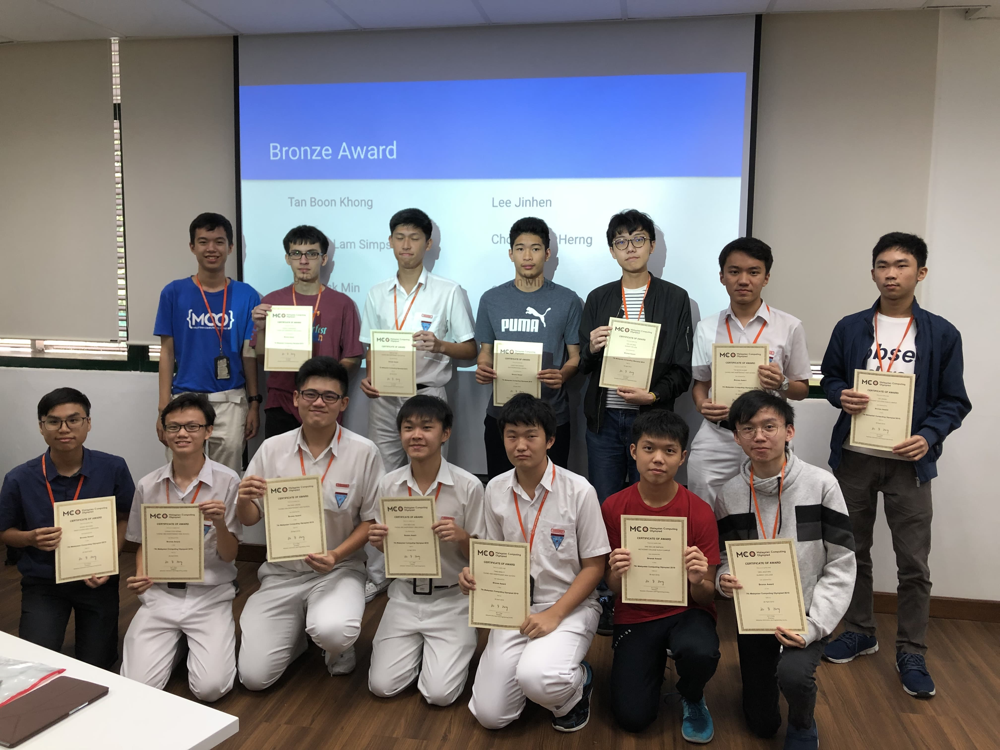

About Me
========

I was born (at a very young age) in Malaysia in 2003. I picked up C++ during secondary school, and got very interested in mathematics and coding. Prior to being admitted into NUS, I spend a lot of time taking part in mathematical and informatics olympiads. I was in the Malaysian team in Asia-Pacific Informatics Olympiad (APIO) 2021. As an undergraduate majoring in Computer Science, I developed strong interests towards theoretical computer science and discrete mathematics, and found passion in teaching as a meaningful activity that coincidentally lies within my capabilities.

|

   Me winning a bronze award from Malaysian Computing Olympiad (MCO) 2019, https://ioimalaysia.org/competition/mco/2019/

|

Outside of academics, I enjoy unforced writing (writing but not for the sake of assignments) as a medium to express my thoughts. I also think a lot about mental wellness and how to cope with things like stress and self-doubt in university. I am a big fan of learning new things and acquiring new skills. I like the idea of iteratively exploring stuff outside of my comfort zone only to end up expanding it. It suffices to say that I find myself cultivating a wide array of hobbies and interests which will be covered in my blogs.

|

Education
---------

National University of Singapore (NUS)
^^^^^^^^^^^^^^^^^^^^^^^^^^^^^^^^^^^^^^

*Bachelor of Computing (Hons) in Computer Science*

* 2022 - 2026 (expected)
* Minor in Mathematics
* GPA: 4.58/5 (First Class Honours)
* Academic Year 2022/2023 Semester 1 Dean's List
* Academic Year 2023/2024 Honour List of Student Tutors
* Academic Year 2024/2025 Semester 2 Dean's List

Chong Hwa Independent High School, Kuala Lumpur
^^^^^^^^^^^^^^^^^^^^^^^^^^^^^^^^^^^^^^^^^^^^^^^

* 2016 - 2021
* Unified Examination Certificate (UEC) with 4A1 and 4A2
* Represented Malaysia in the Asia-Pacific Informatics Olympiad (APIO) 2021
* Course Instructor of Computer Society from 2020 to 2021
* Chairman of Recycling Society from 2019 to 2020

|

Work Experience
---------------

MixtureAI
^^^^^^^^^

*Software Engineer (Intern)*

* May 2024 - Jul 2024
* Collaborated on a project to leverage tool-augmented local language models to develop an office chatbot tailored to a company of around 500 employees based in Qatar.
* Refactored project codebase to remove over 10,000 lines of deprecated or repetitive code.
* Conducted an in-depth review of a 25-page research paper on tool-augmented large language models (LLMs) to inform company's subsequent project implementation choices.
* Fine-tuned and analysed variants of 3 state-of-the-art LLMs to accomplish a sequence classification accuracy of over 90% for tool selection tasks.
* Tools used: Flask, PostgreSQL, Redis, Docker, Google Cloud

Computing for Voluntary Welfare Organizations (CVWO)
^^^^^^^^^^^^^^^^^^^^^^^^^^^^^^^^^^^^^^^^^^^^^^^^^^^^

*Full Stack Developer*

* May 2023 - Jul 2023
* Maintained a case management system to support daily operations of Care Corner Counselling Centre, Care Corner Centre for Co-parenting and Children's Aid Society.
* Collaborated on rewriting existing backend system consisting of about 110,000 lines of code from Ruby on Rails to Golang in less than 13 weeks.
* Optimized backend system to achieve a 500% reduction in time required to execute various backend database queries.
* Tools used: Rails, Golang, MySQL, PostgreSQL
