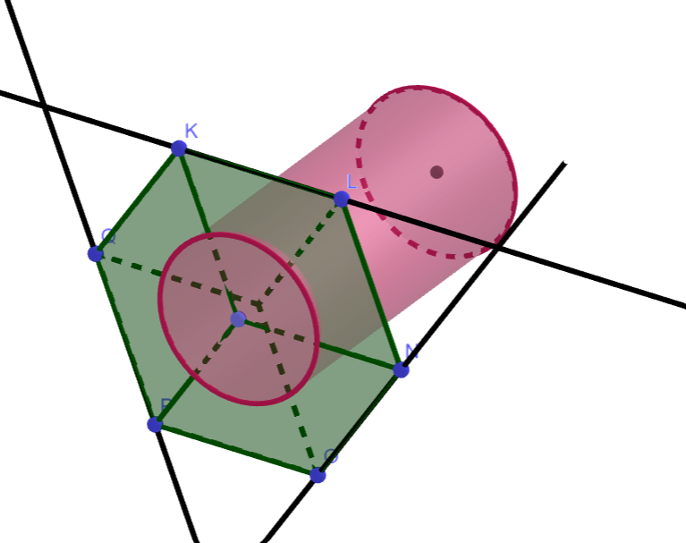
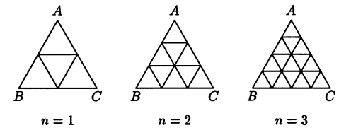
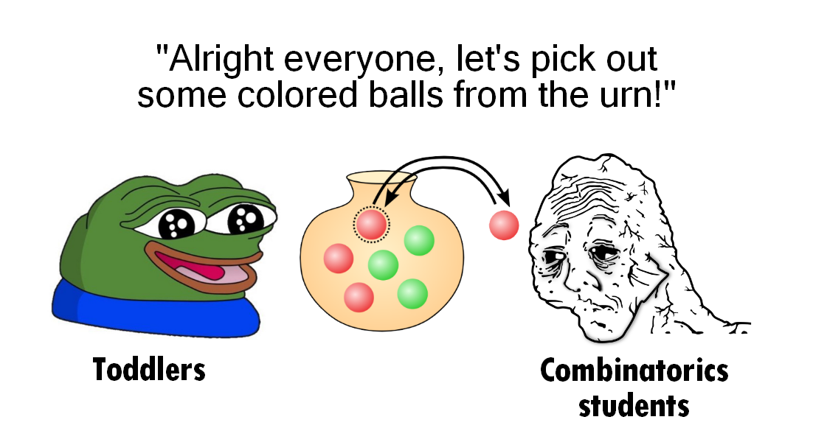

AY25-26 Semester 1 Recap
========================

*Published: December 21, 2025*

Hope everyone has been enjoying the winter solstice. This semester is characterised by the relatively small number of major commitments I have. This does not mean that I had more time to spare, but rather I get to spent more time on each commitment. My FYP has officially begun. I took my second graduate-level course, i.e. CS5234 Algorithms at Scale, the review of which can be found in `the blog I published a few days ago <https://chin-herng.github.io/blogs/nus-cs-course-reviews-part-6/index.html>`_. Also, for reasons to be clarified later, I took MA2214 Combinatorics and Graphs I. On the teaching side, I taught CS1231S and CS2040S as usual.

FYP
___

The aim of my FYP is to investigate the hardness of approximation of the Travelling Salesman Problem (TSP) and its variants. I work with one other undergraduate Neo Jie Xiang and one PhD candidate Rishav Gupta, supervised by Prof. Divesh Aggarwal. I actually started working on the project even before the semester began. During the summer break, I was mainly getting myself familiar with the background of the problem I am working with. This included watching some `MIT lectures <https://ocw.mit.edu/courses/6-890-algorithmic-lower-bounds-fun-with-hardness-proofs-fall-2014/pages/syllabus/>`_ as an introduction to the theory of hardness of approximation. Below I provide a very brief overview in case anyone finds it interesting and wish to work on the problems as well.

Metric TSP
^^^^^^^^^^

Back in 1992, `Arora et al. proved the highly celebrated PCP theorem <https://www.cs.umd.edu/~gasarch/TOPICS/pcp/ALMSS.pdf>`_ which implied a polynomial-time inapproximability result on :math:`\text{MAX-SAT}`. This result is to the theory of hardness of approximation what Cook's Theorem is to the theory of NP-completeness: once inapproximability of one problem has been non-trivially established, the inapproximability of many other problems can be obtained relatively easily via approximation-preserving reductions. Johan Håstad subsequently `improved the PCP theorem <https://www.cs.umd.edu/~gasarch/BLOGPAPERS/max3satl.pdf>`_ and obtained a number of optimal inapproximability results, one of which is that of :math:`\text{MAX-E3-LIN-2}`. Towards showing the inapproximability of :math:`\text{TSP}`, `Karpinski et al. <https://arxiv.org/pdf/1303.6437>`_ used a generalization of expander graphs (known as amplifiers) as gadgets and managed to reduce :math:`\text{MAX-E3-LIN-2}` to :math:`\text{TSP}`, arriving at an inapproximability bound of :math:`\frac{123}{122}`. The last bit of advancement came from `Chlebík and Chlebíková in 2020 <https://link.springer.com/article/10.1007/s10878-020-00659-0>`_, who parametrised the use of bi-wheel amplifers and found a better admissible set of parameters which led to a modest improvement in the inapproximability bound to :math:`\frac{117}{116}`.

.. figure:: images/ramanujan_expander_graph.png
   :width: 300
   :alt: A Ramanujan expander graph. Expander graphs are important gadgets in the theory of hardness of approximation.

   `A Ramanujan expander graph. Expander graphs are important gadgets in reducing vertex degrees. <https://www.researchgate.net/figure/Ramanujan-expander-graph-GV-E-X-X-5-17-with-18-nodes-where-each-node-has-6_fig2_224675919>`_

Following this direction, improving on the current inapproximability bound boils down to finding better admissible set of parameters. The admissibility of a set of parameters is defined based on the existence of bi-wheel amplifiers with such parameters. In turn, such existence is typically proven using probabilistic methods. It follows that the search for better parameters is essentially a problem in the area of combinatorics and graph theory.

On the other hand, `Christofides' algorithm <https://en.wikipedia.org/wiki/Christofides_algorithm>`_ serves as an upper bound by deterministically achieving an approximation factor of :math:`\frac{3}{2}`. Remarkably, if we allow randomization, `there is an algorithm by Karlin et al. in 2023 <https://arxiv.org/pdf/2007.01409>`_ achieving factor :math:`\frac{3}{2} - \epsilon` for some :math:`\epsilon > 10^{-34}` in expectation. The open problem is thus to close the gap between :math:`\frac{117}{116}` and :math:`\frac{3}{2}`.

TSP with Neighbourhoods
^^^^^^^^^^^^^^^^^^^^^^^

We are aware that TSP is well-studied under the metric setting. Near the end of the semester, we actually also got interested in geometrical variants of TSP. Specifically, we are investigating the hardness of TSP in the :math:`d`-dimensional Euclidean space in which we are given :math:`n` sets of points, each representing a neighbourhood, and the goal is to find a shortest closed curve that visits, i.e. has non-empty intersection with, every neighbourhood. This variant is known as :math:`\text{TSPN}` (for any fixed :math:`d`), where N stands for neighbourhoods.

There are many ways to restrict what each neighbourhood can be. An arguably natural thing to do is to enforce that every neighbourhood is a :math:`k`-dimensional affine subspace (otherwise known as a flat) for some fixed :math:`k`. When :math:`k = 0`, every neighbourhood is a point. When :math:`k = 1`, every neighbourhood is a line. In general, we can denote :math:`(k, d)\text{-TSPN}` to be the special case of :math:`\text{TSPN}` in which the neighbourhoods are :math:`k`-dimensional flats in the :math:`d`-dimensional Euclidean space.

Notably, when :math:`k = 0`, Arora `famously provided a polynomial-time approximation scheme (PTAS) <https://graphics.stanford.edu/courses/cs468-06-winter/Papers/arora-tsp.pdf>`_ via dynamic programming, i.e. one can achieve approximation factors arbitarily close to :math:`1`. When :math:`k = d - 1` (i.e. every neighbourhood is a hyperplane), Antoniadis et al. `gave a PTAS <https://arxiv.org/pdf/1804.03953>`_, though interestingly the problem is not known to be :math:`\text{NP-hard}`.

We are particularly interested in the direction of lower bounds. In particular, `a recent work by Antoniadis et al. <https://arxiv.org/pdf/2008.12075>`_ shown that no PTAS exists for :math:`(k, d)\text{-TSPN}` for any :math:`1\leq k\leq d - 2`. In the process, a funny inapproximability factor of :math:`\frac{230001}{230000}` is given for :math:`(1, 3)\text{-TSPN}`, from which one can reduce to all remaining cases. Moreover, under the `Unique Games Conjecture <https://en.wikipedia.org/wiki/Unique_games_conjecture>`_, one further obtains an inapproximability bound arbitrarily close to :math:`2` as long as :math:`d - k` is sufficiently large, i.e. the dimension of space is relatively high compared to that of the neighbourhoods.

For now, I leave it to the interested readers to ask further questions about these results in attempting to improve upon them :)

   Towards reducing tripartite vertex cover to :math:`(1, 3)\text{-TSPN}` instances, visualized in GeoGebra.

MA2214 Combinatorics and Graphs I
_________________________________

I also took MA2214 and got to see how people from the mathematics department think about the mathematics I study in Computer Science. As a regular CS1231S TA myself, I have already been familiar with much of the contents of the course. However, I stress that my main purpose has never been earning the free units and grades. Instead, my motivations to take the course is multi-fold:

1. I am genuinely interested in the course materials and wish to strengthen my understanding as well as pick up anything not in the CS1231S syllabus.
2. I am curious to know how the course can be taught rigorously by a lecturer from the mathematics department. This helps with my own teaching.
3. This course is a prerequisite to MA3233 Combinatorics and Graphs II, which I will be taking in the upcoming semester to enlighten myself with some in-depth graph theory materials and thereafter earn my Minor in Mathematics.

I felt mildly disappointed to learn that the course is designed to be more application-based than proof-heavy. For non-trivial theorems, only proof sketches are given. The lecturer isn't specialised in graph theory, and consequently he often gets stuck and messes up proofs in the second half of the semester, making him appear underprepared most of the time. As a fun fact, during the break time of one lecture, the whole class saw him asking ChatGPT to explain a proof he got stuck on before the break. After that, he asked ChatGPT to generate a quiz to test students on the materials covered in that lecture.

As for the exams, they are designed to have an overwhelming number of problems to solve in an extremely tight time constraint. I did not do well in these exams, but I maintain the stance that the course materials are easy. Being able to do well in the exams required additional strategizing efforts. For example, the final exam had a total mark of 120 but started with 30 True/False questions worth 1 mark each. It is rather obvious to not spend too much time on the True/False questions, but I personally just couldn't care less. I had lots of fun attempting the True/False questions but I ultimately ran out of time to attempt questions with very high weightages. I'm pretty sure I didn't score well in the end.

   `One of problems discussed in MA2214 to illustrate the power of recurrence relations. We want to count the number of parallelograms for any given n. <https://www.isinj.com/mt-amc12/Principles%20and%20Techniques%20in%20Combinatorics%20-%20Chen%20Chuan-Chong,%20Koh%20Khee-Meng%20(WS,1992).pdf>`_

Course administration seemed objectively bad. The lecturer does not seem to reply to my emails. Texts in lecture slides often overflow and go out of frames. Tutorials begin on Wednesdays but most of the time the tutorial questions only get uploaded on Tuesdays. The midterm itself has its starting time heavily delayed due to printing problems (which, to be fair, may or may not be avoidable). I only received my graded midterm scripts in week 13.

The materials covered in the course is beautiful for its own sake. The lecturer being humorous made me enjoyed attending them and paying attention to any new content along the way. There are materials that I have informally read about every once in a while but never got to learn properly. This included generating functions and solving linear recurrence relations. This course did a decent job covering those topics. As for graph theory, I find the Havel-Hakimi theorem pretty cool, and this course did a decent job introducing me to spectral graph theory through the Laplacian matrix representation of graphs.

For my next and final semester, I look forward to the (same) lecturer doing a better job teaching MA3233, and myself being able to allocate ample time to appreciate the beauty of graph theory.

Teaching
________

As an undergraduate, this is my last semester teaching CS1231S, and last semester teaching the "practical-style" CS2040S under `Prof. Halim <https://visualgo.net/en>`_.

CS1231S
^^^^^^^

Here's a perhaps not-so-fun-fact: I originally planned to make full-blown tutorial writeups in this website (as is evident from the CS1231S section in the sidebar) but unfortunately it proved to be too unrealistic of a plan considering how careful and elaborate I tend to be with technical writings in general. In the end, I still made a few tutorial writeups (to be published soon) for sessions that I couldn't finish, or I felt needed extra emphasizing.

Speaking of not finishing, I particularly did not expect time management to become an issue this semester. Honestly, I feel like I have had so much experience to the point where I have too many remarks to share per tutorial question, including even those simpler warm-up ones. It did not occur to me that I needed to start making decisions on what to say and what not to say. It is no longer practical to dump whatever information I know as fast as possible. It also doesn't help that my tutorial room is being used to host practical exams every two weeks, so I had to release students earlier than intended.

I had the opportunity to set some counting problems for the second assignment. With the help of MA2214 resources, a textbook, and some personal inspirations, I proposed a set of questions, a few of which made it in the assignment (including one in which my friend Pallon are among the people being seated into chairs). In short, it didn't go well. Many of the wordings in the questions ended up being ambiguous enough that it needed clarifications after release. I genuinely regret not spending enough time thinking through my wordings and ensuring that they're clear.

   `Relevant meme to avoid wall of text. <https://www.reddit.com/r/mathmemes/comments/1lgc6ro/average_combinatorics_class/>`_

I particularly want to spend a few paragraphs discussing a little bit about the inconvenient formalization of counting problems. For example, consider two formulations of the same counting problem:

1. Find the number of ways to seat :math:`r` people into :math:`n` distinct chairs.
2. Find the number of injective functions from a set of :math:`r` elements to a set of :math:`n` elements.

The first formulation is way more natural and conventional as counting exercises. On the other hand, the second formulation is more precise and removes any possible ambiguity, though it can hide a good amount of intuitions. Students will start to wonder why do we care so much about injective functions. The implicit rule of "no two people can sit on the same chair" seemed so natural that people tend to forget that it is precisely what injective functions are trying to formalize.

It is certainly part of the learning objective that students learn to read English sentences and interpret them correctly. However, we sometimes have to deal with the linguistics issue of different people interpreting the same sentence differently, and the so-called "correct" interpretation is really up to conventions. Consider the following counting problem:

3. Find the number of ways to seat :math:`r` people into :math:`n` identical chairs.

or equivalently,

4. Let :math:`\mathcal{F}` be the set of injective functions from :math:`A` to :math:`B` where :math:`|A| = r` and :math:`|B| = n`. For any :math:`f, g\in\mathcal{F}`, we say that :math:`f\sim g` if and only if there exists a bijection :math:`\sigma` on :math:`B` such that for any :math:`a\in A,\; b\in B` one has :math:`f(a) = b\iff g(a) = \sigma(b)`. Find :math:`|\mathcal{F}/\sim|`.

Now the difference is stark. The answer to the counting problem above is :math:`1` if :math:`r\leq n` and :math:`0` otherwise, because if all chairs are identical, it does not matter which chair seats which person. As long as there are at least as many chairs as there are people, there will be one and only one possible arrangement, in which exactly :math:`r` chairs seat one person each, and the remanining chairs do not.

The catch is that my entire reasoning depends on the interpretation of the word "identical". If everyone agrees that question 3 interprets as question 4, then there should be no dispute on the answer. Those who got the "wrong answer", after all, might not be wrong due to combinatorial misconceptions. What if identical chairs meant that the chairs individually looked the same, but they are still arranged in a row, and we regard two arrangements different if the position of some person is different?

.. figure:: images/chairs.jpg
   :width: 300
   :alt: Do you consider the chairs here identical?

   `Do you consider the chairs here identical? <https://www.istockphoto.com/photo/row-of-five-white-chairs-on-gray-wall-background-in-office-or-living-room-nobody-gm1352654720-427999696>`_

With a little bit of thought, one recognizes that the issue is more linguistic than mathematical. Well, the example above is admittedly a silly one, since it is a well-established convention (by `Gian-Carlo Rota's classification of distribution problems <https://en.wikipedia.org/wiki/Twelvefold_way>`_, for example) what it means for balls/bins to be distinct/identical. My point is that if we all agree to ask counting problems in the form similar to question 1 and 3, then it is of utmost importance that we communicate the terminological conventions clearly when teaching combinatorics. This aligns with our endeavour of teaching students how to read mathematics.

CS2040S
^^^^^^^

CS2040S this semester had more enrollments than expected. This is largely due to the increase of the number of people failing the course in the previous semester. Not that the students became less competent, but rather the teaching team has significantly increased the passing threshold.

Consequently, with only 8 TAs teaching tutorial sessions, the class size increases and so does the responsibility of each TA. I did end up spending more time hosting consultation sessions especially to help struggling students. It is with great honour to find that they all ended up doing pretty well! I am 90% confident that 100% of them is failing this time :)

I cannnot describe in words how fulfulling it is to see students that you know are struggling, slowly locking in and doing all they could to learn. Teaching is a thing I tend to overdo to a large extent, yet every time I look back, I find no regret, for students' achievements and appreciations are the best form of affirmation that I am indeed not wasting my time. This also applies to CS1231S but has been especially prominent in this iteration of CS2040S.

Closing Remarks
_______________

My next and final semester should be way more packed than this one. I foresee lots of CS2040S administrative work to handle, and I will be teaching CS3230 for the first time... just to do something different in the last semester. My FYP should also start to enter the innovative stage, and I expect myself to do less and less literature reviews. If that wasn't enough, I also need to handle my MA3233 and CS5275 coursework. I'm sure nothing will go wrong and everything will be fine. See you in 5 months!
