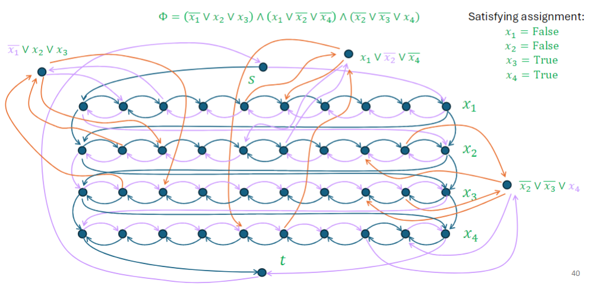
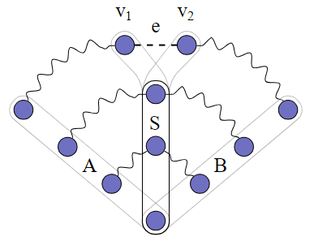
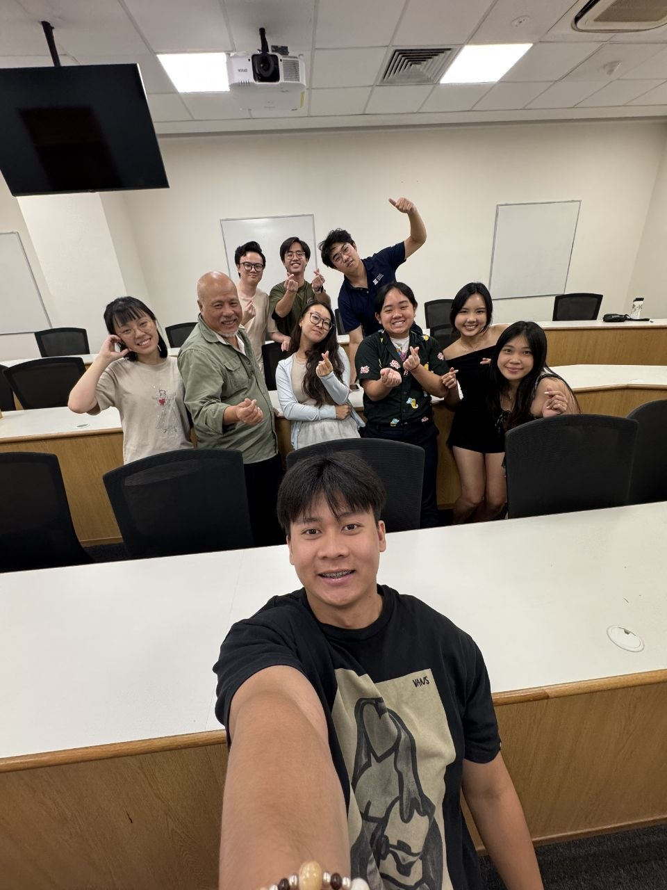
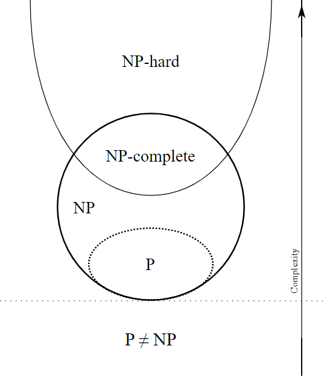
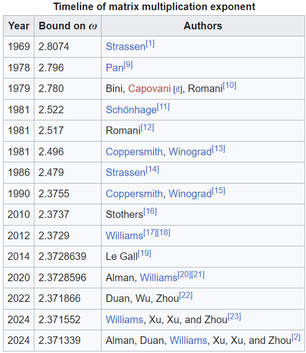
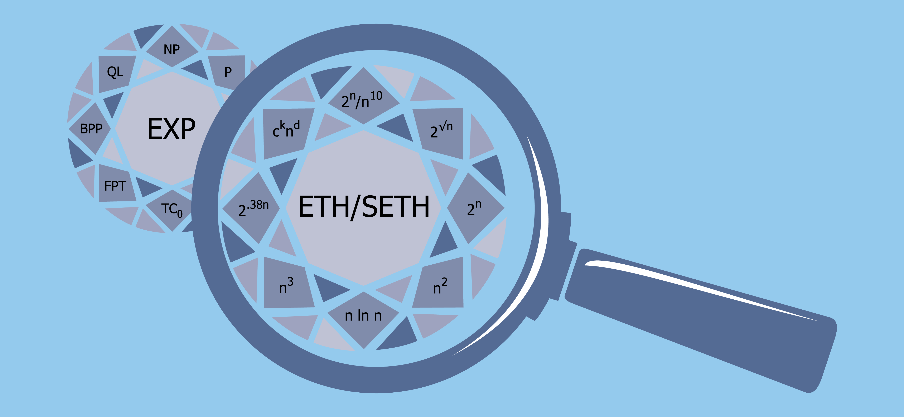

AY25/26 Semester 2 Recap
========================

*Published: May 16, 2026*

So, there goes my last semester as an undergraduate at NUS. I remember I ended last semester's recap with the following paragraph:

    My next and final semester should be way more packed than this one. I foresee lots of CS2040S administrative work to handle, and I will be teaching CS3230 for the first time... just to do something different in the last semester. My FYP should also start to enter the innovative stage, and I expect myself to do less and less literature reviews. If that wasn't enough, I also need to handle my MA3233 and CS5275 coursework. I'm sure nothing will go wrong and everything will be fine. See you in 5 months!

Fortunate enough, I am still alive and indeed got very busy. Even before the semester officially starts, the moment I join the CS2040S teaching team's Discord server, administrative work for CS2040S starts coming in and everything starts going downhill. I just want to say that one of the wisest decisions made by Dr. Eldon this semester is to hire a second Head TA. Big shoutout to the other Head TA Yong Rong, who uses `Vim <https://www.vim.org/>`_ as his text editor, prefers `Typst <https://typst.app/>`_ over LaTeX, and is deeply interested in the `Lean <https://lean-lang.org/>`_ proof assistant. I have worked very closely with him throughout the semester. Thanks for listening me yap and serving as a draft paper for me sometimes. Also, thanks for catching my attention span and chatting with me when I have 10 billion other things to do.

Teaching
________

This semester witnessed my last sessions teaching as an undergraduate TA at NUS.

CS2040S
^^^^^^^

Dr. Eldon made a very wise choice to appoint another Head TA Yong Rong to share the Head TA workload. The administrative work is more or less as much as I am mentally prepared for. Yong Rong handled filtering out plagiarism reports and making sure TAs enter tutorial XPs on time, mostly by himself. Together, we also oversaw the progress of TAs on grading problem sets, and making sure the right materials are released to the students at the right time. The latter is what I think the most important aspect for a course to appear to be run smoothly from the perspective of students.

This is the second iteration of Dr. Eldon taking over CS2040S, and in the first iteration last year he revamped the exam formats. This iteration, he focused on revamping lecture slides as well as the tutorial questions. As such, there are also weekly meetings we attend/host, mostly to discuss the contents to be included in upcoming tutorials. I really enjoy how after the meeting we just have random chats on the way back.

As usual, I had to grade problem sets and host tutorial sessions. I'm pretty happy that I managed to make slides before every tutorial seesion. This is in contrast to last year where I only made slides for the first half of the semester and whiteboarded the second half. The slides are not perfect (and sometimes end up containing a lot of typos) but hopefully it will get improved over the years if I do come back to teach the tutorials again.

   A drawing by Khoa, one of the team leaders of CS2040S.

I just want to spend one paragraph to apologize once again for disappearing without prior notice nearing my undergraduate thesis submission deadline. I get so stressed that I didn't bother looking at my phone, and when I realized everyone is still waiting for me to cook up the last tutorial which I was responsible for setting up, I just couldn't fall asleep that one night until like 5am or something (and the guilt still haunts me until today). That was indeed poor time management on my side, and I really should have informed other team leaders in advance that I need help with setting up the tutorial. Huge thanks to Khoa and Yong Rong for getting the tutorial released more or less on time (using Vim, presumably) upon realizing that I am missing in action.

If everything goes well, I am most likely going to be focusing on research next year. If I am appointed to CS2040S again via GAP, perhaps I get to witness the problem set revamp as well as the Typst-ification of all the documents in the CS2040S repository.

CS3230
^^^^^^

This is my first and last time teaching CS3230 as an undergraduate TA. As someone working in the field of computational complexity, I am most excited to talk about reductions and the NP-completeness theory, which occupy the last three weeks of the semester. The topics before that are of course also quite interesting, all of which I have already heard of, but for a few of the topics I had to rely on the lectures to help myself review them. Thankfully tutorial slides are provided to the TAs with excellent visualizations. Most of the time I only had to edit very small parts of the slides to fit with the way I wanted to explain things.

I am not very much involved in the course administration besides teaching the tutorials and grading the weekly assignments, but overall I feel like the course is very smoothly run. There are three lecturers and they reply to questions very quickly in the class Discord server. I decided to attend every single lecture, and found the lectures delivered more or less fluently. It is strangely enjoying to watch students learn about well-known, fascinating things (such as Strassen's algorithm) for the first time.

CS3230 is one of the notoriously difficult courses in NUS SoC (maybe the same can also be said to CS2040S). Too many times a student lost interest just because of bad grades, forgetting that grades do not absolutely define who they are. For me, it is fine for them to find the subjects intellectually challenging, but my main goal throughout the semester is to at least convince my students that algorithms and theory are fun to learn, independent of actual grade they will end up getting. I really hope that this objective has been met. If any of the CS2040S students are reading this, I will do Dr. Eldon a favour and advise you again not to map this course overseas :)

   Reducing :math:`\text{3SAT}` to :math:`\text{Hamiltonian Cycle}` in polynomial-time, taken from the CS3230 lecture slides.

MA3233 Combinatorics and Graphs II
__________________________________

The one-sentence summary of the course is that it did a goob job introducing us the beautiful results in graph theory, but it is unfortunately poorly managed and the lectures are just a bunch of AI slops. I have made notes for the first few lectures of the course which I will upload onto here very soon.

Generally, the first half of the semester has a unifying theme of linear programming, whereas the second half of the semester has that of topology. I will only provide an overview for the first half as I didn't really pay much attention in the second half.

We begin by studying matchings in a graph and how vertex cover is the dual problem for bipartite graphs. This includes stating and proving Hall's marriage theorem, König's theorem, Berge's theorem and the Tutte-Berge formula, as well as interpreting these results via the lens of linear programming. Then, we studied the notion of connectivity of graphs. In particular, the minimum number of vertices to delete in order to disconnect a graph is precisely maximum the number of internally-disjoint paths between any two vertices of the graph, a result known as Menger's theorem. Predictably, the corresponding minization and maximization problems can be formulated as linear programs forming a primal-dual pair. Finally, we state and prove the max-flow min-cut theorem which can be used to recover most of the duality theorems established so far. We conclude with proving the integral flow theorem while introducing the notion of total unimodularity.

   `An illustration of Menger's theorem <https://en.wikipedia.org/wiki/Menger%27s_theorem>`_

The second half of the semester studies the chromatic number and planarity of a graph. It seems like there is some sort of duality between the two, and the chromatic polynomial of a graph is actually a special case of a more general graph invariant satisfying the deletion-contraction property known as Tutte's polynomial. The course concludes with a brief introduction to matroid theory which is not tested.

I didn't attend most of the tutorials so I can only describe what I see from the lectures. The main problem I have is that the lecture slides are quite clearly generated by ChatGPT and they are not being proofread carefully. The unpreparedness of the lecturer really shows when he can spend minutes talking about the beauty of the subject in an informal manner, but immediately gets stuck any time he wants to cover a technical proof of, say, Menger's theorem. It is perfectly understandable that technical proofs are harder to explain properly, but I think that if the lecturer had actually spent the time to write every step of the proof himself, he would have been way less likely to get stuck explaining. It instead felt like he let ChatGPT generate the proof and he only briefly skimmed through it before declaring the materials as presentable.

LAV2201 Vietnamese II
_____________________

My original plan was actually to try studying Bahasa Indonesia last semester, but after an exemption test I was told to take level 4 instead. I decided not to do that and after looking around for replacements, I ultimately went with pursuing level 2 Vietnamese.

I took level 1 last year (i.e. two semesters ago) but thankfully I managed to not forget most of the level 1 contents just by maintaining my Duolingo streaks, though I did uninstall Duolingo shortly after this semester starts out of high projected (and, in fact, actual) workload.

The pacing for level 2 went just right for me. I expected myself to put almost zero attention to the course outside of class hours, and still managed to follow every class. In particular, grammars and sentence structures have largely never been an issue for me, and instead I find myself struggling mostly with vocabularies, especially those that are not Sino-Vietnamese words. Indeed, in any quiz that I have done throughout the course, I give up answering whenever I needed to recall vocabularies.

Overall, my Viet classes make up 4 hours per week during which I just chill and escape my mind from all the technical stuff I have been working on. Perhaps the best part from doing language courses is that I get to meet new friends! I'm kind of surprised to still be maintaining contacts with some of my classmates even including those from level 1 last year.

   Class photo lacking one classmate unfortunately.

Personally, I find that given my Chinese background, picking up Vietnamese is not difficult at all. I like to say on a very naive manner that Vietnamese is just Chinese with the Chinese characters removed, so that we are reading pinyin directly. Occasionally, the syntax of Vietnamese can be different from Chinese, as is the case for where possessive pronouns typically occur. The phrase "My book" is more commonly written in Vietnamese as "Quyển sách của tôi" which roughly translates to "The book of mine". I find this specific feature of the language similar to Malay's Hukum DM structure.

A large portion of Vietnamese vocabulary consists of Sino-Vietnamese words. These words are especially easy for me to remember as they sound very similar to the corresponding Chinese (and most of the time Cantonese) pronunciation. For example, instead of memorizing "Quyển sách" I only had to recall how ancient Chinese refers to books as "卷册".

Perhaps the more annoying part of Vietnamese is the sheer amount of addressing terms, and also the occasional North-South distinction. For the latter, it is fortunate that the Viet classes covered the Southern dialect while Duolingo covered the Northern dialect, so I ended up being comfortable with hearing and speaking both.

I hope I get to travel to Vietnam soon :)

Closing Remarks
_______________

I wanted to leave the FYP section as an appendix because it is just a long and technical yap from me. Maybe I will eventually move it to a separate blog... Just know that I have written my first thesis ever alongside juggling all the things mentioned above.

Anyway, I have truly come so far relative to when I first matriculated into NUS as a freshman. Back then I was still looking forward of leveraging my advantage in Computer Science (not knowing that I actually only had advantage in Algorithms specifically) to find a high-paying job effortlessly, and then live happily ever after. Back then I was also focusing so much on impressing other people to the point where I have lost track of who I am. So many things happened, and I am glad they did. By the time I locked in, I was already year 3.

The past two years have been infinitely more enjoyable than the first two. I am actually pursuing my own interests, not getting stressed out because I couldn't find jobs, and not getting stressed out because I couldn't impress others. It was a whole other level of peacefulness I have achieved just by focusing on myself, my teaching, and the beauty of theoretical computer science.

I say this in my Instagram story and I will say it again. When my last final ended, I didn't feel relieved because everything is finally over. It only felt that I ran out of privileges to learn cool things full-time. I can only wish that everyone who is graduating feels the same. As for myself, at the time of writing, I am currently extremely nervous about my PhD/Research Assistant application to the point where I am not willing to elaborate anything further. Stay tuned for my good news if there will be any.

Appendix: FYP
_____________

This section is just an excuse for me to yap about fine-grained complexity.

At the start of the semester, the authors of `this paper <https://arxiv.org/abs/2205.07709>`_ came to give a talk at NUS. Basically, if we can encode a problem as a polynomial with exponentially many variables and monomials, then we can conclude the following: If we can use the Strong Exponential Time Hypothesis (SETH) to demonstrate exponential time complexity for the problem, then we will resolve one of two important open problems in circuit complexity. The goal of this section is to elaborate on what all of these mean.

In computational complexity, there are many open problems that remain unresolved for decades, but we have gotten very good at relating one open problem with another. In classical NP-completeness theory, we speak of "If there is a polynomial-time algorithm for this problem, then we would have resolved the P vs NP problem. We believe that the latter is unlikely, so most probably we cannot hope to solve this problem efficiently". In fact, a large volume of results in computational complexity builds upon the conjecture that :math:`\text{P}\neq\text{NP}`. If there is a contradiction somewhere among these results, we would have proven :math:`\text{P} = \text{NP}` and many results will instantly become irrelevant.

   `Classical NP-Completeness theory. <https://upload.wikimedia.org/wikipedia/commons/a/a0/P_np_np-complete_np-hard.svg>`_

Fine-Grained Complexity
^^^^^^^^^^^^^^^^^^^^^^^

Fine-grained complexity is a subarea of computational complexity established roughly 15 years ago. As motivation, let us briefly recall what NP-completeness theory is doing. First, we conjecture that :math:`\text{P}\neq\text{NP}`, and do something non-trivial to establish that :math:`\text{SAT}` is NP-hard, that is to say that if :math:`\text{SAT}` can be solved in polynomial time, then :math:`\text{P} = \text{NP}`. Once the NP-hardness of one problem has been established, we opened up a floodgate of NP-hardness results for further problems, thanks to polynomial-time reductions: If problem :math:`A` polynomial-time reduces to problem :math:`B`, and problem :math:`B` can be solved in polynomial time, then problem :math:`A` can also be solved in polynomial-time. The power of this implication then comes from the contrapositive: If :math:`A` is NP-hard, then so must :math:`B`.

NP-completeness theory allows us to, most of the time, classify whether a problem is polynomial-time solvable, based on the assumption that :math:`\text{P}\neq\text{NP}`. The idea of fine-grained complexity is to, well, go more fine-grained, by asking for the exact complexity of a problem. If a problem is polynomial-time solvable, what is the best time complexity we can achieve? Is it :math:`\mathcal{O}(n^3)`, :math:`\mathcal{O}(n^2)` or :math:`\mathcal{O}(n\log n)`, or is it something else? If a problem is not polynomial-time solvable, can we solve the problem in :math:`\mathcal{O}(2^{\log^2 n})` time? Note that :math:`2^{\log^2 n} = (2^{\log n})^{\log n} = n^{\log n}`, making the complexity superpolynomial but subexponential. Or, does the problem really need exponential, e.g. :math:`\mathcal{O}(2^n)` time? Can we instead solve the problem in :math:`\mathcal{O}(1.99^n)`?

   `Table showing history of improvements in the complexity upper bound of matrix multiplication. <https://en.wikipedia.org/wiki/Computational_complexity_of_matrix_multiplication>`_

Aligned with what we have done in NP-completeness theory, we make a conjecture that essentially claims that :math:`\text{SAT}` needs :math:`\mathcal{O}(2^n)` time where :math:`n` is the number of variables in the input. This is consistent with our current knowledge: we indeed do not know how to solve :math:`\text{SAT}` better than brute-force. Note that this conjecture is also stronger than the conjecture that :math:`\text{P}\neq\text{NP}`. If we can show that indeed :math:`\text{SAT}` needs :math:`\mathcal{O}(2^n)` time, then we have successfully found an :math:`\text{NP}` problem, namely :math:`\text{SAT}`, that is not solvable in polynomial-time. The conjecture that :math:`\text{SAT}` needs :math:`\mathcal{O}(2^n)` time is what is known as the Strong Exponential Time Hypothesis (SETH).

Now all there is to do is to define a notion of reduction (known as fine-grained reduction) that allows the exponential hardness assumption on :math:`\text{SAT}` to translate. This turns out to be a lot more complicated than defining the polynomial-time reduction. The full definition is essentially `due to Virginia Vassilevska Williams <https://people.csail.mit.edu/virgi/ipec-survey.pdf>`_, but to give you a sense of how complicated it can be, consider what can be said if we have reduced a :math:`\text{SAT}` instance of :math:`n` variables into a graph problem :math:`A` of :math:`2n` vertices. According to SETH, we can conclude that any instance of :math:`A` of :math:`2n` vertices must need :math:`\mathcal{O}(2^n)` time to solve, allowing us to establish only a :math:`\mathcal{O}(2^{\frac{n}{2}}) = \mathcal{O}((\sqrt{2})^n)` lower bound for :math:`A`. Notice how in contrast to NP-completeness theory, the blowup in the instance size starts to matter. In particular, only reductions with linear blowups preserve exponential hardness.

The story I have described so far is far from complete. We in fact ended up making more conjectures than just SETH. For example, the 3SUM conjecture conjectures that :math:`\text{3SUM}` cannot be solved in :math:`\mathcal{O}(n^{2 - \varepsilon})` time, for any constant :math:`\varepsilon > 0`. This is again consistent with our current knowledge. We know from CS2040S that we can solve :math:`\text{3SUM}` in :math:`\mathcal{O}(n^2)` time. In fact, `there is even an algorithm <https://arxiv.org/abs/1404.0799>`_ that runs slightly faster than :math:`\mathcal{O}(n^2)`. However, no algorithm is discovered running in time :math:`\mathcal{O}(n^{1.99})`, for example.

You might then rightfully ask whether it is possible to use SETH to prove the 3SUM conjecture. Well, the computational complexity theorists tried for some time and couldn't do it. In fact, they did what they are best at doing: they found that if they can reduce :math:`\text{SAT}` to :math:`\text{3SUM}` in a way that demonstrates quadratic complexity for :math:`\text{3SUM}` from SETH, then we would have refuted another hypothesis which we believe is true, namely the `Nondeterministic Strong Exponential Time Hypothesis (NSETH) <https://people.csail.mit.edu/virgi/6.s078/papers/nseth.pdf>`_. Said differently, we don't believe that such a reduction exists.

   `A pretty cool graphic on fine-grained complexity, of course inserted here to prevent wall of text <https://simons.berkeley.edu/programs/fine-grained-complexity-algorithm-design>`_

Hopefully by now you recall the result I stated at the beginning of this section and notice the similarities involved. To reiterate, if a problem :math:`A` admits a suitable polynomial formulation, and moreover we can use SETH to demonstrate exponential complexity for :math:`A`, then we can resolve one of two important open problems in circuit complexity. I will not elaborate on what the open problems in circuit complexity are, but just treat resolving them as "some very massive advancement in computational complexity". What this result entails is that for problems admitting a suitable polynomial formulation, there is a barrier towards demonstrating exponential complexity using SETH. Being able to reduce :math:`\text{SAT}` to these problems with linear blowup is at least as hard as making massive advancements in circuit complexity.

This particular result is important because we in fact have not been successful in designing reductions from :math:`\text{SAT}` to many classical NP-hard problems, e.g. Vertex Cover, Hamiltonian Path etc. with linear blowup. Lo and behold, these classic NP-hard problems all admit a suitable polynomial formulation, explaining why these reductions have been so hard to come by.

Our Contribution
^^^^^^^^^^^^^^^^

What we did in my FYP is basically to apply the polynomial formulation framework to Travelling Salesman Problem (TSP), as we set out to investigate the inapproximability of TSP in the first place. We also managed to show that approximating the optimal value for many classical NP-hard problems, including Vertex Cover, Hamiltonian Path and TSP, similarly have the same barrier towards exponential hardness. This is not surprising, as approximating is intuitively no harder than solving exactly, and the barrier already holds even when we aim to solve exactly.

The funny way of phrasing these barrier results is that, we show that "it is hard to show that it is hard to approximate TSP (and a number of other NP-hard problems)". The first "hard" refers to "at least as hard as discovering new circuit lower bounds", whereas the second "hard" refers to demonstrating exponential complexity from SETH.
