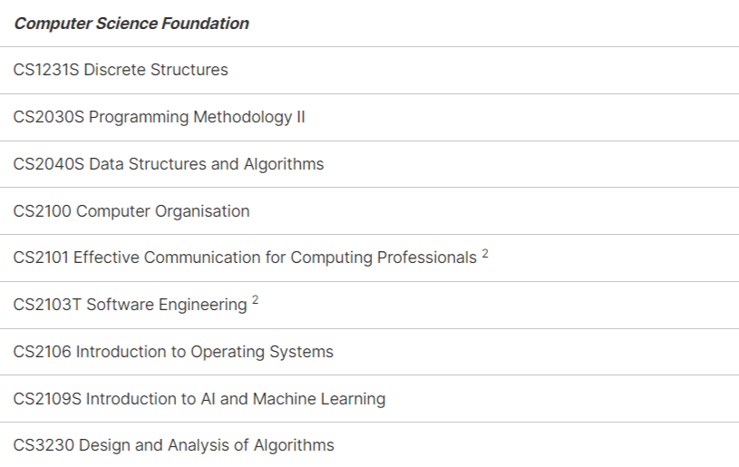
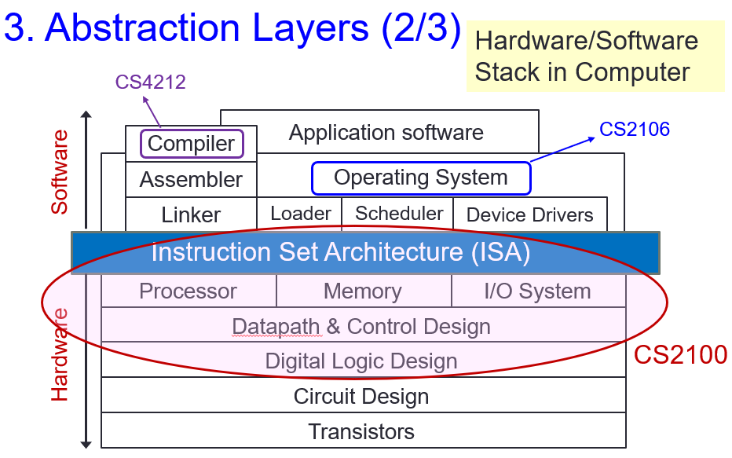
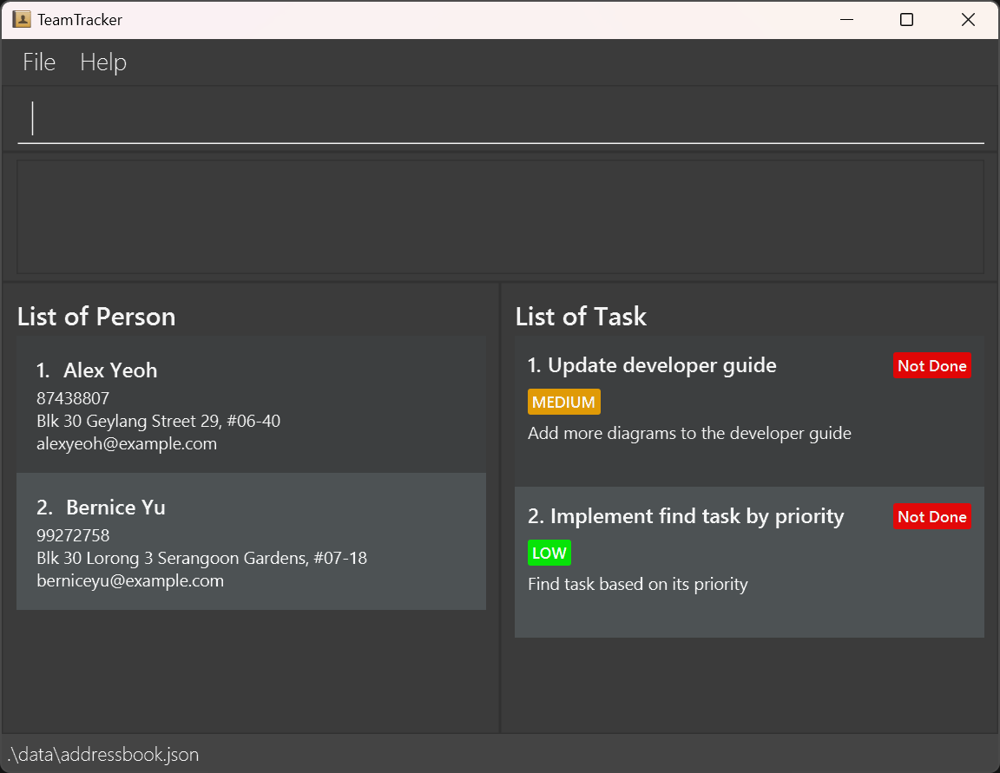
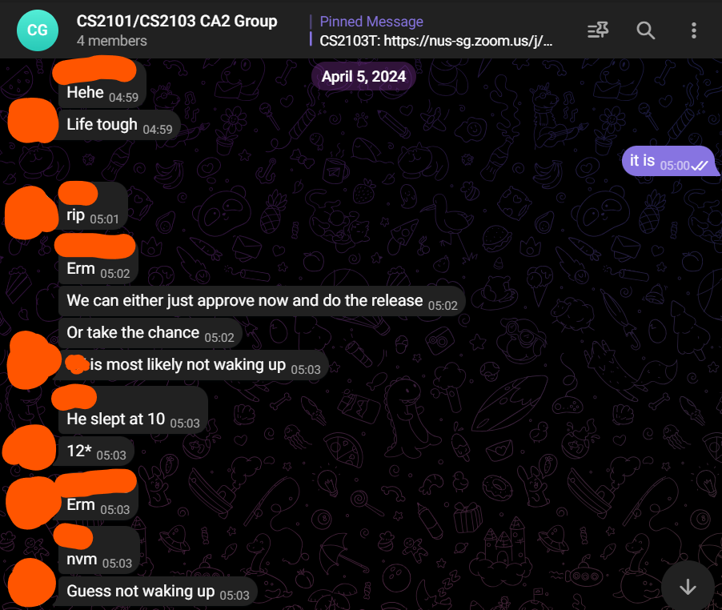

NUS CS Course Reviews Part 2
============================

*Published: July 17, 2024*

I have been consistent with writing one course review each day while juggling my summer internship as well as CS2040S TA application.

|

   `NUS CS Foundation Courses <https://www.comp.nus.edu.sg/programmes/ug/cs/curr/#summary-of-degree-requirements-for-bachelor-of-computing-computer-science>`_

|

We covered CS1231S, CS2030S and CS2040S in Part 1. I might actually end up writing a separate blog post serving as my extended review for each of CS1231S and CS2040S.

CS2100 Computer Organisation
____________________________

I took this in AY22/23 Sem 2 under Prof. Aaron Tan Tuck Choy, Colin Tan Kheng Yan, Prabhu Natarajan and Trevor Erik Carlson. My final grade is B+.

* Tutorial Attendance (1%)
* Lecture Quizzes (5%)
* 2 Assignments (10%)
* Labs (14%)
* Midterm (20%)
* Final (50%)

   `Probably the most important slide ever to gain a big picture on what is going on <https://www.comp.nus.edu.sg/~cs2100/2_resources/lectures.html>`_

The first CS course I actually didn't like so much? Partially because I didn't do well, but I also blame it on the dryness of the content. Overall, the course starts from C programming and breaks the abstraction barriers all the way down to logic gates. We get an overview of what happens on the CPU and RAM level when we compile and execute code. I walked away with an affirmation that this is not what I want to specialize in the future, and I completely understand the necessity of the said abstraction barriers. It's like I went to the backstage and saw a huge mess of 0s and 1s.

**Content Difficulty: 5/10.** The content is not difficult to learn. It's the calculations/tracing involved that is near-impossible to execute perfectly. I can multiply any two numbers by hand, but that doesn't mean I can flawlessly multiply two 10-digit numbers by hand in one take. With that said, I did learn a lot from the course. Computers have always seemed like a magic to me and this course actually demystified its internals for me, allowing me to appreciate the complexities and practical efforts involved to make modern-day computers a reality. I'm convinced that it is truly one of the greatest human inventions of all time.

**Workload: 6/10.** 2 hour of recitations, 1 hour of tutorial and 1 hour of lab session. "Chin Herng!" I hear you ask, "where are the lectures?". We get weekly pre-recorded lecture videos which, when played at normal speed, takes somewhere between 4 to 8 hours to fully watch. Prof. Trevor hosts my recitation slots. He would do a short recap followed by additional extensions of the lecture content. He would go on and show us the "bigger picture" of what we are actually learning. Tutorials cover tutorial sheets and there are near-weekly lab assignments.

If it isn't obvious yet, the main workload arises from watching lecture videos. Lecture quizzes, assignments and lab assignments were mostly trivial provided we understand the lecture content. Tutorial questions were of moderate difficulty. I would advise spending a significant amount of time on past-year papers to prepare for exams.

**Profs: 9/10.** Prof. Colin and Prof. Aaron's lectures are less boring to watch compared to Prof. Prabhu's. Prof. Prabhu would advise us to watch his lectures in 2x speed and I find that more reasonable than ever. Outside of lecture videos, I don't see them very often. Prof. Aaron seems to put much of his energy on CS1231S instead. You can find my very positive review of him in Part 1.

Prof. Trevor did not cover the lecture content but hosted my recitation slot. Let's just say he was single-handedly keeping my passion for the lecture content alive. He was really engaging and went a lot in-depth with the lecture contents. He was very attentive and passionate to any questions we might have, even for questions that are out-of-syllabus. The 2-hour recitation slot was rarely boring. His recitation slot was eventually merged with one of Prof. Aaron's slots due to low attendance. My friends and I stopped attending the recitation slot afterwards because we find those just a recap of the lecture contents which we already knew.

**Assessment.** My strongest opinion on the course goes here. I genuinely did not like the way the assessments are done. I really appreciate the lecture videos for going through the details of the calculations/tracings involved in the design of data paths and control paths, conversion of an assembly instruction into machine code, as well as various different pipelining stages. These are fun and interesting to watch, and really give a sense of completeness as we get to see the techniques in action. You want me to do several of these mechanical work perfectly in a time-constrained environment? I screamed so loud my family in Malaysia heard and called me to ask what happened.

Honestly, I would appreciate something like a tricky MCQ question that tests me on concepts regarding ISA design than doing all those calculations. This is one of those classic examples I find, where doing bad in the exam does not imply bad understanding of the concepts involved. Conversely, one can simply do enough past-year papers to get familiar with all the calculations and do well in the exam without knowing what they have learned at all.

CS2101 Effective Communication for Computing Professionals
__________________________________________________________

I took this in AY23/24 Sem 2 under Ms. Dara Leah Richard. My final grade is A-.

   `Random LinkedIn graphics to mitigate walls of text <https://www.linkedin.com/pulse/effective-communication-skills-administrative-adney-thomas-zelfc>`_

I am just going to give a very brief review mostly because I do not have a strong opinion on the course. I am mostly comfortable with public speaking so the presentations are more fun than annoying. I am slightly annoyed by having to memorize scripts for my presentations, simply because that is not what I do.

I did not register for my tutorial slots with my friends. I didn't know anyone in the class at the start of the semester. However, from what I have observed from my friends, most of them did successfully end up in the same team despite sharing the same nationality.

Also, this course is twinned with CS2103T (meaning the two courses have to be taken in the same semester and group members are shared). I walked away not learning much from CS2101, but enjoyed the opportunity to interact with my classmates. I have no idea how I did not get a B. Maybe the real learning outcomes are the friends we made along the way. 

I tried to think a bit harder on what I have learnt from the course. I think CA1 did benefit me by shedding light on the various types of communicators. I did come to a meaningful conclusion that we should be aware of these communication styles and morph between them depending on who we are communicating to. CS2101 also made me double-down on my preference for presentations without scripts, which makes rooms for informalities.

**Content Difficulty: ???/10.** I never pay attention to the class.

**Workload: 3/10.** 4 hour of weekly tutorials. Apart from occasional failure to wake up, these are pretty manageable. Most of the workload comes from preparing for presentations, which will depend on who you team up with (or whether you want to try hard on the presentations).

**Tutor: 7/10.** I guess she's alright? I like how she didn't call me out for not paying attention to the class. Her comments to my presentation styles/ideas have been gentle. She is overall a cool lecturer. She seems like she is there to do her job, and she did. Didn't really make the content engaging but I don't know who can.

**Assessment.** There are 4 CAs. CA1 requires us to present on an aspect of communication? Not entirely sure of the theme, but my team ended up presenting about the various types of communicators. We went as far as acting out a skit. CA2 was a presentation of the CS2103T team project. I didn't spend a lot of effort preparing for it. CA1 and CA2 are really the only two graded class presentations. It was truly one of the experiences of all time.

CA3 is basically the user guide of CS2103T team project. In my team, we documented the features we were responsible for implementing. CS2101 tutors generally have no idea what is going on at the technical level, so do expect to receive very generic comments and take their advice with a pinch of salt. CA4 is the only individual CA. Essentially, we need to talk about what we have learnt from the course in any method we prefer except writing an essay. I ended up recording a 3-minute video of myself talking about things I hope appear to be sensible to the tutor.

CS2103T Software Engineering
____________________________

I took this in AY23/24 Sem 2 under Prof. Damith Chatura Rajapakse. My final grade is A-.

   `The team project my team and I worked on <https://nus-cs2103-ay2324s2.github.io/website/admin/teamList.html>`_

Administrative information of the course is a good reflection of software engineering in the real world: a huge ball of dynamic mess covered with plasters powering a system that barely works. Especially because it is dynamic, things like grade components, assessment formats might change significantly over time. I will therefore put less emphasis on these information and more on my overall feelings towards the course.

Tutorial slots are registered in parallel with CS2101. My CS2103T tutorial consisted of half of my CS2101 classmates. The other half sits at the other side of the same physical venue at the same time, attending a different slot hosted by a different tutor.

In the field of software engineering, new tools, frameworks, libraries and technologies are released on an almost weekly basis. Hence, I find it somewhat reasonable that the course does not teach you React.js, Node.js, MySQL or whatever tech stack you used in Orbital. Instead, the course sticks with Java and the applications we write will certainly not be web-based. 

Overall, the course did a very good job reflecting the messy nature of software engineering. It is as if the course is designed to be this chaotic. I find it an oddly good point that students should learn to deal with such level of complexities in order to excel in the field of software engineering. The administrative information, individual and team projects, as well as the practical exam allowed us see all the gray areas in action, and how people have been making up rules to cover up those gray areas, which only uncovers more gray areas and so on and so forth.

**Content Difficulty: 5/10.** The course mostly covers high-level design principles, techniques, terminologies and conventions that apply to software engineering in general. Some of the contents are common-sense, the rest can be understood if tried hard enough. Be aware that these theories may not always apply in a practical setting and may sometimes even conflict each other. I think more than learning what the course is trying to teach, it is equally important to form our independent stance/opinion especially on certain debatable topics.

**Workload: 10/10.** 2 hour weekly lecture and 1 hour of tutorials. Almost no one cares about the weekly lectures. The contents of the course is delivered on the course website and we just have to read through them every week. When combined, contents from each week would form the textbook of the course up to reordering of topics covered. My point is that there is a significant amount of reading each week followed by a quiz consisting of some 30 MCQ/MRQ questions.

I don't really know how to explain this but due to how theoretically minded I tend to be, I spent an excessive amount of time on the reading and couldn't catch up with it from around week 5 onwards. The contents are easy to understand but it is exactly this easiness that makes me felt like I barely scratched the surface, so I would end up spending an excessive amount of time thinking deeper and diving deeper into each of the topics, obviously beyond the course's syllabus. I guess this is more of a me problem.

Apart from the reading, most of the rest of the workload falls into the individual and team projects. Perfectionists mostly struggle with the projects due to their irresistible urge to achieve every single milestone, write the most comprehensive test cases, ensure that their OOP design is optimally extensible and that there are absolutely 0 issues with their code quality. Speaking from personal experience, my individual project had "a significantly-above-average amount of Java code" (quoted from an email from the teaching team) but it was a one-week-late submission. I had to email Prof. Damith to explain my situation. Not the best experience.

   Huge shoutout to my teammates. This is us being awake at 5am.

**Profs: 9/10.** Prof. Damith has been very supportive and helpful to the students. He actively engages in the course GitHub forum. Most importantly, I cannot possibly fathom the effort he spent to manage the huge pile of messy administrative information in the course. How experienced and passionate you have to be in order to deal with that and not feel like quitting your job?

**Assessment.** First half of the semester (actually less than that) will be dedicated to an individual project. The course gives very specific milestones and features that need to be implemented and encourages us to do no more than what we were told to do. This is accompanied by a user guide that acts as a "instruction manual" for using the app. Second half of the semester was dedicated to a team project, where we evolve a generic address book application by adding domain-specific features to it.

Towards the end of the semester, there was a practical exam. I don't even want to explain how controversially messed up it is, nor do I want to recall for you the complicated rules of the PE. There is even a lengthy section of bullet points in the course website attempting to justify the existence of the PE. The only thing I learnt from it was how large is the gray area between a functionality bug and a feature flaw. 

There is also a final consisting of conceptual questions that mostly tests you on whatever theory was covered in the course. I don't think I did very well on it since I did not manage to catch up with the contents, but generally students should be able to do well on it with sufficient revisions, even without attempting past year papers (which is a good sign of a meaningful exam, refer to my CS2100 assessment review).
