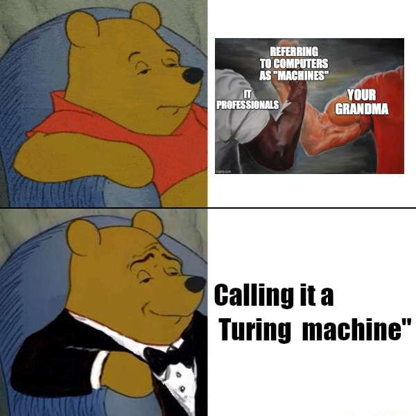
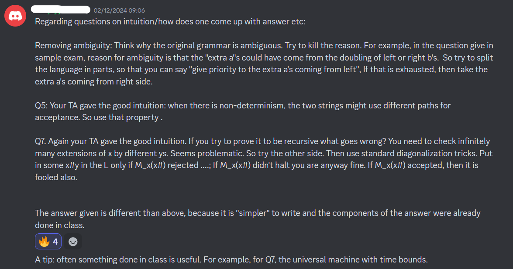
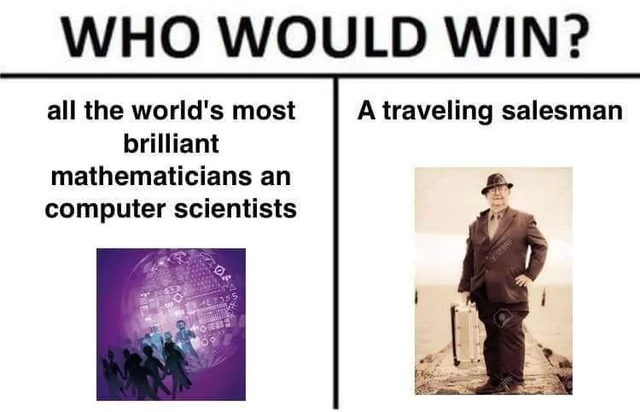
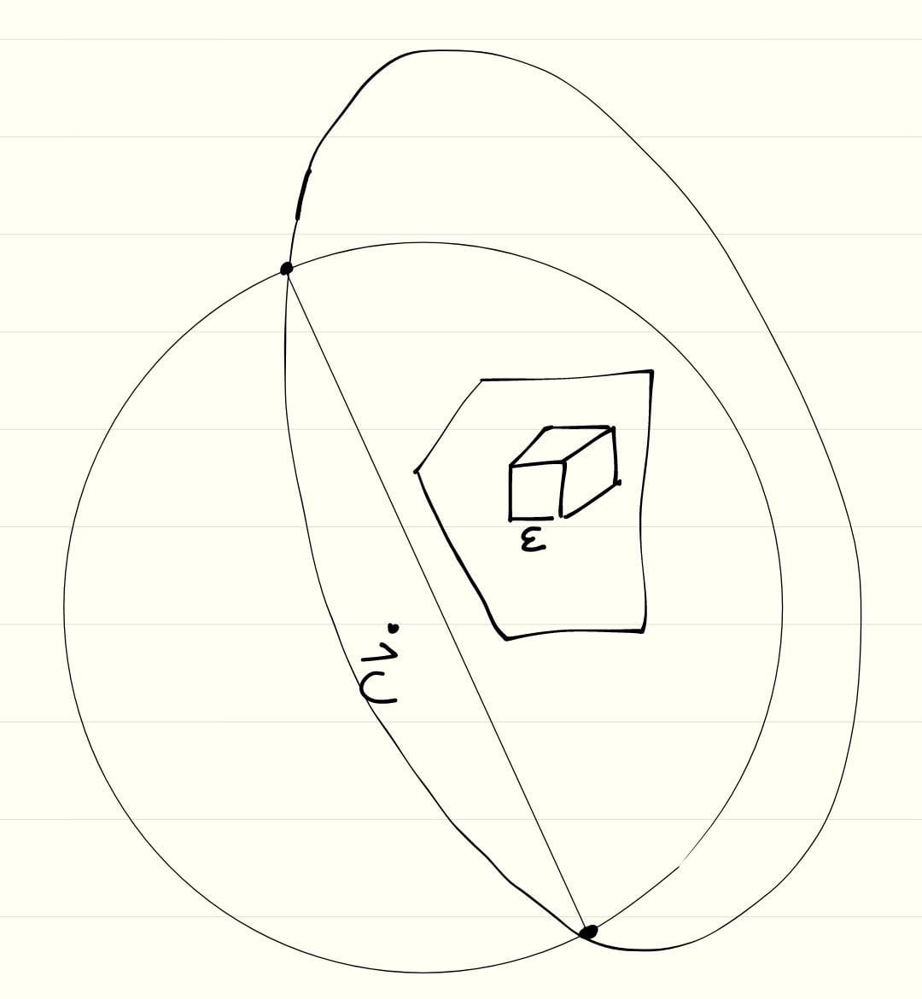
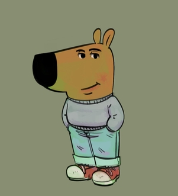

NUS CS Course Reviews Part 3A
=============================

I covered all the CS Foundation Courses I have taken in part 1 to 3. One semester later, I took 2 more CS courses in the Algorithms & Theory focus area, and today I shall give my review to both of them.

CS3231 Theory of Computation
____________________________

I took this in AY24/25 Sem 1 under Prof. Sanjay Jain. My final grade is B+.

* Tutorials (10%)
* Midterm 1 (25%)
* Midterm 2 (25%)
* Final (40%)

As a CS theory enjoyer, this is by far the most interesting course I have taken so far. CS1231S is the only prerequisite, but is also a very strong prerequisite. The course is rigorous and uses a handful of contents covered in CS1231S. It is possible to take this course without taking CS2040S/CS3230, though I will warn that having taken these courses gives a significant amount of advantage in some chapters, especially the one on NP Completeness.

The course is roughly divided into four sections:

1. Deterministic Finite Automata (DFA) and Regular Languages
2. Push Down Automata (PDA) and Context-Free Languages
3. Turing Machines and Recursively Enumerable Languages
4. Computability and Computational Complexity Theory

Essentially, this course is a rigorous treatment of computers and computations. What I mean by that is that we will eventually give the most general (in the sense of computing power) mathematical definition of a computer, known as Turing machine, then use this as a model of computation to derive interesting results on what can/cannot be computed (computability theory, also known as recursion theory), and how efficient can the computation be done (computational complexity theory).

   `Turing machine is just the mathematical definition of a computer <https://ifunny.co/picture/tx8g0L5s8>`_

From my point of view, the first two section above is really just an introduction to automata theory and language theory, in order to get us ready to study Turing machines. This means that in some sense, section 3 is the "punchline" of the course. Only a small part of section 4 is tested in the final, as it just serves as an introduction to the natural continuation of the course, i.e. CS5230 Computational Complexity. I have also signed up to take this course and will come back with a course review in 4 months.

Part of the reason I had so much fun in the course is attributed to the friends I have made along the way. In the tutorial, I met two people who are CS2040S TA, just like me, and another two people who are CS1231S TA, just like me. This is in addition to several other people who all had very strong and respectable backgrounds. It was a lot of fun getting to know them and talk to them throughout the semester.

**Content Difficulty: 7/10.** This course emphasizes on rigorous proofs. One common mistake in studying such courses is to get lost within the ocean of formalism, forgetting to take a step back and admire the big picture (refer to `this essay <../on-learning-and-teaching-mathematics/index.html>`_ where I discuss this in a bit more detail!). If we remember to do that, the content really isn't super difficult to understand. Tutorials are extremely helpful in this regard, so do spend time to attempt all questions.

**Workload: 10/10.** 2 hour weekly lectures and 1 hour of tutorial. Compared to CS4234 (the only other CS course I took in the semester), this course has a heavier workload. The main source of workload comes from the weekly tutorials, for which we are required to submit our attempt. I habitually typeset my solutions in LaTeX, which adds towards the time required to complete them. Tutorial questions are a mix of easy and hard difficulty, and generally take me more than one day to complete.

**Prof & TA: 11/10.** This course has easily the best teaching team I have ever seen in my candidature at NUS. This teaching team consisted only of Prof. Sanjay and TA Ivan. They had been extremely supportive throughout the semester. Both lectures and tutorials were hosted by Prof. Sanjay, and these classes were engaging. Ivan never hosted any class, but was still able to make so much impact by giving very personalized and useful feedback on each of our tutorial submissions. Both Prof. Sanjay and Ivan also spent a lot of effort answering our questions in the course Discord. By "spend a lot of effort", I mean that they don't just provide us with answers. They also provide hints and intuitions behind solutions. This is true even for questions that are out of syllabus.

   Prof. Sanjay explaining intuitions behind the solutions to a sample final paper, username redacted just in case.

It is just so apparent to me that the goal of the teaching team is to help us learn, rather than just to provide us with clever solutions and laughing at us for not being able to come up with these solutions on our own. For this, I heavily respect and appreciate their effort.

**Assessment.** There are two midterms. Midterm 1 is about DFA and regular languages, and Midterm 2 is about PDA and context-free languages. They are not midterms, but closer to something like 1/3-terms, because midterm 1 usually happens earlier than the midterms of other courses (week 6), and midterm 2 usually happens later (week 10).

Prior to each of the three exams, a sample paper with exactly the same format and about the same difficulty will be released. The format is essentially 5 questions (10 for final) in 1 hour (2 hours for final), most of which require proof-writing.

The exam questions are difficult. The first two or three questions might still be doable, but beyond which I basically aim to write down something that can get me partial marks. I don't yet have a good method to prepare for these exams apart from simply doing more exercises, but also I don't complain about the difficulty. Thanks to the teaching team's explanation on the intuitions behind these solutions, I totally see how these questions are doable for people who are extremely familiar with the content, and I am just not there yet.

CS4234 Optimisation Algorithms
______________________________

I took this in AY24/25 Sem 1 under Prof. Divesh Aggarwal. My final grade is B+.

* Individual Scribe Notes (10%)
* Tutorial Participation (10%)
* Graded Assignment 1 (25%)
* Graded Assignment 2 (25%)
* Final (30%)

The teaching team of the course had to change during week 1 due to unforeseen circumstances. As a result, week 1 lecture was cancelled, week 2 lecture was covered by Prof. Seth Gilbert, and lectures from week 3 onwards were covered by Prof. Divesh.

Under Prof. Divesh, this course emphasizes on proof writing as well as design and analysis of algorithms. One has to be reasonably strong in CS1231S and CS3230 content to be able to follow along. Perhaps unfortunately, I didn't spend enough effort when taking CS3230 (refer to `this course review <../nus-cs-course-reviews-part-3>`_), and subsequently the course did end up quite challenging for me.

Most of the time (exceptions being network flows and linear programming), the overarching theme of the course is on applying different techniques to obtain "good enough" solutions to intractable problems. This often results in approximation algorithms, although in the first lecture, we are also introduced two other types of "good enough" solutions.

   `Relevant meme to avoid wall of text. <https://www.reddit.com/r/ProgrammerHumor/comments/d2kpru/traveling_salesman/>`_ Edit, 22 June 2025: I am doing an FYP on this problem now!

For completeness, the following is the list of contents covered in the course in chronological order, specific to this special iteration under Prof. Divesh.

1. Weighted Vertex Cover
2. Weighted Set Cover
3. Traveling Salesman Problem
4. Weighted Boolean Satisfiability
5. Network Flows
6. Semidefinite Programming
7. Linear Programming

More than the combinatorial optimization problems themselves and the algorithms that "solve" them, the focus on the course are the different techniques used to obtain these algorithms. Sometimes, there are simple greedy/randomized algorithms that yields good approximation ratios. Other times, we can use linear programming/semidefinite programming with a clever rounding scheme to obtain good approximation ratios. Being able to apply these techniques on other problems is what will be tested in the graded assignments as well as the final exam. This basically summarizes about 70% of the course content. The remaining 30% consists of miscellaneous fun stuff like Lovász local lemma and probabilistic method, flow networks, as well as some discussion on linear programming.

I found the contents very interesting and enjoyable. It was eye-opening learning about the various techniques used in designing algorithms for intractable optimization problems. This is the first course I have taken that has significant relevance to what I could do in my final year project. Motivated by the contents of the course, part of my winter vacation plan is, in fact, to look into some research problems along this direction.

**Content Difficulty: 10/10.** "This is probably the most difficult algorithms course you will do as an undergraduate" - Prof. Divesh. This course is an advanced version of CS3230. From my point of view, being able to follow through the lectures is not that difficult, with the help of lecture notes a bit of effort. The real difficulty comes to learning the techniques involved and being able to apply them to other problems. For this reason, the problem sets as well as graded assignments are super difficult.

   Illustration of the ellipsoid method from my scribe notes.

**Workload: 7/10.** 2 hour weekly lecture and 1 hour of tutorial. I spent less time on this course compared to CS3231 (the only other CS course I am taking in the semester). In hindsight, this might not be a good idea. I usually go through every lecture note after they have been released (which is at least 8 days after the lecture itself). Prior to some tutorial sessions, there would be problem sets for us to attempt. There was no need to make any submission, but we would be asked to present our solutions during the tutorial to earn participation marks.

In the second half of the semester, there were two graded assignments. I personally typeset my solutions in LaTeX. These assignments were literally the peak difficulty of the course. I spent a huge amount of time on every single problem and ended up submitting assignment 1 late by one day. I started assignment 2 very early and still ended up taking 2 weeks and submitting it only one day before the deadline.

Lastly, each student was assigned to complete individual scribe notes on one lecture, typeset on LaTeX. I was allocated the last lecture, in which we covered the ellipsoid method, LP duality as well as integral LP solutions (e.g. in the case of maximum bipartite matching). I took slightly less than one week to complete my scribe notes.

**Profs/TAs: 5/10.** Huge respect for Prof. Divesh. He took over the course and handled it quite well despite the unforeseen circumstances. I enjoy his style of teaching, in which he often pauses and asks questions to help us stay engaged throughout the lecture. The lectures are not recorded and there are no slides, but Prof. Divesh handwrites many of the details on the whiteboard in a well-organized manner. 

Some of the tutorial session I attended is covered by a TA, and the others were hosted by Prof. Divesh himself. I found the TA super disorganized. He stuttered a lot when explaining solutions to the problem set problems, and he had quite an illegible handwriting on whiteboard. More than presenting solutions in a clear and orderly tone, it almost seemed like he was thinking out loud and writing random things on the whiteboard.

   `Illustration of the CS4234 teaching team. <https://en.wikipedia.org/wiki/Chill_guy>`_

Despite submissions for the problem sets being optional, it was mentioned that we can submit our solution through email to receive feedback from the teaching team. I did this once for the third problem set and received feedback only 8 days after. Fine, I mean it was an optional submission anyways.

Then comes graded assignment 1, which took an entire month from the date of submission to the day I collected back my graded script. That script looked like it is being put into the bag of a primary school kid and thrown around the classroom (this is a quote from how one of my friends had described it). What I ended up collecting is quite seriously wrinkled and clearly mishandled.

What about graded assignment 2? Well, three days before the final exam, it has come to my realization that I haven't yet collected the graded script. I was apologetic as I thought I might have missed the time period for collection, but upon sending an email, I was shocked to find out that the grading is still in progress. At the time of writing, i.e. one week into the winter vacation, I have not gotten back my script.

**Assessment.** The two graded assignments were super difficult (as admitted by Prof. Divesh himself). In particular, graded assignment 2 was so difficult that some hints are released for some of the problems. Prof. Divesh then promised that the final exam will be very easy. I am super glad that he kept his promise. The final was, in fact, very easy. The bad news is that I'm pretty sure I flunked the easiest problem in that final. I am currently so mad about it I decided to talk about it briefly in the next paragraph.

Essentially, the problem was to prove the existence of an orientation (assignment of direction to edges) of a connected undirected graph where every vertex has an even degree, such that the graph is strongly connected. I was so confident that there has to be a problem on Lovász local lemma on the final exam, so I spent some 15 minutes trying to apply it on this problem, and didn't manage to solve it. The next morning, only a few minutes after I was awake, when I was still in the state of lying on my bed with random thoughts in my head, without even opening my eyes, the solution occurred to me naturally. It was exactly the same argument used to prove that a graph is Eulerian if and only if all vertices have even degree, i.e. start with any vertex, make a cycle, delete the cycle and repeat.

I literally solved the problem with my eyes closed...

Closing Remarks
_______________

CS3231 and CS4234 are the only two CS courses I took in the recently-concluded semester. This is in addition to juggling my teaching duties, in which I handle two CS1231S tutorial classes and one CS2040S tutorial class. I wouldn't say that this is a light workload, considering that I spent an above-average effort on my teaching. Regardless, I had a lot of fun, given that I am learning exactly what I am interested to learn, and teaching is exactly where my passion lies. Ultimately, this semester helped to strengthen my decision to get into research and pursue a career in academia in the future.
