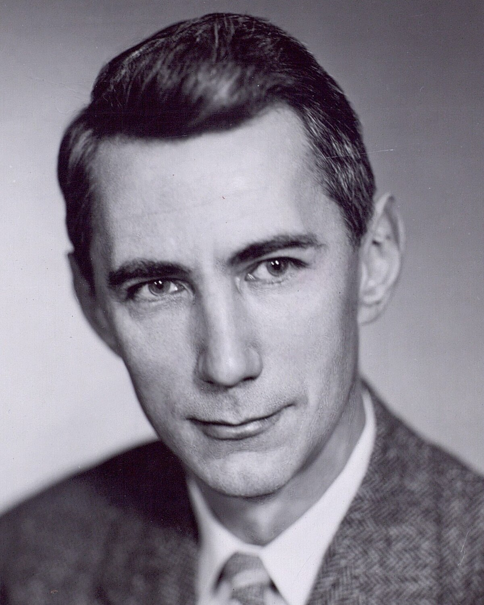
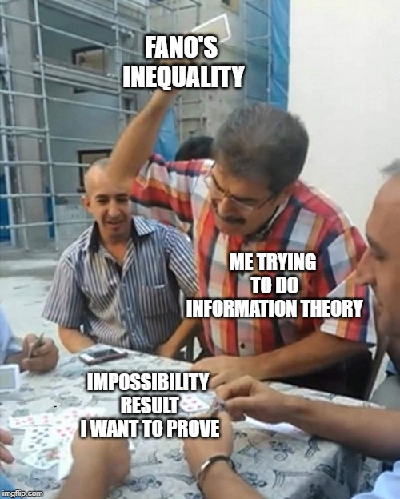
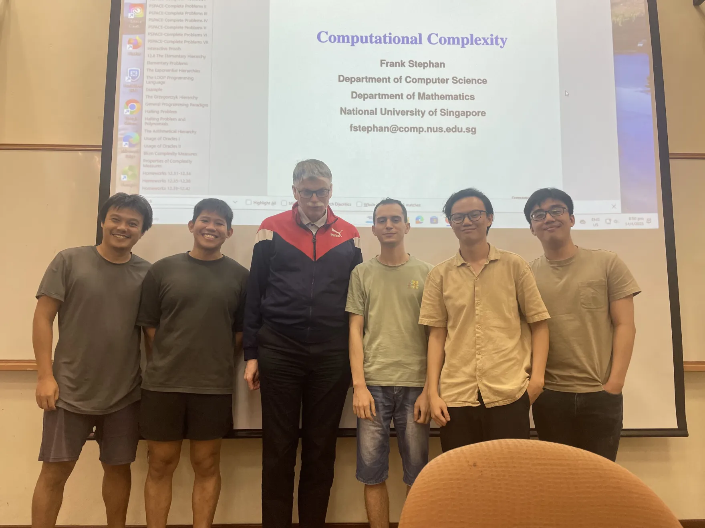
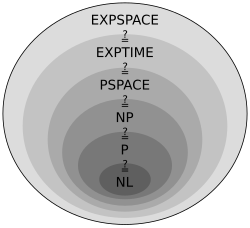
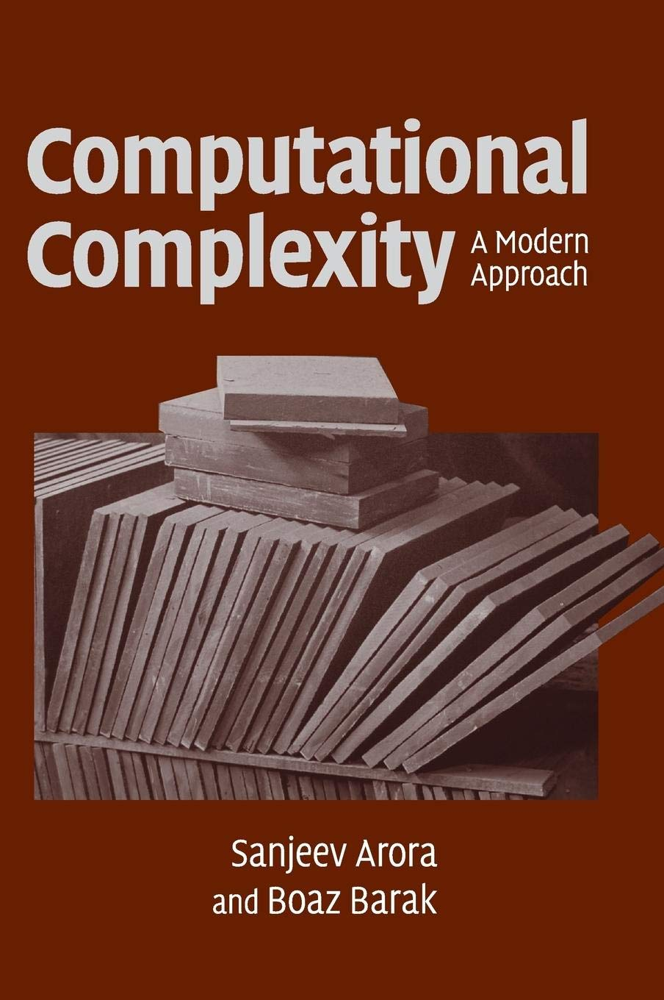
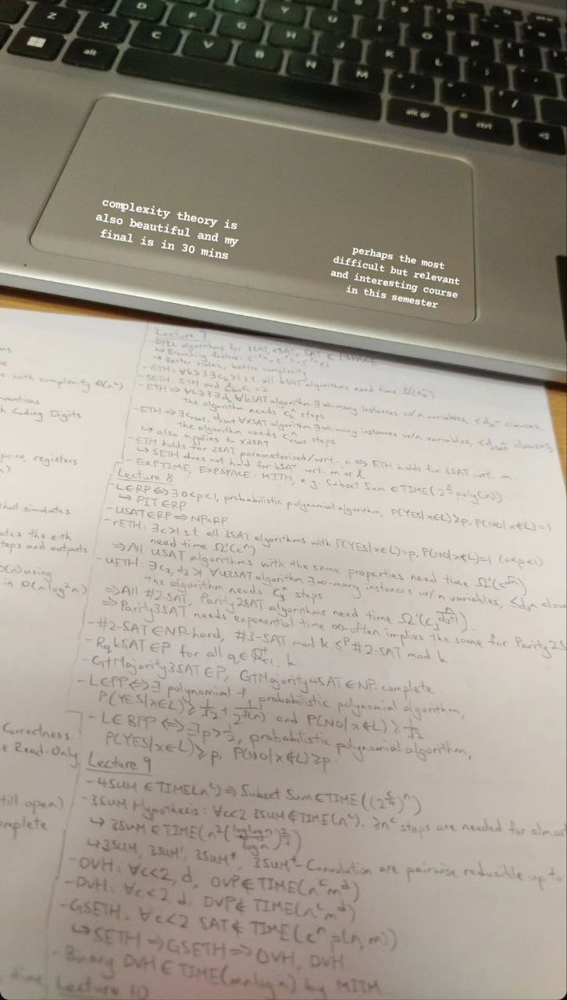

NUS CS Course Reviews Part 5
============================

*Published: May 20, 2025*

My Year 3 has come to an end. I picked up some basic Vietnamese and did an introductory course in economics, right when Donald Trump announced his Liberation Day tariffs. On the technical side, I did a course in information theory, as well as a course in computational complexity. On the teaching side, it has also been a lot of fun tutoring the semester-2 iteration of CS2040S for the second time, and tutoring CS1231S under a different course instructor for the first time.

CS3236 Introduction to Information Theory
_________________________________________

I took this in AY24/25 Sem 2 under Prof. Rahul Jain. My final grade is B+.

* In-Lecture Quizzes (10%)
* Tutorial Participation (10%)
* Assignments (20%)
* Midterm (20%)
* Final (40%)
* Bonus Mark for In-Lecture Quiz Solution Presentation (1% per presentation)

I took this course because it is in the Algorithms & Theory focus area. Up until this point the only course remaining in the Primaries of the focus area that I haven't yet taken is CS4231 Parallel and Distributed Algorithms (though I don't think I will be taking it).

ST2334 Probability and Statistics is a prerequisite of the course, but all we really needed were maybe up until the first half of ST2334? We will not be using the various probability distributions, confidence intervals, hypothesis testing or things like that. We will be using probabilities (duh), expectations, (conditional) independence, the law of large numbers and very basic Markov chains. This list is non-exhaustive but trust me, it ain't much. I consider probability as my weaker area of mathematics but I think I handled the contents well. To be clear, this course is theoretical, so there are a good amount of mathematics involved. With that said, it is as practical as you can get in its focus area.

   `Claude Shannon, the father of information theory <https://en.wikipedia.org/wiki/Claude_Shannon>`_

The field of information theory has an interesting lore: most of the contents we studied in the course originated from an article by Claude Shannon, the father of information theory. Besides this, he made a lot of contributions that essentially laid the foundations of the Information Age. Please go and look him up. He is absolutely underrated. Anyways, here is a brief outline of the course contents:

1. Information Measures
2. Symbol-Wise Source Coding
3. Block Source Coding
4. Channel Coding
5. Practical Channel Codes

I particularly liked the fact that the course has very little content. Here is a summary: First, we define the various information measures like entropy, relative entropy and mutual information. Then, we look at the problem of compressing a source information into codewords so as to minimize the average length of these codewords, or the error probability in the case of block source coding. We show that the fundamental limit of such compressions is given by the entropy. Lastly, we look at the problem of transmitting messages across a channel: how to minimize and correct the errors resulting from the noises in the channel as much as possible. We show that the fundamental limit of channel coding is the mutual information. Throughout the course we also get to see some concrete source/channel coding such as the Huffman Code and the Hamming Code. We even generalized Hamming Code towards the end of the course.

**Content Difficulty: 5/10.** Like I said, the course has very little content and has been very chill. The lectures are easily digestible and the lecture notes published are very concise and well-written. The mathematics is not too difficult to follow. Coupled with occasional stepping back and looking at the bigger picture, it is not difficult to internalize the intuitions behind the materials and be able to appreciate the subject for what it is.

**Workload: 9/10.** 2 hour weekly lectures and 1 hour of tutorial. The main workload of the course comes from the weekly tutorials, for which we are required to submit our attempts to selected questions, graded by correctness. I habitually typeset my solutions in LaTeX, which adds towards the time required to complete them. Tutorial questions are a mix of easy and hard difficulty, and generally take me more than one day to complete. (yes, I copy-pasted this from `my review on CS3231 <../nus-cs-course-reviews-part-3a>`_. The situation is very similar here.)

I unfortunately were not able to submit all the assignments (i.e. tutorials) on time due to other commitments. With that said, I never gave up on attempting and completing them on my own even if it means getting 0 marks. I learn a lot from these questions and also have a lot of fun doing them. This unfortunately means that I lose a lot of marks from the assignment component which ultimately pulled my overall mark to slightly below median (hence the B+ grade), so I guess don't miss the assignments unless you're just as insane? I personally did not regret because being able to learn properly is all I care about.

   `Relevant meme to avoid wall of text <https://theinformaticists.wordpress.com/wp-content/uploads/2022/03/d2b8c-fanoinequality.jpg>`_

**Profs/TAs: 9/10.** I don't really get to know the TAs and the only person we interact with regularly is Prof. Rahul himself. He hosts both the lectures and the tutorials. I just want to begin by saying that he has successfully redeemed himself after all the bad reviews on him and his teaching in some other courses (`my review on CS3230 <../nus-cs-course-reviews-part-3>`_, which I took under him, mildly hinted towards the same sentiment as well). In this semester, I see him being extremely coherent and clear in his lectures. The pace is very slow (as there are also very little content to cover) and he really goes all out to make sure everyone gets it before moving on. The TAs, on the other hand, might be a bit too slow in giving feedbacks for assignments, but they do give constructive feedbacks when necessary, so I also appreciated that a lot.

One opinion I have is that the teaching team has not emphasized too much on how to solve problems. Tutorial sessions have been about presenting solutions, but never about explaining the intuitions behind how to get there in the first place. The chain rule for mutual information has several forms and it is just unclear when to use which. Many times asserting inequality relations between information measures just boils down to algebra, so either we see it or we don't. Now this is where I put a little disclaimer that I stopped attending the tutorials in the last few weeks so this issue might have been addressed without me noticing.

**Assessment.** Both the midterm and the final were honestly very manageable for me. I am glad to have upper quartile on the midterm and slightly above median on the final. From my perspective, most, if not all, of the questions on the exams are very much doable. In particular, they are easier than the assignments. There are also only 4 questions if I remember correctly? But we are given 2 hours to do them, and these are certainly not IMO-style problems, so allocating 30 minutes per question is actually very ample. The questions I weren't able to do, upon reflection, mainly reveals my lack of familiarity on the content.

Besides the midterm and the final, we earn tutorial participation marks by presenting solutions to the assignment questions. Each student needed to present around 3 solutions to get the full mark. I presented 4 times and stopped attending tutorials in the last few weeks because I didn't finish the questions and didn't want to get spoiled. Lastly, there are sometimes in-lecture quizzes consisting of around 4 MCQ questions for which we are given 15 minutes to do. I usually find them tough and tend to not do well. There were three of these and the teaching team ended up taking the best two.

CS5230 Computational Complexity
_______________________________

I took this in AY24/25 Sem 2 under Prof. Frank Christian Stephan. My final grade is A.

* Homework (10%)
* Midterm (30%)
* Final (60%)

Being the first graduate-level course I have ever taken, I have had a very interesting and distinct experience with the course. In week 1 lecture, there were around 9 to 10 students. Several students have since dropped the course and we ended up with only 5 students, consisting of 2 undergraduates, 1 master and 2 PhDs. To be clear, I do not think that every Level 5000 course is like that. I have seen people trying to bid for courses like CS5242 Neural Networks and Deep Learning and weren't successful, presumably due to its popularity. At the time of writing, the field of AI is "where the money is". In contrast, most CS undergraduates tend to already develop a fear/frustration towards the topics of mathematics and theoretical computer science from the moment they do CS1231S, and they tend to treat these subjects as something that they have to suffer through in order to graduate and go to "where the money is". This is indeed something I constantly think about and have been actively working on addressing as much as possible :/

   
   The class photo. The third person from the left is Prof. Frank Stephan.

I realized I have been going a bit off-topic so anyways here is an overview of what complexity theory is all about. I do want to warn that as this will be my area of specialization, I will likely yap for several long paragraphs to put into words the beauty of the subject as I see it. This course has CS3231 as a prerequisite and it's really a continuation from where CS3231 left off. Having studied a little bit of automata theory and language theory, CS3231 defined a Turing machine and studied it in terms of what it can/cannot compute. CS5230 then takes over and addresses a deeper question: among the computable problems, how efficiently can we compute them? This is where we make a leap from computability theory (aka recursion theory) to computational complexity theory. Here is a list of topics covered:

1. Models of computation and the asymptotic notation
2. Different complexity measures and hierarchy, diagonalization
3. :math:`\text{LOGSPACE}` and its relation to :math:`\text{P}`
4. :math:`\text{NLOGSPACE}`, :math:`\text{ALOGSPACE}`, :math:`\text{ALOGSPACE}`, :math:`\text{NC}` and Savitch's theorem
5. :math:`\text{LINSPACE}`, :math:`\text{NLINSPACE}`, :math:`\text{CSL}` and the LBA problems
6. :math:`\text{P}`, :math:`\text{NP}`, :math:`\text{coNP}` and :math:`\text{NP}`-complete problems
7. DPLL algorithms in :math:`\text{EXP}` and/or :math:`\text{EXPSPACE}`, the Exponential Time Hypothesis (ETH)
8. :math:`RP`, :math:`\text{PP}`, :math:`\text{BPP}`, the Valiant-Vazirani theorem and the complexity of counting
9. Conditional lower bounds for problems in :math:`\text{P}`
10. The complexity of multiplication and matrix multiplication, nondeterministic deciders
11. The Poylnomial hierarchy and :math:`\text{AP} = \text{PSPACE}`
12. :math:`\text{PSPACE}` and beyond

Seeing the different complexity classes and the relations between them makes me appreciate complexity theory as a subject that essentially classifies computational problems, or puzzles, into hierarchies of computational hardness. Some puzzles are easy to solve, like finding a certain element in a list. Some are hard to solve, but it is easy to verify a proposed solution, like sudoku. Are these two classes of puzzles the same? Some puzzles are not only hard to solve, but also hard to verify a proposed solution, like chess. If given a certain configuration on the chess board someone makes a move and claims that it is optimal, how do we know whether they're right?

Furthermore, some puzzles fully characterize a certain complexity class! The Satisfiability :math:`(\text{SAT})` problem, along with thousands of other important puzzles, some related to practical areas such as operations research like the Travelling Salesman Problem :math:`(\text{TSP})`, are surprisingly complete for the class :math:`\text{NP}`. What this means is that every other puzzle whose solution is easily checkable can be viewed, if we squint our eyes hard enough, as an instance of :math:`\text{SAT}`, or as an instance of :math:`\text{TSP}`. Then there's alternation: some puzzles are essentially a two-player game just like chess. If we limit the number of moves by enforcing a polynomial bound, then we have a characterization on :math:`\text{AP}`, which is in fact the same as :math:`\text{PSPACE}`. More fundamentally, the problem of evaluating a quantified Boolean formula is :math:`\text{PSPACE}`-complete, as we can think of "there exists" as player 1 and "for all" as player 2, and we are trying to get player 1 to win a game described by the formula. Is there a move, such that for all possible moves from player 2, player 1 can make a further move, such that for all possible further moves from player 2, and so on and so forth, so that the formula evaluates to true?

   
   `A hierarchy of complexity classes. NL refers to NLOGSPACE and EXPTIME refers to EXP in this blog <https://en.wikipedia.org/wiki/Complexity_class>`_

The fact that we can classify puzzles like so, reason about their hardness by means of reducing one puzzle to another is to me the beauty of the subject. Another new and developing area of complexity theory is fine-grained complexity, where for example we look at a problem already known to be in :math:`\text{EXP}` and asks how small can we make the base of the exponent in the time complexity, or look at a problem already known to be in P and asks whether we can do it in linear rather than quadratic time. `This answer <https://cstheory.stackexchange.com/questions/5323/are-pspace-complete-problems-inherently-less-tractable-than-np-complete-prob/5337#5337>`_ by Ryan Williams, as remarked himself, serves as a pretty good illustration of this idea.

Now, despite the already-packed content of the course, there are topics that I wish were covered in the course, some of which are in fact listed in NUSMods but was never covered presumably due to the description being outdated. I wish Cook's theorem was revisited, so that one can see how exactly is :math:`\text{SAT}` characterizing :math:`\text{NP}`. I wish there were more than one slide of elaboration on Gap theorem, for it was also in the last lecture of CS3231 but not elaborated further. I wish approximation algorithms and the related complexity classes like :math:`\text{APX}` and :math:`\text{PTAS}` are covered, because they are strongly related to my final year project. I also wish there were lectures dedicated to interactive proofs as from what I've heard, the topic is nice intersection between complexity theory and cryptography. I had also come across terms like the PCP theorem and the Unique Games Conjecture from CS4234 and was hoping CS5230 talks about them briefly. As I start to type out this list, I find that these are indeed a bit too much to add and perhaps it is understandable for some of them to be left out. Regardless, I will be reading more about them on my own for sure.

**Content Difficulty: 11/10.** Generally I couldn't understand much from the lectures and I had to go through the slides afterwards. The slides are typically wordy to allow us to read up on our own. Going through the slides takes a minimum of one day, depending on how much I know beforehand regarding the topic, and how stressed I am. I'll just say that Prof. Frank Stephan's slides are not the best piece of text to read. He has a distinct choice of writing style and sentence structuring which I wouldn't say is grammatically incorrect, but rather unconventional. I spent a good amount of effort understanding every result from how to prove it in my own words to what it intuitively communicates and its significance. I had to make some hand-wavy attempts to convince myself to move on and believe the result rather than getting stuck with a particular detail of the proof.

It sometimes also took a substantial amount of searching up on the Internet to get a different perspective or explanation to the same topic. The book Computational Complexity: A Modern Approach by Sanjeev Arora and Boaz Barak has been helpful a couple of times, although not everything can be found there. Despite this, the book did cover way more than the course was able to cover and I have plans to go through it on my own in the future. Wikipedia and the CS Stack Exchange are also excellent online resources.

   
   `Cover page of Computational Complexity: A Modern Approach by Sanjeev Arora and Boaz Barak <https://www.amazon.com/Computational-Complexity-Approach-Sanjeev-Arora/dp/0521424267>`_

One highlight is that in the first two weeks, Prof. Frank Stephan tried to illustrate the idea that there are other machine models out there apart from Turing machines, and we can similarly study the complexity of problems with respect to these machines. He did so by introducing the addition machine, a register machine that has a fixed number of registers and can perform addition and comparison as basic steps. This is a machine studied by Floyd and Knuth in the past. Prof. Frank Stephan and Prof. Sanjay Jain also had a paper about the machine concerned with, among other things, the number of registers required to achieve a linear time bound. I remember having nothing else useful to refer to when studying the first two weeks of lecture. Some of us thought that this will be the case for the rest of the course but thankfully the course focused on Turing machines from week 3 onwards.

**Workload: 8/10.** 2 hour weekly lectures and 1 hour of tutorial. The lecture and the tutorial are back-to-back and happens after dinner hours. Each week's lecture will have a set of homework problems associated with it, and each student is expected to do a total of 10 problems in the entire semester. For example, we are allowed to not do any homework problem for one lecture and do several from another lecture. The solutions need to be posted on Canvas, and then a presentation of the solution is made in the following week's tutorial. The homework problems have varying range of difficulties from being very trivial to very tricky. I initially aimed to do one problem every week that I find challenging personally. I couldn't catch up due to other commitments and had to do some easy ones towards the end of the semester to secure the homework grades. I prepared for the midterm and the final by making a help sheet and looking through the only sample paper posted.

The way the homework policies are set, the minimal effort required to secure the homework grades is actually very low, though I imagine there will be a good amount of guilt and to some extent, disrespect, to both the lecturer and to ourselves, if we deliberately choose the easiest problems from early weeks for all 10 homework problems. Majority of my time is spent on going through the lecture slides and making sure I genuinely understand most, if not all, of what is covered. The score of 8/10 accounted for this effort.

**Profs: 8/10.** I see that Prof. Frank Stephan is actually trying to improve this teaching, though unfortunately during the semester, no one - me included - gave a constructive feedback to his teaching. I will be honest that I didn't do it because I didn't want to appear nitpicky and disrespectful. I did write down my feedback at the end of the semester so I hope that would be helpful for him to improve in the future.

It actually came as a surprise to me that Prof. Frank Stephan is the lecturer for the course, though it wasn't a negative feeling when I found out, since I didn't know how his teaching is like, and maybe it's good. When the first lecture came along, I found his voice monotone and he is often just reading words from the slides without much elaborations. I had a hard time understanding his utterances as well due to his German accent. I eventually got a bit used to the accent but it still seemed impossible for me to understand the content during the lecture, so I resorted to reading on my own while also paying attention to the things he say during the lecture with the hope that it will aid my self-studying later on. The slides had a similar layout as CS3231's slides by Prof. Sanjay Jain, but is a lot more wordy and has a distinct writing style, though I feel like this isn't too bad to get used to.

With all of these being said, I still commend Prof. Frank Stephan for his subtle effort in making us laugh (he keeps mentioning how an answer to the :math:`\text{P}` versus :math:`\text{NP}` problem should be difficult to get accepted in academia and it's quite funny to me), his strict implementation of university rules by never leaving his belongings unattended and stopping a classmate from eating a banana in class, (more seriously) his extremely helpful feedback for our homework solutions, his humble apology when I asked him something he didn't know straight away, and lastly his immense kindness and patience towards us (he literally still answers questions right now, at the time of writing, which is 2 weeks into the summer break). I respect him not just for his research output but also his character and personality.

   
   My Instagram story 30 minutes before the final, featuring my help sheet.

**Assessment.** The midterm and the final papers are a lot easier than I anticipated them to be. Most of the problems are easy once one has genuinely understood the lecture content, and there are even some clear giveaways. This is in contrast to exams where one has to grind and solve many problems to gain experience in doing them efficiently during the exam. As mentioned earlier, I prepared for these exams by making my own help sheet and going through the sample papers. The whole process took less than one day each.
