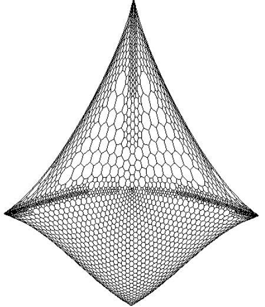
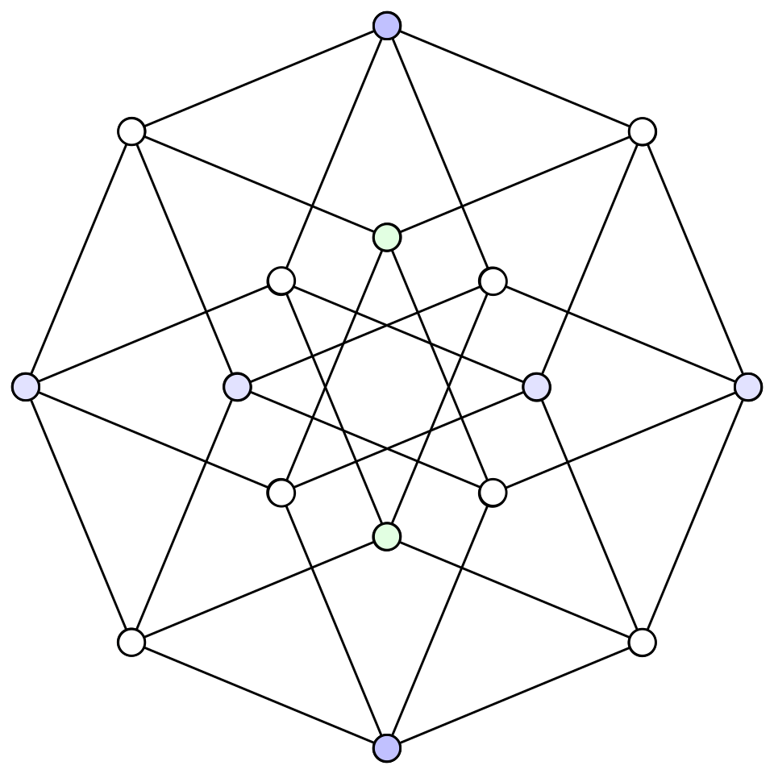
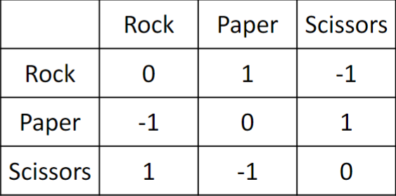

NUS CS Course Reviews Part 7
============================

*Published: May 14, 2026*

My last semester as an undergraduate has come to an end, and I would say that it ended on a high note, one of the reasons being that I took CS5275.

CS5275 The Algorithm Designer's Toolkit
_______________________________________

I took this in AY25/26 Sem 2 under Prof. Chang Yi-Jun. My final grade is *[TO BE ANNOUNCED]*.

* Midterm (25%)
* Problem Sets (35%)
* Final (40%)

Under Prof. Chang, the course has been structured to cover three major topics, namely expander graphs, Boolean functions and multiplicative weights update. These are three seemingly unrelated topics that turn out to all be relevant in many areas of theoretical computer science. The course blew my mind away in many instances. Many ideas presented in the course are just... really beautiful and brilliant.

Loosely speaking, an expander graph is a well-connected graph. The measure for well-connectedness of a graph is roughly the amount of effort required to disconnect the graph, relative the size of the region being disconnected. We studied many useful properties of expanders, e.g. how it is robust against edge deletions and how it has low random walk mixing times. We also looked at the Leighton-Rao algorithm for approximating conductance, which in turn shed light on the beautiful technique of metric embedding. Lastly, we had to quickly pick up spectral graph theory, i.e. the study of graphs via the eigenvalues of matrix representations of these graphs. This leads us to study Ramanujan graphs which are the best expanders in some sense. This concludes the first half of the semester.

The second half of the semester begins with the study of Boolean functions. We learnt about the Fourier expansion of Boolean functions and the BLR linearity test. We then turned to an application of Boolean functions in social choice theory, and saw how an election can be modeled as a Boolean function, culminating in a proof of the Arrow's impossibility theorem. Lastly, we saw how Boolean functions with a concentrated Fourier spectrum can be efficiently learnt via the Goldreich-Levin algorithm.

The last two lectures are dedicated to the multiplicative weights update framework for making predictions based on experts' advice. We saw how the framework can be applied to learn a linear binary classifier, solving a fundamental machine learning problem rigorously. Finally, we used the same framework to prove the minimax theorem for zero-sum games.

   `Drawing of a graph using the eigenvectors corresponding to the two smallest eigenvalues of its Laplacian matrix. <https://www.mathe2.uni-bayreuth.de/axel/papers/koren:on_spectral_graph_drawing.pdf>`_

I see connections between some of the topics in the course with my research area in hardness of approximation. In the problem I am literally working on, namely the Travelling Salesman Problem (TSP), the state-of-the-art inapproximability bound is obtained, and can be improved, just by demonstrating the existence of certain specialized types of expander graphs. I might write a blog to elaborate more about this for those who are interested.

It was also eye-opening for me to realise that Boolean functions are among the fundamental ingredients behind the original proof of the well-celebrated PCP theorem. When I stumbled upon `Håstad paper <https://www.cs.umd.edu/~gasarch/TOPICS/pcp/hastadopt.pdf>`_ for the first time last year, I found it very technical and intimidating. Looking at the same paper again recently, I saw familiar terminologies like "Fourier coefficient". Suddenly, understanding the PCP machinery seemed very much within reach. If this wasn't fascinating enough, a significantly simpler proof of the PCP theorem was discovered in 2005 by Irit Dinur, using expander graphs.

Then there is the connection between Boolean functions and social choice theory. I first learnt about Arrow's impossibility theorem when taking EC1101E. The lecturer at that time, for obvious reasons, did not prove the theorem and said that it was graduate-level. I was there wondering why would there even be theorems and proofs in an introductory economics course! My vocabulary is insufficient to describe how I felt when in CS5275, I saw the precise formulation of the theorem, followed by a clean proof of it. From my point of view, I now mentally group Arrow's impossibility theorem and PCP theorem under the same major topic. This connection was the most surprising to me.

   `The 4-dimensional hypercube. <https://en.wikipedia.org/wiki/Hypercube_graph>`_

The bijection between voting rules and cuts in the hypercubes blew my mind once again. It turns out that several important properties that quantify whether a voting rule is good turn out to be related to the conductance of the corresponding cut in a hypercube. The study of voting rules eventually yields Poincaré's inequality which we can then use to show that hypercubes are decent expanders. Just like that, we have connected social choice theory with a specific family of graphs in graph theory.

The Goldreich-Levin algorithm is also important in the seemingly-unrelated area of cryptography. In fact, the algorithm was first devised to answer a question in cryptography! Considering that my potential PhD advisor also works in cryptography, it is of my interest to also eventually understand a little bit about the area. I'll write what I currently know here: The roughly idea is that thanks to the Goldreich-Levin algorithm, we can efficiently construct pseudorandom generators from one-way functions. We don't yet know whether one-way functions exist, but if they do, that would be a very massive advancement in our understanding of randomization.

Just so that multiplicative weights update receive some love, I will briefly mention the fact that the minimax theorem for zero-sum games can be applied in the computational complexity setting to give Yao's principle, an important theorem covered in CS5234 that can be used to establish lower bounds for randomized algorithms. The connection is somewhat beautiful: the two players in question are simply the algorithm designer and the adversarial input designer. The minimax theorem then allows us to prove lower bounds for randomized algorithms by playing the game as an adversary: to come up with an input distribution so difficult that no deterministic algorithm with too small of a complexity can be correct against it.

   The payoff matrix for rock paper scissors (screenshot from Prof. Chang's slides), a classic zero-sum game. The row and the column player want to minimize and maximize the payoff, respectively.

**Content Difficulty: 8/10.** I think due to the sheer breadth of the materials covered, not one topic has appeared to be too difficult for me, but overall there are many things to get used to and learn (and admire). For anyone taking a graduate-level course for the first time, however, I believe the course will still appear to be more difficult than anything you have seen before. The same advice I had for CS5234 applies here: make lecture notes consistently. I will post some of my lecture notes here in the near future for anyone interested.

**Workload: 8/10.** 3 hour weekly lectures. For the first two weeks, all three hours are dedicated to lecture. Subsequent weeks had the last hour dedicated to tutorial sessions. The tutorial sessions either discuss a tutorial problem set or a (mandatory) problem set. The former was held by Prof. Chang himself while the latter was held by TA Ivan. The main workload for me comes from attempting the mandatory problem sets and also making my own lecture notes. I miscalculated the effort I needed to finish the first problem set and hence I basically did not attempt it, though thankfully the grading only takes into consideration the best three out of four problem sets.

**Profs/TAs: 10/10.** The teaching team consists of Prof. Chang and TA Ivan, both of which are absolutely amazing. Prof. Chang is a really good lecturer because he explains everything in a very fluent manner, also spending effort to make sure everyone gets the intuitions before moving on. I like how he frequently points out when is a good time to ask questions, and from which point onwards the remaining of the lecture will depend solely on what is being covered so far. It really encourages us to raise whatever doubts we might have. The result is a very lively class that frequently raises questions and discussions, rather than only Prof. Chang himself talking for the entire lecture. I would say that this course gave me the best classroom experience I have ever seen in NUS.

The course had roughly 30 students and is not bell-curved. The following is extracted straight from an announcement by Prof. Chang:

   If you did well, congratulations! If not, that's completely ok. It's academic folklore that "the best grade in grad school is a passing grade," as there are many meaningful and important things to focus on beyond exams. I recognize that this course attracts very strong students with a deep interest in algorithms and theory, so the average student quality of the class is likely above the average within NUS School of Computing. I will take this into account when assigning final grades, so don't worry about your grades too much.

TA Ivan is as amazing as he had been back in CS3231. Apart from grading the problem sets, I highly appreciate his effort in preparing his grading remarks. On average, these documents are 15-page long per problem set, listing out for each problem the solutions and common mistakes. He explains in impressive details the thought process behind each solution, and for every common mistake he also explains what exactly went wrong, how much were deducted etc. Even Prof. Chang himself couldn't imagine how much time it would have taken for him to produce these remarks.

**Assessment.** There are tutorial problem sets and (mandatory) problem sets. As the names suggest, the former is not graded (only discussed during tutorial sessions) while the latter is graded. There are in total 4 mandatory problem sets with 16 marks each, but the teaching team only considers the best three. By presenting solutions during tutorial sessions, we can earn extra marks of up to 3.5%, where 3% is for the first presentation and 0.5% is for the second. The 48 marks from the best three problem sets combines with the extra 3.5% to be the final grade for the Problem Set component, capped at 35%. Basically, it really seemed like the teaching team wanted to give us this 35%.

Both the midterm and the final are of similar difficulty. From my perspective, they are challenging. For both assessments, I consistently do very slightly better than the median. The paper has some questions that are obvious giveaways, and some others can be gotten via making educated guesses (especially under the format of True/False questions). I struggled quite a lot with proofs. For the midterm, I basically left 2 out of 2 proof questions blank. For the final, I left 1 out of 3 proof questions blank, and I would say that the two questions I didn't leave blank are pretty much giveaways.
