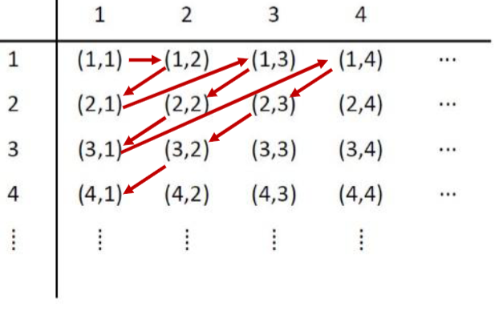

Cardinality
===========

.. note::

    The "Exercise" dropdowns roughly corresponds to week 10 tutorial questions. No solution is provided, reason being a mix of me being lazy and the answers being available online anyways.

Being an essential part of set theory, cardinality studies the sizes of sets. For finite sets, this notion is intuitive: the cardinality of a finite set $A$ is the number of elements in $A$. Let us try to define "number of elements" in a more precise language.

.. admonition:: Definition: Cardinality of a Finite Set

    The cardinality of a finite set $A$ is the unique integer $n$ such that there exists a bijection $f : \{1, 2, \cdots , n\}\rightarrow A$.

This formal definition makes sense if we think about $f$ as a "counting function". When we manually count the elements of $A$, we point to some element and say "this is element $1$", then we point to a second element and say "this is element $2$", and so on. It does not matter which element is assigned to which number, for we know that if $A$ has $n$ elements, we will eventually stop at the number $n$. Similarly, starting from $1$, the function $f$ associates every number to a unique element of $A$ (injective because of the uniqueness), in a way that every element of $A$ is being associated a number (surjective). There is exactly one possible $n$ that the function will stop at, and that is intuitively the number of elements of $A$.

Countability and Countably Infinity
___________________________________

Mathematicians used to think that the notion of cardinality does not get more interesting than that. For infinite sets, they simply declare their cardinality to be undefined (using the symbol $\infty$) and call it a day. This is until Georg Cantor discovered that there are different types of $\infty$. More precisely, there is a piece of intuition which, when formalized, allows us to compare infinite sets and say which ones are "larger" than which other ones. Let us see how.

.. admonition:: Definition: Same Cardinality

    Two sets $A$ and $B$ are said to have the same cardinality, denoted $| A | = | B | $, if and only if there exists a bijection $f : A\rightarrow B$. Note that "same cardinality" is an equivalence relation (prove it!).

This makes sense for finite sets. If two finite sets $A$ and $B$ have the same number of elements, it must be possible to transform every element in $A$ to a unique element in $B$, in a way that every element in $B$ has a unique preimage in $A$. For example, when $A = \{a, b, c, d, e\}$ and $B = \{v, w, x, y, z\}$, the function $f : A\rightarrow B$ where $f(a) = v$, $f(b) = w$, $f(c) = x$, $f(d) = y$ and $f(e) = z$ is a bijection between $A$ and $B$. Such a bijection exists if and only if $A$ and $B$ have the same number of elements, in this case $5$.

So, the thing Cantor did is to extend this notion of "same-cardinalityness" to even the infinite sets. If $A$ and $B$ are infinite, and there is a bijection between $A$ and $B$, we also say that $A$ and $B$ have the same cardinality, i.e. $| A | = | B | $. Let's see our first example. The most natural infinite set is, well, the set of natural numbers $\mathbb{N}$. What other sets have the same cardinality with $\mathbb{N}$?

Observe that $| \mathbb{Z}^+ | = | \mathbb{N} | $, because there is a bijection between $\mathbb{Z}^+$ and $\mathbb{N}$ (note that since we are dealing with bijections, it actually does not matter which one is the domain, and which one is the codomain). For example, the function $f : \mathbb{Z}^+\rightarrow\mathbb{N}$ such that $f(n) = n - 1$ is one such bijection. This function maps $1$ to $0$, $2$ to $1$, $3$ to $2$ and so on, essentially shifting every element of $\mathbb{Z}^+$ by one.

Recall that a bijection $f : \{1, 2, \cdots , n\}\rightarrow A$ can be seen as a "counting function" for $A$. We can now extend this notion to bijections $f : \mathbb{Z}^+\rightarrow A$. If such a bijection exists, i.e. $| A | = | \mathbb{Z}^+| $, then intuitively, we can "count" the elements of $A$ (but we will not finish counting). For example, since $| \mathbb{Z}^+ | = | \mathbb{N} | $, it makes sense that we can "count" the elements of $\mathbb{N}$ by pointing to the element $0$ and shouting $1$, then pointing to the element $1$ and shouting $2$, and so on.

.. admonition:: Definition: Countable Sets

    We define a set $A$ to be countable if and only if either $A$ is finite, or $| A | = | \mathbb{Z}^+| $. If the latter is true, we also say that $A$ is countably infinite. If $A$ is not countable, then $A$ is said to be uncountable.

In other words, by definition, every finite set is countable. Moreover, every infinite set with the same cardinality as $\mathbb{Z}^+$ is countable.

To avoid using the phrase "cardinality of $\mathbb{Z}^+$" repetitively, we will henceforth use the symbol $\aleph_0$ to denote $|\mathbb{Z}^+|$. So, all countably infinite sets have cardinality $\aleph_0$. Note that even though $\aleph_0$ denotes a cardinality, it is not any positve integer. In fact, we say that $\aleph_0$ is an example of a transfinite cardinal number, i.e. it describes a cardinality value beyond the finite numbers. It is even the smallest transfinite cardinal number, i.e. if a set has cardinality "smaller than" $\aleph_0$, then it has to be finite. The proof of this will be delayed to the last page.

According to the definition above, to show that a set $A$ is countably infinite, we have to construct a bijection from $\mathbb{Z}^+$ to $A$. However, as mentioned before, "same cardinality" is an equivalence relation. So, by symmetry, it also suffices to construct a bijection from $A$ to $\mathbb{Z}^+$. Furthermore, by transitivity, we can actually avoid working with $\mathbb{Z}^+$ altogether: if it is known that $B$ is countably infinite, then the existence of a bijection between $A$ and $B$ also shows that $A$ is countably infinite.

Sequence View
_____________

Countably infinite sets are interesting because in the intuitive sense, they are exactly the infinite sets that can be counted, otherwise known as enumerated, one-by-one, in some order, indefinitely. This brings us to an equivalent formulation of countably infinite sets in the language of infinite sequences. Using this formulation over the bijection view has the advantage of simplifying notations.

.. admonition:: Theorem: Sequence View of Countably Infinite Sets

    A set $A$ is countably infinite if and only if there exists an infinite sequence $a_1, a_2, \cdots$ in which every $a_i$ is an element of $A$, and every element of $A$ appears exactly once.

In one direction, suppose there is an infinite sequence $a_1, a_2, \cdots$ in which every $a_i\in A$ and every element of $A$ appears exactly once. Then, the function $f : \mathbb{Z}^+\rightarrow A$ such that $f(n) = a_n$ is a bijection. We are simply mapping every index, or subscript, to the corresponding entry in the sequence. This is an injection because no two indices have the same element, and this is a surjection because every element appears in the sequence.

Conversely, suppose there is a bijection $f : \mathbb{Z}^+\rightarrow A$. Then, the sequence $f(1), f(2), \cdots$ is a sequence in which every entry is an element of $A$, and every element of $A$ appears exactly once.

The moral of the story here is that infinite sequences are conceptually the same as functions with domain $\mathbb{Z}^+$, written in different notations. The indices/subscripts of the entries in sequences correspond to the inputs to the functions, and vice versa. When the function is injective, its corresponding sequence has no duplicated entry. When the function is surjective, every element in its codomain appears in its corresponding sequence.

With the infinite sequence view, we can think about countably infinity differently. In particular, when we want to show that a set is countably infinite, instead of thinking in terms of a problem of constructing bijections, it might be more natural to formulate the problem as "can we list out the elements of the set in a sequence?". Here is one example.

.. admonition:: Theorem: $\mathbb{Z}^+\times\mathbb{Z}^+$ is Countably Infinite

    Exactly what the title says :)

We shall list out the elements of $\mathbb{Z}^+\times\mathbb{Z}^+$ in the sequence $(1, 1), (1, 2), (2, 1), (1, 3), (2, 2), (3, 1), \cdots$ as described by the figure below:

We now have a sequence such that every entry is in $\mathbb{Z}^+\times\mathbb{Z}^+$, and every pair in $\mathbb{Z}^+\times\mathbb{Z}^+$ appears exactly once, so we have shown that $\mathbb{Z}^+\times\mathbb{Z}^+$ is countably infinite. In the function view, we have constructed the bijection $f : \mathbb{Z}^+\rightarrow\mathbb{Z}^+\times\mathbb{Z}^+$ such that $f(1) = (1, 1)$, $f(2) = (1, 2)$, $f(3) = (2, 1)$ and so on. It is also possible to specify $f$ as a singe-line formula, but for our purposes it suffices to know that this can be done without actually doing it.

.. dropdown:: Exercise

    Show that $\mathbb{Z}$ is countably infinite.

It is usually easier to show that a set is infinite than to show that it is countable. Hence, to argue that a set is countably infinite, most of the time we really only need to focus on the latter. For this reason, the following result is often helpful.

.. admonition:: Theorem: Surjection Implies Countability

    If there exists a sequence $a_1, a_2, \cdots$ in which every element of $A$ appears, then $A$ is countable.

Crucially, we no longer require that every element of $A$ to appear exactly once. As long as we have a sequence in which every element of $A$ appears, we can already conclude that $A$ is countable. This is intuitive from the function view: having such a sequence essentially gives us a surjection from $\mathbb{Z}^+$ to $A$. Every element in $A$ is being mapped to by some element in $\mathbb{Z}^+$. Now, $\mathbb{Z}^+$ need not be injective, so there could be more elements in $\mathbb{Z}^+$ than there are in $A$. Loosely speaking, one has $|A|\leq|\mathbb{Z}^+|$, so $A$ is either countably infinite or finite. In both cases, $A$ is countable.

So, if we want to use the sequence argument to argue that a given set $A$ is countable, we only need to give a sequence in which every element of $A$ appears. This is a simplification mainly by allowing us to not worry about duplicate entries in the sequence. In the function view, it suffices to find a surjection from $\mathbb{Z}^+$ (or any known countable set) to $A$.

.. dropdown:: Exercise

    Show that $\mathbb{Q}$ is countably infinite.

Now we are in a good position to analyze $A\cup B$, given countably infinite $A$ and $B$. In fact, we claim that $A\cup B$ will also be countably infinite. The infinity is clear, and the countability can be demonstrated by showing a sequence in which every element of $A\cup B$ appears.

.. admonition:: Theorem: Union of Countably Infinite Sets is Countably Infinite

    If $A$ and $B$ are countably infinite, then $A\cup B$ is countably infinite.

If $A$ is countably infinite, then there exists a sequence $a_1, a_2, \cdots$ in which every element of $A$ appears. Similarly, there exists a sequence $b_1, b_2, \cdots$ in which every element of $B$ appears. Then, the sequence given by $a_1, b_1, a_2, b_2, \cdots$ is a sequence in which every element of $A\cup B$ appears. Note that it is necessary to intertwine the two sequences since both are infinite.

.. dropdown:: Exercise

    1. Show that if $A$ and $B$ are countable, then $A\cup B$ is countable.
    2. Show that if $A_1, A_2, \cdots, A_n$ are countable, then $\bigcup_{i = 1}^n A_i$ is countable.
    3. Show that if $A_1, A_2, \cdots$ are countable, then $\bigcup_{i = 1}^\infty A_i$ is countable.
    4. Show that if $A_1, A_2, \cdots, A_n$ are finite, then $\bigcup_{i = 1}^n A_i$ is finite.
    5. Show that there exist finite sets $A_1, A_2, \cdots$ such that $\bigcup_{i = 1}^\infty A_i$ is infinite.

Moreover, we have the following intuitive theorem:

.. admonition:: Theorem: Every subset of a countable set is countable.

    Exactly what the title says :)

This is intuitive because a subset of a set must be no larger than the set itself. To prove this more rigorously, let $S$ be a countable set and let $A\subseteq S$. Since $S$ is countable, there is a sequence $s_0, s_1, \cdots$ such that every element of $S$ appears. But then, since $A\subseteq S$, that sequence is also one such that every element of $A$ appears, so $A$ is countable.

Uncountable Sets
________________

So far, we have extended the concept of cardinality beyond finite sets, and denoted that infinite sets with the same cardinality with $\mathbb{Z}^+$ have cardinality $\aleph_0$. These are the countably infinite sets. Now, not all infinite sets are countable. A priori, this is not an obvious fact, and the discovery of an uncountable set involved a clever argument given by Cantor, known as Cantor's diagonalization argument. So in fact, there are infinite sets $A$ which, no matter how hard we try, we can never find a bijection between $\mathbb{Z}^+$ and $A$.

Using Cantor's diagonalization argument, we will show that

.. admonition:: Theorem: There is an uncountable set.
    
    The set $(0, 1) = \{x\in\mathbb{R} : 0 < x < 1\}$ is uncountable.

By way of contradiction, suppose $(0, 1)$ is countably infinite, so by definition we know that there exists an infinite sequence $x_1, x_2, \cdots$ such that $x_i\in (0, 1)$ and every number in $(0, 1)$ appears exactly once.

Let the decimal representation of $x_i$ be the (infinite) string $0.a_{i, 1}a_{i, 2}\cdots$. For example, if $x_1 = \frac{1}{2}$, then the decimal representation of $x_1$ is the infinite string $0.500\cdots$, so $a_{1, 1} = 5$, $a_{1, 2} = 0$, $a_{1, 3} = 0$ and so on. Note that $0.499\cdots$ is also a decimal representation of $x_1$, By declaring all decimal representations with infinitely repeating $9$s invalid, we ensure that decimal representations are always unique.

Now, we will construct a problematic number $x^*$ whose decimal representation is $0.b_1b_2\cdots$, where we define $b_i = 1$ if $a_{i, i} = 0$ and $b_i = 0$ otherwise. In the example above, the digits $a_{i, i}$ for every $i$ is highlighted in red and they dictate the digits of $x^*$.

.. math::
    \begin{array}{c|cc}
        x_1 & 0.\textcolor{red}{3}141\dots \\
        x_2 & 0.5\textcolor{red}{9}26\dots \\
        x_3 & 0.53\textcolor{red}{0}8\dots \\
        x_4 & 0.979\textcolor{red}{3}\dots \\
        \vdots & \vdots \\
        \hline
        x^* & 0.0010\dots
    \end{array}

Note that for every $i$, since $b_i\neq a_{i, i}$, one has $x_i\neq x^*$. This means that $x^*$ does not appear in the sequence $x_1, x_2, \cdots$. However, clearly $x^*\in (0, 1)$, so $x^*$ must appear in the sequence $x_1, x_2, \cdots$. We have arrived at a contradiction.

Yes, this proof is very disturbing and weird. Georg Cantor later suffered depression and mental health issues, partially because no one believed that his diagonalization argument is valid. Today, we know that it is valid, and demonstrates a concrete infinite set that is not countable, i.e. uncountable.

Since then, mathematicians have been very creative in adopting diagonalization as a framework to prove impossibility results (in this case, impossibility of enumerating elements of $(0, 1)$). Many other sets have also been discovered whose uncountability may be proven similarly by diagonalization.

.. dropdown:: Exercise

    Show that the power set of any infinite set is uncountable.

Also, now that we know a set that is uncountable, there is a second way to show uncountability:

.. admonition:: Theorem: Supersets of Uncountable Sets are Uncountable

    Exactly what the title says :)

This is a contraposition to the fact that subsets of countable sets are countable. Again, this is intuitive because if a set is already uncountable, any set that contains it as a subset must be no smaller, and hence also uncountable.

So, as a corollary, the set of real numbers $\mathbb{R}$ must be uncountable, since it already contains an uncountable subset $(0, 1)$.

In summary, finite sets have finite cardinalities. Sets with the same cardinality with $\mathbb{Z}^+$ are known as countably infinite sets and their cardinality is denoted $\aleph_0$. Uncountable sets are intuitively larger than countably infinite sets. Now, is there any cardinality that is larger than all the finite ones (i.e. transfinite), but smaller than $\aleph_0$? The answer is no.

.. admonition:: Theorem: The transfinite cardinal number $\aleph_0$ is the "Smallest Infinity"

    Every infinite set has a countably infinite subset.

The intuition is that if $S$ is an infinite set, then $S$ has an infinite supply of elements, allowing us to construct an infinite sequence by repeatedly listing down a previously-unlisted element of $S$. We can then let $A\subseteq S$ be the set of elements that appears (exactly once) in such an infinite sequence. If $S$ is countably infinite, then in fact $A = S$. If $S$ is uncountable, then our listing will always miss out on some (in fact, uncountably many) of its elements. In the function view, this is equivalent as constructing an injection from $\mathbb{Z}^+$ to $S$. The range of this injection, namely $A$, is exactly a countably infinite subset of $S$.

.. dropdown:: Exercise

    Show that if $X$ is infinite and $Y$ is finite, then $| X\cup Y | = | X | $.

Summary
_______

Beyond the finite sets, the smallest transfinite cardinal number is $\aleph_0$. This is the cardinality of $\mathbb{Z}^+$ as well as a bunch of other sets, known collectively as the countably infinite sets. In the function view, there exists bijections between these sets and $\mathbb{Z}^+$. In the sequence view, a set $A$ is countably infinite if and only if there exists an infinite sequence $a_1, a_2, \cdots$ in which every $a_i$ is an element of $A$, and every element of $A$ appears exactly once. Beyond countably infinite sets are the uncountable sets.

In terms of techniques, to show that a set $A$ is countable, it suffices to find a sequence in which every element of $A$ appears. In the function view, it suffices to find a surjection from $\mathbb{Z}^+$ (or any known countable set) to $A$. This is usually done alongside showing that the set is infinite, a task that is typically relatively simple.

To show that a set $A$ is uncountable, we either use the technique of diagonalization, or show that $A$ is a superset of some known uncountable set.

There are various pragmatic results we know regarding the relationships between countability, countably infinity, and uncountability. There are also various sets of numbers known to be countably infinite, such as $\mathbb{Z}^+$, $\mathbb{N}$, $\mathbb{Q}$, $\mathbb{Z}^+\times\mathbb{Z}^+$, and various sets known to be uncountable, such as $(0, 1)$ and $\mathbb{R}$.
