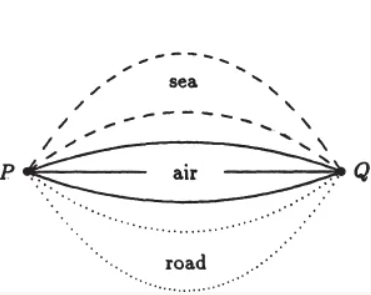
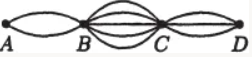
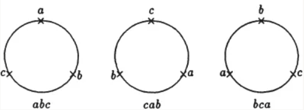
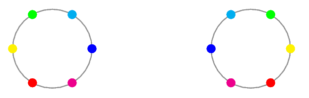
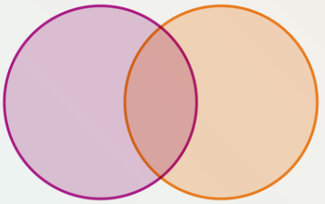
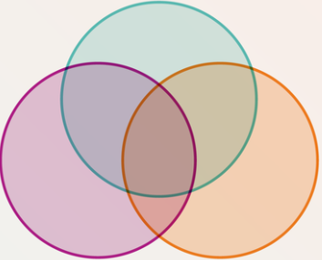

Combinatorics
=============

.. note::
    This page provides minimal examples and does not provide any exercise, though a quick online search will find 10 billion examples and exercises on this topic.

Roughly speaking, combinatorics is the study of efficient ways to find out the cardinality of finite sets (a.k.a. counting). We begin by stating two basic principles of counting which is intuitively true and we will not prove as it is not the main focus of the subject.

Addition Principle
__________________

Intuitively, if the objects we are counting can be grouped into two types that are disjoint from one another, then our desired count is exactly the sum of the number of objects of each type.

To formulate this idea in set-theoretic language, say we are trying to determine $| S | $. If we can in fact write $S = A\sqcup B$ (where $\sqcup$ denotes a disjoint union), then the addition principle allows us to assert the equality $| S | = | A | + | B | $.

Crucially, note that even though we only stated the addition principle for two types (or two sets), by an inductive argument the principle can be generalized to any finite number of types (or sets).

   Illustration of the addition principle, taken from Principles and Techniques in Combinatorics by Chen Chuan-Chong and Koh Khee Meng.

In the figure above, say the objects we are counting are the ways one can reach from point P to point Q. We note that these ways can be grouped into three types, i.e. the means of transportations. It then follows by the addition principle that there are $2 + 3 + 2 = 7$ ways.

Multiplication Principle
________________________

Intuitively, if the objects we are counting can be constructed in two steps, in which every possible combination of choices we make in the two steps yields a different object, then our desired count is exactly the number of ways the first step can be performed, multiplied by the number of ways the second step can be performed.

To formulate this idea in set-theoretic language, say we are trying to determine $| S | $. If we can in fact write $S = A\times B$, then the multiplication principle allows us to assert the equality $| S | = | A | \times | B | $.

Just like addition principle, multiplication principle generalizes to any finite number of sets.

   Illustration of the multiplication principle, taken from Principles and Techniques in Combinatorics by Chen Chuan-Chong and Koh Khee Meng.

In the figure above, we are counting the ways one can reach from point A to point D. We note that every such way can be constructed in three steps, i.e. by first specifying which road to take to reach B, followed by C, followed by D. This gives us a total of $2\times 5\times 3 = 30$ ways.

Another interesting example to consider is the number of subsets, i.e. the cardinality of the power set, of an $n$-element set $S$. We first fix an ordering of the elements of $S$. Now, every subset of $S$ can be constructed in $n$ steps. In the $i$-th step, we decide whether to select the $i$-th element of $S$. With $2$ choices each step, this gives us a total of $2^n$ subsets of $S$.

Permutation
___________

In this section we investigate the problem of counting the number of $r$-permutations of a set $S$, defined as a length-$r$ sequence (or equivalently an $r$-tuple) $(a_1, a_2, \cdots, a_r)$ whose entries are elements of $S$ and every element of $S$ appears at most once. For example, the sequences $(c, a, d)$ and $(a, c, d)$ are two different $3$-permutations of the set $\{a, b, c, d, e\}$, whereas the sequences $(a, d, a)$ and $(b, e)$ are not.

One very basic observation is that the number of $r$-permutations of $S$ depends solely on $| S | $ and not on the specific elements of $S$.

To count the number of $r$-permutations of an $n$-element set in general, note that every $r$-permutation can be constructed in $r$ steps, where in the $i$-th step we decide the $i$-th entry in the sequence. Now, there are $n$ ways to perform the first step, i.e. decide the first entry, following which there are $n - 1$ ways to perform the second step, as the element decided as the first entry can no longer be selected again. Similarly, the third step can be performed in $n - 2$ ways. Completing the pattern, we can say by the multiplication principle that there are

.. math::
    n(n - 1)(n - 2)\cdots (n - r + 1)

possible $r$-permutations of an $n$-element set. We denote this value as $P^n_r$. Using the factorial notation, we can say that

.. math::
    P^n_r = \frac{n!}{(n - r)!}

For example, the number of $3$-permutations of a $5$-element set is exactly $P^5_3 = 5\times 4\times 3 = 60$. The number of ($3$-)permutations of a $3$-element set $\{a, b, c\}$ is $3! = 6$. For the sake of completeness, we can list out all $6$ of these permutations: $(a, b, c), (a, c, b), (b, a, c), (b, c, a), (c, a, b), (c, b, a)$.

Circular Permutation
^^^^^^^^^^^^^^^^^^^^

An interesting variant of the problem is to consider circular permutations. Defining circular permutations precisely can be a bit tricky, but intuitively a circular $r$-permutation of an $n$-element set $S$ is an arrangement of $r$ elements of $S$ around a circle, and we consider two circular $r$-permutations to be equal if they are identical up to rotational symmetry.

   The three circular $3$-permutations above are equal. Figure taken from Principles and Techniques in Combinatorics by Chen Chuan-Chong and Koh Khee Meng.

What the figure above also hints towards is a way we can count the number of circular $r$-permutations of an $n$-element set. We will denote this desired count as $Q^n_r$. Now, observe that there is a second way to count the number of $r$-permutations of an $n$-element set in general: Every $r$-permutation can be constructed in $2$ steps. In the first step, we decide a circular $r$-permutation. In the second step, we essentially rotate the said circular $r$-permutation.

After performing the above two steps, we can read off the elements from 12am in clockwise order to obtain an (linear) $r$-permutation of $S$. There are $Q^n_r$ ways to perform the first step, and $r$ ways to perform the second (we can of course rotate by an arbitrary degree, but only exactly $r$ linear permutations can possibly be generated). It follows by the multiplication principle that

.. math::
    P^n_r = Q^n_r\times r\iff Q^n_r = \frac{P^n_r}{r}

of course assuming that $r > 0$. We can also interpret the equation $Q^n_r = \frac{P^n_r}{r}$ as a manifestation of a "division principle". Instead of counting the number of circular $r$-permutations directly, we start by considering the number of (linear) $r$-permutations. Every circular $r$-permutation is now being counted exactly $r$ times, corresponding to the $r$ ways it can be rotated to produce a different linear permutation. It follows that we can obtain our desired count just by dividing by $r$.

As a special case, the number of circular ($n$-)permutations of an $n$-element set is precisely

.. math::
    Q^n_n = \frac{P^n_n}{n} = \frac{n!}{n} = (n - 1)!

It is important to note that as per our definition above, we do not declare two circular $r$-permutations to be equal if they are identical up to reflectional symmetry, although reflectional symmetries are sometimes relevant (and actually complicates the counting) in certain settings. For example, it makes sense to consider reflectional symmetries when arranging beads around a bracelet, since a turned-over bracelet is still a bracelet. It does not make sense to consider reflectional symmetries when arranging people around a table, since under most settings, turning over tables and people are considered rude.

   The two circular $6$-permutations above are identical up to reflectional symmetry, but we will consider them to be not equal. Figure taken from `this Mathematics Stack Exchange answer <https://math.stackexchange.com/a/2395407>`_.

Combination
___________

A related problem to counting permutations is to count combinations. An $r$-combination of a set $S$ is a subset of $S$ of cardinality $r$. For example, the subset $\{a, c, d\}$ is a $3$-combination of the set $\{a, b, c, d, e\}$ whereas the subset $\{c\}$ is not.

Note that compared to permutations, the only difference here is that combinations do not concern the ordering of the selected elements, so $\{a, c, d\}$ and $\{a, d, c\}$ are the same $3$-combinations, hence they should only be counted as one.

Let $\binom{n}{r}$ denote the number of $r$-combinations of an $n$-element set. We observe now that there is a second way to count the number of $r$-permutations of an $n$-element set in general: Every $r$-permutation can be constructed in $2$ steps. In the first step, we decide an $r$-combination. In the second step, we decide a permutation of the said $r$-combination. There are $\binom{n}{r}$ ways to perform the first step, and $r!$ ways to perform the second. It follows by the multiplication principle that there are

.. math::
    \binom{n}{r}r!

possible $r$-permutations of an $n$-element set. We can therefore conclude that $P^n_r = \binom{n}{r}r!$, and so

.. math::
    \binom{n}{r} = \frac{P^n_r}{r!} = \frac{n!}{(n - r)!r!}

We can similarly interpret the equation $\binom{n}{r} = \frac{P^n_r}{r!}$ as a manifestation of "division principle", instead of counting the number of $r$-combinations directly, we start by considering the number of $r$-permutations. Every $r$-combination is now being counted exactly $r!$ times, corresponding to the $r!$ ways it can be permuted. It follows that we can obtain our desired count just by dividing by $r!$.

For example, the number of $2$-combinations of the set $\{a, b, c, d\}$ is exactly $\binom{4}{2} = 6$. For the sake of completeness, we can list out all $6$ of these $2$-combinations: $\{a, b\}$, $\{a, c\}$, $\{a, d\}$, $\{b, c\}$, $\{b, d\}$, $\{c, d\}$.

A quick observation is that in general we have $\binom{n}{r} = \binom{n}{n - r}$. This is intuitive because from a set of $n$ elements, selecting $r$ elements is equivalent to selecting $n - r$ elements to discard. Algebraically, we see that there is a symmetry in the expression we have derived for $\binom{n}{r}$.

.. math::
    \binom{n}{n - r} = \frac{n!}{(n - (n - r))!(n - r)!} = \frac{n!}{r!(n - r)!} = \binom{n}{r}

Also, recall that there are $2^n$ subsets of an $n$-element set. We can count these subsets in a different way using the addition principle, just by grouping the subsets into $n$ disjoint types based on the cardinalities of these subsets. This allows us to conclude that

.. math::
    \binom{n}{0} + \binom{n}{1} + \cdots + \binom{n}{n} = 2^n

Binomial Theorem
^^^^^^^^^^^^^^^^

There is a surprising connection between the field of combinatorics and algebra via the notion of generating functions. We will not cover generating functions in this course, but we will cover a very simple and special case of it via introducing the binomial theorem.

To motivate the binomial theorem, recall the following two expansions we have seen in our good old pre-university years (though some schools only covered the first).

.. math::
    (x + y)^2 &= x^2 + 2xy + y^2 \\
    (x + y)^3 &= x^3 + 3x^2y + 3xy^2 + y^3

Towards eliminating any attempt at rote memorization, let us briefly recall how the second expansion arises. First, we write $(x + y)^3 = (x + y)(x + y)(x + y)$. We now see that the coefficient of $x^3$ is $1$ because we can only select $x$ from every factor to obtain the term $x^3$. To obtain the term $x^2y$, we ought to select $x$ from two factors and $y$ from one. From the set of $3$ factors, there are $\binom{3}{1} = 3$ ways to select one factor from which we will select $y$, therefore the coefficient of $x^2y$ is $3$. Similarly, there are $\binom{3}{2} = 3$ ways to select two factors from which we will select $y$ and obtain the term $xy^2$.

It is then reasonable for us to conjecture that

.. math::
    (x + y)^4 &= \binom{4}{0}x^4 + \binom{4}{1}x^3y + \binom{4}{2}x^2y^2 + \binom{4}{3}x^3y + \binom{4}{4}y^4 \\
    &= x^4 + 4x^3y + 6x^2y^2 + 4xy^3 + y^4

and we would be right, as can be verified by brute-force. The more ambitious readers would have already conjectured that

.. math::
    (x + y)^n = \sum_{r = 0}^n \binom{n}{r}x^{n - r}y^r

and they would also be right, as can be proven by induction on $n$. We call this the binomial theorem, true for any real numbers $x, y$ and nonnegative integers $n$ (after defining $0^0 := 1$).

.. note::
    The binomial theorem can in fact be generalized to handle even complex exponents $n$ under a suitable generalization of $\binom{n}{r}$, in which case the finite sum becomes an infinite series.

Inclusion-Exclusion Principle
_____________________________

Inclusion-exclusion principle is a generalization of addition principle, in the sense that it can be helpful for finding the cardinality of $S = A\cup B$ even when $A$ and $B$ are not necessarily disjoint. Just like the binomial theorem, the inclusion-exclusion principle can be motivated just by reminiscing our good old pre-university years, in particular the day when our teacher wrote down the following on the board (again, some schools only covered the first formula).

.. math::
    | A\cup B | &= | A | + | B | - | A\cap B | \\
    | A\cup B\cup C | &= | A | + | B | + | C | - | A\cap B | - | A\cap C | - | B\cap C | + | A\cap B\cap C |

If you had a good teacher, the following diagrams would most likely also be drawn to illustrate why these formulae are true.

   The Venn diagram for two sets. Figure taken from `Scientific American`_.

.. _Scientific American: https://www.scientificamerican.com/article/venn-diagrams-history-and-popularity-outside-of-math-explained/

Instead of counting the elements in $A\cup B$ directly, we start by considering the sum of $| A | $ and $| B | $. Every element of $A\cap B$ is now being counted exactly twice, one from $| A | $ and one from $| B | $. It follows that we can obtain our desired count just by subtracting one copy of $| A\cap B | $. Note that if $A$ and $B$ are disjoint, we recover the addition principle.

   The Venn diagram for three sets. Figure taken from `Scientific American`_.

In the three-set case, we start by considering the sum $| A | + | B | + | C | $. At this point, if an element lies in exactly one set, say $A$, then it will be counted exactly once via adding up $| A | $. If an element lies in exactly two sets, say $A$ and $B$ but not $C$, then it will be counted exactly twice, one from $| A | $ and one from $| B | $. If an element lies in all three sets (i.e. $A\cap B\cap C$), then it will be counted exactly thrice, one from $| A | $, one from $| B | $ and one from $| C | $.

Now, we subtract $| A\cap B | + | A\cap C | + | B\cap C | $. For an element that lies in exactly one set, its count is unchanged. For an element that lies in $A$ and $B$ but not $C$, its count will be subtracted by one via subtracting $| A\cap B | $. For an element that lies in $A\cap B\cap C$, its count will be subtracted by three. Hence, at this point, all elements in $A\cap B\cap C$ are being counted exactly zero times, while the remaining elements are being counted exactly once. It therefore suffices to add a copy of $|A\cap B\cap C | $.

It is then reasonable for us to conjecture that

.. math::
    | A \cup B \cup C \cup D | &= | A | + | B | + | C |  + | D | \\
    &- | A \cap B | - | A \cap C | - | A \cap D | - | B \cap C | - | B \cap D | - | C \cap D | \\
    &+ | A \cap B \cap C | + | A \cap B \cap D | + | A \cap C \cap D |  + | B \cap C \cap D | \\
    &- | A \cap B \cap C \cap D | 

and we would be right, as can be verified by brute-force. The more ambitious readers would have already conjectured that... wait for it... drum roll please...

.. math::
    \left|\bigcup_{i = 1}^n A_i\right| = \sum_{\emptyset\neq J\subseteq\{1,\ldots ,n\}} (-1)^{|J| + 1}\left|\bigcap_{j\in J} A_j\right|

and they would also be right, as can be proven by induction on $n$. We call this the inclusion-exclusion principle, true for any collection of $n$ sets $A_1, A_2, \cdots, A_n$.

Pigeonhole Principle
____________________

The pigeonhole principle is rather easy to recall from its name: If there are more pigeons than there are pigeonholes, then two pigeons must enter the same pigeonhole. The mathematical formulation of pigeonhole principle is fundamentally a statement about functions.

If we think of the set of pigeons as the domain $X$, and the set of pigeonholes as the codomain $Y$, then the pigeons entering the pigeonholes can be thought of as a function $f : X\rightarrow Y$. Indeed, we are enforcing that no pigeon enters two different pigeonholes and every pigeon must enter a pigeonhole. The pigeonhole principle then asserts that if $| X | > | Y | $, then every function $f : X\rightarrow Y$ must not be injective, i.e. there must exists two elements $a, b\in X$ such that $f(a) = f(b)$. The contrapositive is sometimes known as the injection principle: If there is an injection from $X$ to $Y$, then $| X | \leq | Y | $.

More generally, we can consider a quantified version of pigeonhole principle. As a motivating example, if there are $10$ pigeons and $3$ pigeonholes, necessarily some pigeonhole must have at least two pigeons, but a stronger statement that we can get is that in fact some pigeonhole must have at least $4$ pigeons, for if not, then every pigeonhole has at most $3$ pigeons and hence there must be at most $3\times 3 = 9$ pigeons in total, which is a contradiction.

So, if there are $m$ pigeons and $n$ pigeonholes, then some pigeonhole must have at least $\left\lceil\frac{m}{n}\right\rceil$ pigeons. Otherwise, every pigeonhole has at most $\left\lceil\frac{m}{n}\right\rceil - 1$ pigeons. Using the fact that $\left\lceil\frac{m}{n}\right\rceil < \frac{m}{n} + 1$, we can conclude that there are less than $n\cdot\frac{m}{n} = m$ pigeons in total, which is a contradiction.

.. note::
    Even more generally, if there are $m$ pigeons, $n$ pigeonholes, and nonnegative integers $k_1, k_2, \cdots, k_n$ such that
    
    .. math::
        k_1 + k_2 + \cdots + k_n < m + n
    
    then the first pigeonhole must have at least $k_1$ pigeons, or the second pigeonhole must have at least $k_2$ pigeons, or $\cdots$, or the $n$-th pigeonhole must have at least $k_n$ pigeons. If not, then for every $i$, the $i$-th pigeonhole must have at most $k_i - 1$ pigeons, allowing us to conclde that there are at most

    .. math::
        (k_1 - 1) + (k_2 - 1) + \cdots + (k_n - 1) < m + n - n = m

    pigeons, which is a contradiction.

Distribution Problems
_____________________

The analogy of pigeons entering pigeonholes turns out to be capturing a wide range of counting problems. Adhering to common conventions, let us from now on replace pigeons with balls and pigeonholes with bins. A distribution problem is a counting problem involving balls entering bins. The balls can be identical or distinct, and the bins can be identical or distinct. Moreover, we may optionally enforce that no bin is empty (i.e. every bin has at least one ball) or no bin has more than one ball (i.e. every bin has at most one ball).

For example, if there are $r$ distinct balls, which we will denote $b_1, b_2, \cdots, b_r$, to be distributed into $n$ distinct bins, which we will denote $B_1, B_2, \cdots, B_n$, such that no bin has more than one ball, then observe that we can view every distribution as an $r$-permutation $(B_{i_1}, B_{i_2}, \cdots, B_{i_r})$ of the set of $n$ bins, where for every $j$, ball $j$ enters bin $B_{i_j}$. It follows that there are $P^n_r$ possible distributions.

However, the situation is different if the $r$ balls are now identical (while the $n$ bins are still distinct, and we still enforce that no bin has more than one ball). For example, the distribution in which $b_1$ enters $B_1$ and $b_2$ enters $B_2$ is no longer distinguishable from that in which $b_1$ enters $B_2$ and $b_2$ enters $B_1$. More formally, it no longer makes sense to give numberings to the balls.

Instead, we can now view every distribution as an $r$-combination $B'$ of the set of $n$ bins, where every bin in $B'$ has one ball whereas every bin not in $B'$ has no ball. There are now only $\binom{n}{r}$ possible distributions.

Stars and Bars
^^^^^^^^^^^^^^

Consider now that we drop the constraint of no bin having more than one ball (there are still $r$ identical balls and $n$ distinct bins). The resulting number of distributions can be obtained via the method of stars and bars.

Without the need to distinguish between the balls, finding the number of distributions is the same as finding the number of nonnegative integer solutions to the equation

.. math::
    x_1 + x_2 + \cdots + x_n = r

where $x_i$ is interpreted as the number of balls entering bin $B_i$. To do so, we imagine a row of objects consisting of $r$ stars and $n - 1$ bars. For example, let $r = 7$ and $n = 3$, so that we are considering the equation $x_1 + x_2 + x_3 = 7$. Here is one permutation of the corresponding $r + n - 1 = 9$ objects.

.. math::
    ★ ★ ★ ★ | ★ | ★ ★

From this permutation, we can read off a nonnegative integer solution as follows. First, we add two more bars to the extreme left and the extreme right. This results in a total $n + 1$ bars, and hence $n$ pairs of adjacent bars. The value of $x_i$ is then the number of stars in between the $i$-th pair of adjacent bars from the left. The example permutation above thus reads $(x_1, x_2, x_3) = (4, 1, 2)$, i.e. $4 + 1 + 2 = 7$. Clearly, this correspondence between solutions and permutations is bijective.

It follows that in general, our desired count is precisely the number of permutations of $r + n - 1$ objects consisting of $r$ (identical) stars and $n - 1$ (identical) bars. This is in turn equivalent to selecting $r$ positions among $r + n - 1$ positions to place the stars. In the example permutation above, we have selected the positions $1, 2, 3, 4, 5, 7, 9, 10$ (1-indexed).

We can hence conclude that our desired count is exactly

.. math::
    \binom{r + n - 1}{r} = \binom{r + n - 1}{n - 1}

In particular, when $r = 7$ and $n = 3$, there are $\binom{7 + 3 - 1}{3 - 1} = 36$ possible distributions.

Now, if we enforce that no bin is empty, the problem becomes finding the number of positive integer solutions to the equation

.. math::
    x_1 + x_2 + \cdots + x_n = r

We can similarly tackle the problem using the method of stars and bars: Imagine a row of $r$ stars

.. math::
    ★ ★ ★ ★ ★ ★ ★

Observe that since no bin is empty, every positive integer solution corresponds to a choice of $n - 1$ gaps out of the $r - 1$ gaps created by the $r$ stars. It follows that our desired count is $\binom{r - 1}{n - 1}$.

Perhaps a more generalizable approach, however, is to let $y_i := x_i - 1$ for every $i$. Now, take our equation and subtract both sides by $n$:

.. math::
    (x_1  - 1) + (x_2 - 1) + \cdots + (x_n - 1) &= r - n \\
    \implies y_1 + y_2 + \cdots + y_n &= r - n

Since we were looking for positive integer solutions, we have $x_i\geq 1$ for every $i$, which implies $y_i\geq 0$ for every $i$. The problem now reduces to finding the number of nonnegative integer solutions to the resulting equation, which we already know how to tackle. Our desired count is precisely

.. math::
    \binom{r - n + n - 1}{n - 1} = \binom{r - 1}{n - 1}

The above approach is more generalizable in the sense that it is applicable whenever we want to find the number of integer solutions to the equation

.. math::
    x_1 + x_2 + \cdots + x_n = r

subject to the constraints $x_1\geq c_1, x_2\geq c_2, \cdots, x_n\geq c_n$ for any constants $c_1, c_2, \cdots, c_n$. Setting all these constants to $0$ and $1$ recovers the two problems described above.

Gian-Carlo Rota's Twelvefold Way
^^^^^^^^^^^^^^^^^^^^^^^^^^^^^^^^

.. note::
    This subsection is out of the scope of CS1231S as of AY25/26 S1.

To state the distribution problems more formally, there is a set $X$ of balls and a set $Y$ of bins. A distribution problem is counting the number of equivalence classes in the set of functions from $X$ to $Y$, with respect to some equivalence relation defined below.

- When the balls and bins are distinct, every function forms its own equivalence class.
- When the balls are identical and the bins are distinct, two functions are equivalent if and only if they are identical up to reordering of the elements in $X$.
- When the balls are distinct and the bins are identical, two functions are equivalent if and only if they are identical up to reordering of the elements in $Y$.
- When the balls and bins are identical, two functions are equivalent if and only if they are identical up to reordering of the elements in $X$ and/or $Y$.

Moreover, we may optionally enforce that the functions from $X$ to $Y$ must be injective (every bin has at most one ball) or surjective (every bin has at least one ball).

With $4$ choices for the equivalence relation and $3$ choices for whether we are considering any function, injections only or surjections only, we have (by the multiplicative principle) a total of $12$ distribution problems. This idea of classification is credited to Italian mathematician Gian-Carlo Rota. Table below summarizes the solution to each of them, where $r$ denotes the number of balls and $n$ denotes the number of bins.

.. container:: center-table

  .. list-table::
    :widths: 19 27 27 27
    :header-rows: 1

    * -
      - No restriction
      - Injections
      - Surjections
    * - Distinct Balls, Distinct Bins
      - $n^r$
      - $P^n_r$
      - $n!\cdot S(r, n)$
    * - Identical Balls, Distinct Bins
      - $\binom{r + n - 1}{n - 1}$
      - $\binom{n}{r}$
      - $\binom{r - 1}{n - 1}$
    * - Distinct Balls, Identical Bins
      - $\sum_{k = 0}^n S(r, k)$
      - $\begin{cases} 1 & 0\leq r\leq n \\ 0 & \text{otherwise}\end{cases}$
      - $S(r, n)$
    * - Identical Balls, Identical Bins
      - $\sum_{k = 0}^n p(r, k)$
      - $\begin{cases} 1 & 0\leq r\leq n \\ 0 & \text{otherwise}\end{cases}$
      - $p(r, n)$

In the table above, the function $S(r, n)$ is known as the Stirling numbers of the second kind, defined as the number of distributions of $r$ distinct objects into $n$ identical bins such that no bin is empty. There is a closed form for $S(r, n)$ in the form of a summation which can be derived via the inclusion-exclusion principle. We encourage readers to derive it themselves.

.. note::
    The Bell number $B_r := \sum_{k = 0}^r S(r, k)$ is defined as the number of ways to distribute $r$ distinct balls into any number of identical bins such that no bin is empty. Equivalently, this is the number of possible partitions of an $r$-element set.

The function $p(r, n)$ is the number of distributions of $r$ identical objects into $n$ identical bins such that no bin is empty. Equivalently, it is the number of ways to express the positive integer $r$ as the sum of $n$ positive integers such that the addends are in non-decreasing order. Unfortunately, unlike $S(r, n)$, no closed-form for $p(r, n)$ is known.

.. note::
    The partition function $p(r) := \sum_{k = 0}^r p(r, k)$ is defined as the number of ways to express the positive integer $r$ as the sum of any number of positive integers such that the addends are in non-decreasing order. The function is featured in the biographical drama film "The Man Who Knew Infinity" about the Indian mathematician Srinivasa Ramanujan.

The twelvefold way is powerful enough to capture permutations and combinations ($P^n_r$ and $\binom{n}{r}$) as special cases, though there certainly are limitations to this classification, e.g. it does not capture circular permutations, nor does it consider what happens when ordering matters within each bin, e.g. when every "bin" is now a row of balls, or a circular table that can seat people. Nonetheless, even in the twelvefold way, there are already naturally-occurring counting problems for which we do not yet know how to tackle efficiently. It is all too easy to enter into deep mathematics on a discussion of seemingly simple counting problems.
