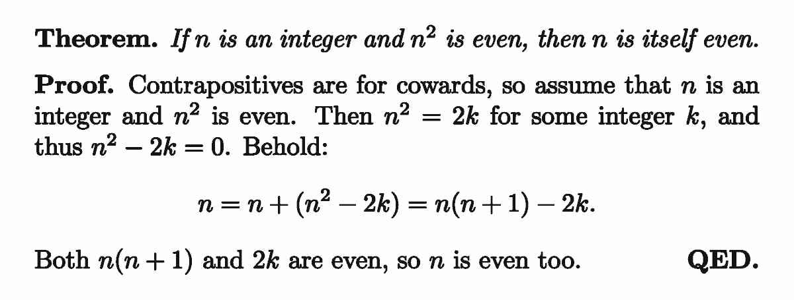

Propositional Logic
===================

While application of logic appears to be intuitive, the study of logic itself can get quite philosophical at times, having been developed from the movement of `analytic philosophy <https://en.wikipedia.org/wiki/Analytic_philosophy>`_.

Statements and Statement Variables
__________________________________

A *statement* is a sentence that is either true or false.

.. note:: You can then ask "how do we define a sentence?" or even "what is a definition?" and these would be valid questions, though we won't bother answering them. For the purpose of mathematics, anything that you think is a sentence is a sentence, and it is reasonable to assume that this will not cause any ambiguity in a thousand years.

A *variable* is a symbol used to represent an object. For example, a *statement variable* is a symbol that represents a statement. We could define $p$ to be the statement "I did not go to Universal Studios Singapore" and henceforth $p$ would be a statement variable. Sometimes they are used as shorthands for actual statements, other times they are necessary to represent a general statement.

Note here that the truth of a statement need not be absolute in any sense. "I did not go to Universal Studios Singapore" can be true from the perspective of one person, but false from another.

Logical Connectives
___________________

A *logical connective* is a symbol used in between statements to form new statements. Such statements are known as *compound statements*.

A *propositional statement*, or a *proposition*, is a statement formed using statement variables and logical connectives.

We will introduce three logical connectives: $\wedge$, $\vee$, and $\sim$. Let $p$ and $q$ be statement variables.

* $p\wedge q$ is known as the *conjunction* of $p$ and $q$, read "$p$ and $q$".
* $p\vee q$ is known as the *disjunction* of $p$ and $q$, read "$p$ or $q$".
* $\sim p$ (also $\neg~p$) is known as the *negation* of $p$, read "not $p$".

Each logical connective is defined using a truth table, which exhaustively lists down the truth of the resulting proposition for every possible combination of truth values of $p$ and $q$ (or just $p$ for negation). Below, $T$ denotes true and $F$ denotes false.

.. container:: tables

  .. container:: center-table

    .. list-table:: $p\wedge q$ is always false unless both $p$ and $q$ are true.
      :widths: 33 33 34
      :header-rows: 1

      * - $p$
        - $q$
        - $p\wedge q$
      * - $T$
        - $T$
        - $T$
      * - $T$
        - $F$
        - $F$
      * - $F$
        - $T$
        - $F$
      * - $F$
        - $F$
        - $F$

  .. container:: center-table

    .. list-table:: $p\vee q$ is always true unless both $p$ and $q$ are false.
      :widths: 33 33 34
      :header-rows: 1

      * - $p$
        - $q$
        - $p\vee q$
      * - $T$
        - $T$
        - $T$
      * - $T$
        - $F$
        - $T$
      * - $F$
        - $T$
        - $T$
      * - $F$
        - $F$
        - $F$

  .. container:: center-table

    .. list-table::
      :widths: 50 50
      :header-rows: 1

      * - $p$
        - $\sim p$
      * - $T$
        - $F$
      * - $F$
        - $T$

We are now ready to see an example of "translating an English sentence into the language of mathematics". Remember that part of the course objectives is to learn how to write mathematics. Here, the idea to communicate is given (in English) and we are just communicating it mathematically.

Let $p$ be the statement "I went to Universal Studios Singapore" and $q$ be the statement "I rode the Battlestar Galactica". To communicate "I went to Universal Studios Singapore and I rode the Battlestar Galactica", we may write $p\wedge q$. The choice of using $\wedge$ here really stems from our interpretation of the sentence, in particular the English word "and".

.. note:: There are many other ways to do this. In particular, note that there is nothing stopping us from letting $p$ be the entire statement, and then writing down $p$. Do you need the statement "I went to Universal Studios Singapore" elsewhere? If so, it might be a good idea to separate it out.

A compound statement is also a statement, so we can in fact use logical connectives to connect it with other statements, forming propositions like $p\wedge q\wedge r$ or $\sim p\vee q$.

Conditionals
^^^^^^^^^^^^

We will now introduce another logical connective: $\rightarrow$. Let $p$ and $q$ be statement variables. $p\rightarrow q$ is read "$p$ implies $q$", and have the following definition via a truth table.

.. container:: center-table

  .. list-table::
    :widths: 33 33 34
    :header-rows: 1

    * - $p$
      - $q$
      - $p\rightarrow q$
    * - $T$
      - $T$
      - $T$
    * - $T$
      - $F$
      - $F$
    * - $F$
      - $T$
      - $T$
    * - $F$
      - $F$
      - $T$

$\rightarrow$ is often used to write down ideas exhibiting conditional relationships. Let $p$ be "it is raining" and $q$ be "the ground is wet". The sentence "if it is raining, then the ground is wet" is written as $p\rightarrow q$.

The truth tables for $\wedge$, $\vee$ and $\sim$ quite intuitively captures the idea of "and", "or" and "not" in English. This is not quite the case for $\rightarrow$.

The second row makes the most sense to us: hypothetically if we observe that it is raining, but then we observe that the ground is not wet, the conditional relationship "if it is raining, then the ground is wet" cannot be true, so $p\rightarrow q$ being false captures this intuition.

Observe that $p\rightarrow q$ is required to be true when both $p$ and $q$ are true, as otherwise we cannot differentiate it from the case where $p$ is true and $q$ is false. Unfortunately, this makes sentences like "if you are reading this, then Paris is in France" true, and this intuition mismatch is what we have to accept.

What does our intuition tell us about $p\rightarrow q$ when $p$ is false? Well, nothing. We said "if $p$, then $q$". We did not intend to draw conclusions when $p$ is false. It is therefore our freedom to define $p\rightarrow q$ to be whatever we find convenient when $p$ is false. What we eventually settled on is to have it be true. One tutorial question later will give a justification on this decision.

.. note:: If you're interested, check out `paradoxes of material implication <https://en.wikipedia.org/wiki/Paradoxes_of_material_implication>`_ for more examples of intuition mismatch arising from the definition of $p\rightarrow q$.

As a result, when $p\rightarrow q$ is true, the overall information we gain is that it is impossible that $p$ is true but $q$ is false.

Biconditionals
^^^^^^^^^^^^^^

$p\leftrightarrow q$ is read "$p$ if and only if $q$" and is defined by the following truth table:

.. container:: center-table

  .. list-table:: $p\leftrightarrow q$ is true when $p$ and $q$ are both true or both false.
    :widths: 33 33 34
    :header-rows: 1

    * - $p$
      - $q$
      - $p\leftrightarrow q$
    * - $T$
      - $T$
      - $T$
    * - $T$
      - $F$
      - $F$
    * - $F$
      - $T$
      - $F$
    * - $F$
      - $F$
      - $T$

Intuitively, $p\leftrightarrow q$ is the conjunction of $p\rightarrow q$ and $q\rightarrow p$. Just like how $\rightarrow$ is used to express conditional relationships, $\leftrightarrow$ further asserts that the relationship also goes the opposite way. Not only do we have "if $p$, then $q$", but also "if $q$, then $p$". As a result, $p$ and $q$ can only be both true or both false simultaneously.

Ambiguity in Propositions
^^^^^^^^^^^^^^^^^^^^^^^^^

At this point, it should be understood that propositions have a truth value under a truth assignment of its statement variables. For example, the proposition $p\vee q\vee r$ is false if we assign $p$, $q$, $r$ to all be false.

An issue arises if we consider the expression $p\wedge q\vee r$. This statement could represent the conjunction of $p$ and $q\vee r$, or the disjunction of $p\wedge q$ and $r$. When $p$ is false, $q$ is true and $r$ is true, the statement is false in the former interpretation, but true in the latter.

This issue is similar to that of evaluating the arithmetic expression $3 + 4\times 5$. In both cases, ambiguity arises if we do not establish a conventional order of operations and/or introduce parentheses to the expression.

CS1231S establishes the convention that $\sim$ should be performed first, followed by $\wedge$ and $\vee$, which are coequal. This means that parentheses must be used to distinguish between the two possible interpretations of $p\wedge q\vee r$ as $(p\wedge q)\vee r$ or $p\wedge(q\vee r)$. Note that there is no "left-to-right evaluation rule". The expression $p\wedge q\vee r$ is deemed ambiguous and thus meaningless.

Continuing the order of operations, $\rightarrow$ and $\leftrightarrow$ are coequally performed last. This means, for example, that the statement $\sim p\wedge q\rightarrow r$ is unambiguous.

.. hint::

  There is no need to remember the order of operations, as it could vary from courses to courses. In addition, it doesn't hurt to use parentheses whenever we are unsure of the order of operations, or to avoid confusing readers who might not be using the same conventions.

Tautologies and Contradictions
______________________________

A *tautology* is a proposition that is true under all possible truth assignments of its statement variables.

A *contradiction* is a proposition that is false under all possible truth assignments of its statement variables.

For example, the proposition $p\vee\sim p$ is a tautology, while the proposition $p\wedge\sim p$ is a contradiction, as can be seen from the following truth table:

.. container:: center-table

  .. list-table:: The column $p\vee\sim p$ is always $T$, while the column $p\wedge\sim p$ is always $F$.
    :widths: 25 25 25 25
    :header-rows: 1

    * - $p$
      - $\sim p$
      - $p\vee\sim p$
      - $p\wedge\sim p$
    * - $T$
      - $F$
      - $T$
      - $F$
    * - $F$
      - $T$
      - $T$
      - $F$

The intuition here is that a statement is always either true or false, but never both.

.. note:: At this point, it is important to realise that the number of rows in a truth table is decided by the number of statement variables involved. The propositions above only involve the variable $p$, which can either be true or false, resulting in two rows in the truth table.

Logical Equivalence
___________________

Two propositions $\phi$ and $\psi$ are *logically equivalent* (denoted $\phi\equiv\psi$) whenever their truth values are equal under all possible truth assignments to their statement variables.

.. note:: We tend to use Greek letters $\phi$ ("phi") and $\psi$ ("psi") to denote propositions. By our definition of propositions, this means for example that $\phi$ could consist of statement variables $p$, $q$ and $r$ alongside logical connectives.

For example, let $\phi$ be $p\rightarrow q$ and $\psi$ be $\sim p\vee q$. From the truth table below, we see that they share the same truth values under all possible truth assignments to $p$ and $q$.

.. container:: center-table

  .. list-table:: The column $p\rightarrow q$ is always the same as the column $\sim p\vee q$. Thus we have $p\rightarrow q\equiv\sim p\vee q$.
    :widths: 20 20 20 20 20
    :header-rows: 1

    * - $p$
      - $q$
      - $p\rightarrow q$
      - $\sim p$
      - $\sim p\vee q$
    * - $T$
      - $T$
      - $T$
      - $F$
      - $T$
    * - $T$
      - $F$
      - $F$
      - $F$
      - $F$
    * - $F$
      - $T$
      - $T$
      - $T$
      - $T$
    * - $F$
      - $F$
      - $T$
      - $T$
      - $T$

.. note:: What is the difference between $p\leftrightarrow q$ and $p\equiv q$? This is a question that has confused many students for extended periods of time, myself included. Some claim that they are interchangeable, some claim that there are philosophical differences. I am presenting below the differences as I understand it.

  * $\leftrightarrow$ is a logical connective. Hence, $\phi\leftrightarrow\psi$ can be viewed as one propositional statement.
  * $\equiv$ is an assertion on propositional statements. $\phi\equiv\psi$ cannot be viewed as one propositional statement. Rather, it is a statement asserting the logical equivalence between two propositional statements.

  Similar questions had been asked in the Mathematics Stack Exchange `here <https://math.stackexchange.com/questions/2432462/whats-the-difference-between-biconditional-iff-and-logical-equivalence>`_ and `here <https://math.stackexchange.com/questions/500644/distinction-between-equality-logical-equivalence-and-biconditionality>`_, and in the Philosophy Stack Exchange `here <https://philosophy.stackexchange.com/questions/65024/what-is-the-difference-between-logical-equivalence-and-material-equivalence>`_.

The equivalence between $p\rightarrow q$ and $\sim p\vee q$ is only one of a collection of laws establishing commonly used logical equivalences.

.. dropdown:: Laws of Logical Equivalences

  Let $p$, $q$, $r$ be statement variables, $\text{true}$ be a tautology, $\text{false}$ be a contradiction. One can verify using truth tables the following logical equivalences.

  * Commutative laws

    .. math::
      
      p\wedge q\equiv q\wedge p \\
      p\vee q\equiv q\vee p

  * Associative laws

    .. math::
      
      p\wedge q\wedge r\equiv (p\wedge q)\wedge r\equiv p\wedge(q\wedge r) \\
      p\vee q\vee r\equiv (p\vee q)\vee r\equiv p\vee(q\vee r)

    Note that due to the associative laws, propositions like $p\wedge q\wedge r$ is unambiguous.

  |

  * Distributive laws

    .. math::

      p\wedge(q\vee r)\equiv (p\wedge q)\vee (p\wedge r) \\
      p\vee(q\wedge r)\equiv (p\vee q)\wedge (p\vee r)

    Some students have trouble realizing that this is corresponding to the identities $a(b + c) = ab + ac$ and $(a + b)c = ac + bc$ for real numbers $a$, $b$, $c$.

  |

  * Identity laws

    .. math::

      p\wedge\text{true}\equiv p \\
      p\vee\text{false}\equiv p

  * Universal bound laws

    .. math::

      p\vee\text{true}\equiv\text{true} \\
      p\wedge\text{false}\equiv\text{false}

    Observe the similarities between the identity laws and the universal bound laws. Try not to confuse the two!

  |

  * Negation laws

    .. math::

      p\vee\sim p\equiv\text{true} \\
      p\wedge\sim p\equiv\text{false}

  * Double negative law

    .. math::

      \sim(\sim p)\equiv p

  * Idempotent laws

    .. math::
      
      p\wedge p\equiv p \\
      p\vee p\equiv p

  * De Morgan's laws

    .. math::

      \sim (p\wedge q)\equiv\sim p\vee\sim q \\
      \sim (p\vee q)\equiv\sim p\wedge\sim q

    It is helpful to see this law as "the distribution laws for negation".

  |

  * Absorption laws

    .. math::

      p\vee (p\wedge q)\equiv p \\
      p\wedge (p\vee q)\equiv p

    I used to forget this law exists until I needed it. Any time the same variable appears inside and outside the parentheses, and the two logical connectives are different, the proposition is logically equivalent to the repeated variable. In assignment 1, you will also see a variant of the absorption laws.

  |

  * Negation of $T$ and $F$

    .. math::

      \sim\text{true}\equiv\text{false} \\
      \sim\text{false}\equiv\text{true}

    To be pedantic, you can't quite see this using a truth table. We should rather just apply the definition of negation.

  |

  * Implication law

    .. math::

      p\rightarrow q\equiv\sim p\vee q

    Intuitively, $p\rightarrow q$ is only false when $p$ is true but $q$ is false, so $p\rightarrow q\equiv\sim (p\wedge\sim q)$. The equivalence then follows from De Morgan's Laws and the double negative law. Another way to remember this is to know that $p\rightarrow q$ is true the moment $p$ is false (hence the $\sim p$), but requires $q$ to be true when $p$ is true (hence the $q$).

With these laws at hand, we now have two methods to go around establishing the logical equivalence of two given propositions $\phi$ and $\psi$.

#. Use a truth table and compare the columns of $\phi$ and $\psi$. In general, the number of rows in the truth table should grow exponentially with respect to the number of variables involved.
#. Use the laws above to simplify $\phi$ and $\psi$ to the same proposition. More often than not, that same proposition is either $\phi$ or $\psi$.

.. dropdown:: Question 2

  The following are common mistakes made by students. Can you explain the mistakes and correct them?

  a. $a\wedge\sim (b\wedge c)\equiv a\wedge\sim b\vee\sim c\quad\text{by De Morgan's law}$
  b. $\sim (x\vee y)\vee z\equiv\sim x\wedge\sim y\vee z\quad\text{by De Morgan's law}$

  .. dropdown:: Answer

    The expressions obtained after applying De Morgan's law is ambiguous. Correction:

    .. math::

      a\wedge\sim (b\wedge c)\equiv a\wedge (\sim b\vee\sim c)\quad\text{by De Morgan's law} \\
      \sim (x\vee y)\vee z\equiv (\sim x\wedge\sim y)\vee z\quad\text{by De Morgan's law}

.. dropdown:: Question 3

  Simplify the propositions below using the laws given in **Theorem 2.1.1 (Epp)** and the **implication law** (if necessary) with only negation ($\sim$), conjunction ($\wedge$) and disjunction ($\vee$) in your final answers. Supply a justification for every step.

  a. $\sim a\wedge (\sim a\rightarrow (b\wedge a))$

  .. dropdown:: Answer

    .. math::
      \begin{align*}
        &\sim a\wedge (\sim a\rightarrow (b\wedge a)) \\
        &\equiv\sim a\wedge (\sim (\sim a)\vee (b\wedge a)) &\text{by the implication law} \\
        &\equiv\sim a\wedge (a\vee (b\wedge a)) &\text{by the double negative law} \\
        &\equiv\sim a\wedge (a\vee (a\wedge b)) &\text{by the commutative law} \\
        &\equiv\sim a\wedge a &\text{by the absorption law} \\
        &\equiv a\wedge\sim a &\text{by the commutative law} \\
        &\equiv\text{false} &\text{by the negation law}
      \end{align*}

  b. $(p\vee\sim q)\rightarrow q$

  .. dropdown:: Answer

    .. math::
      \begin{align*}
        &(p\vee\sim q)\rightarrow q \\
        &\equiv\sim (p\vee\sim q)\vee q &\text{by the implication law} \\
        &\equiv (\sim p\wedge\sim (\sim q))\vee q &\text{by De Morgan's law} \\
        &\equiv (\sim p\wedge q)\vee q &\text{by the double negative law} \\
        &\equiv q\vee(\sim p\wedge q) &\text{by the commutative law} \\
        &\equiv q\vee(q\wedge\sim p) &\text{by the commutative law} \\
        &\equiv q &\text{by the absorption law}
      \end{align*}
    
  c. $\sim (p\vee\sim q)\vee (\sim p\wedge\sim q)$

  .. dropdown:: Answer

    .. math::
      \begin{align*}
        &\sim (p\vee\sim q)\vee (\sim p\wedge\sim q) \\
        &\equiv (\sim p\wedge\sim (\sim q))\vee(\sim p\wedge\sim q) &\text{by De Morgan's law} \\
        &\equiv (\sim p\wedge q)\vee (\sim p\wedge\sim q) &\text{by the double negative law} \\
        &\equiv\sim p\wedge (q\vee\sim q) &\text{by the distributive law} \\
        &\equiv\sim p\wedge\text{true} &\text{by the negation law} \\
        &\equiv\sim p &\text{by the identity law}
      \end{align*}

  d. $(p\rightarrow q)\rightarrow r$

  .. dropdown:: Answer

    .. math::
      \begin{align*}
        &(p\rightarrow q)\rightarrow r \\
        &\equiv (\sim p\vee q)\rightarrow r &\text{by the implication law}\\
        &\equiv (\sim(\sim p\vee q))\vee r &\text{by the implication law}\\
        &\equiv (\sim (\sim p)\wedge\sim q)\vee r &\text{by De Morgan's law}\\
        &\equiv (p\wedge\sim q)\vee r &\text{by the double negative law}
      \end{align*}

  * For now, we want students to cite justification for every step. This is to ensure that you do not arrive at the answer by coincidence. Only after you have gained sufficient experience then would we relax this and allow you to skip obvious steps, or combine multiple steps in a line.
  * The original question for part (a) involves correcting an answer that skipped a few steps so that it can be awarded full credit. This will be emphasized verbally, but on this page I don't want to put too much focus on exam-wise reminders.
  * Hereafter, we use $\text{true}$ and $\text{false}$ to denote some tautology and contradiction respectively. We can rightfully treat them as shorthands for some "legit" propositions like $p\vee\sim p$ and $p\wedge\sim p$.
  * The various techniques used to simplify propositions will be covered verbally as needed.

We can similar establish logical nonequivalence between propositions. Two propositions are not logically equivalent whenever we can find a truth assignment to their statement variables such that the resulting truth values of the propositions are different.

When $\phi$ and $\psi$ are logically equivalent, we can use a truth table and see that the columns of $\phi$ and $\psi$ are exactly the same. When they're not logically equivalent, we must be able to find a row in the truth table in which the columns of $\phi$ and $\psi$ mismatch.

.. dropdown:: Question 4

  Prove, or disprove, that $(p\rightarrow q)\rightarrow r$ is logically equivalent to $p\rightarrow (q\rightarrow r)$.

  * We have two options (corresponding to "Prove" and "disprove"):
  
    * "Guess" that the propositions are logically equivalent, then try to establish this fact by either using a truth table or by simplification.
    * "Guess" that the propositions are not logically equivalent, then try to look for a truth assignment for which there is a mismatch on the truth values of the two propositions.

    Which option to pick relies mainly on intuitions, but remember that there is nothing stopping us from trying both! If one option didn't work, we might at least obtain some inspirations on how to proceed with another.

  * We shall first guess that $(p\rightarrow q)\rightarrow r\equiv p\rightarrow (q\rightarrow r)$.
  
    * From Question 3(d), the left hand side simplifies to $(p\wedge\sim q)\vee r$.

      * It is not necessary to remember Question 3(d). One could just redo the simplifications.

    * The right hand side simplifies, using the implication law twice, to $\sim p\vee\sim q\vee r$.
    * At this point, we are stuck and can't seem to simplify either side any further.
    * Maybe we should turn to using a truth table:

    .. container:: center-table

      .. list-table::
        :widths: 14 14 14 14 15 14 15
        :header-rows: 1
        
        * - $p$
          - $q$
          - $r$
          - $p\rightarrow q$
          - $(p\rightarrow q)\rightarrow r$
          - $q\rightarrow r$
          - $p\rightarrow (q\rightarrow r)$
        * - $T$
          - $T$
          - $T$
          - $T$
          - $T$
          - $T$
          - $T$
        * - $T$
          - $T$
          - $F$
          - $T$
          - $F$
          - $F$
          - $F$
        * - $T$
          - $F$
          - $T$
          - $F$
          - $T$
          - $T$
          - $T$
        * - $T$
          - $F$
          - $F$
          - $F$
          - $T$
          - $T$
          - $T$
        * - $F$
          - $T$
          - $T$
          - $T$
          - $T$
          - $T$
          - $T$
        * - $F$
          - $T$
          - $F$
          - $T$
          - $F$
          - $F$
          - $T$
        * - $F$
          - $F$
          - $T$
          - $T$
          - $T$
          - $T$
          - $T$
        * - $F$
          - $F$
          - $F$
          - $T$
          - $F$
          - $T$
          - $T$

    * Now, we see that the columns of $(p\rightarrow q)\rightarrow r$ and $p\rightarrow (q\rightarrow r)$ do not match!
  * At this point, it should be clear that we are working towards establishing logical nonequivalence instead, so we need to come up with a truth assignment that disproves the equivalence. The truth table told us exactly the truth assignments we are looking for.

  .. dropdown:: Answer
    
    $(p\rightarrow q)\rightarrow r$ is not logically equivalent to $p\rightarrow (q\rightarrow r)$
    
    When $p$, $q$, $r$ are all false, $(p\rightarrow q)\rightarrow r$ is false but $p\rightarrow (q\rightarrow r)$ is true.

    .. note::
      * Another mismatch occurs at the row where $p$ and $r$ are false, and $q$ is true. Note that to establish logical nonequivalences, it suffices to just give one such truth assignments.
      * It is possible to discover these truth assignments without filling out a truth table, via efficient trial-and-errors. For example, in a deliberate attempt to force the left hand side be false, and the right hand side be true, it is necessary to set $r$ to false, and it suffices to set $p$ to false. Now, regardless of $q$, we have a mismatch.
      * Alternatively, since $(p\rightarrow q)\rightarrow r\equiv (p\wedge\sim q)\vee r$ and $p\rightarrow (q\rightarrow r)\equiv\sim p\vee\sim q\vee r$, we can turn to analysing $(p\wedge\sim q)\vee r$ and $\sim p\vee\sim q\vee r$ instead, which might be simpler.

More on Conditionals
____________________

We will make the following definitions:

* The *converse* of the proposition $p\rightarrow q$ is $q\rightarrow p$.
* The *inverse* of the proposition $p\rightarrow q$ is $\sim p\rightarrow\sim q$.
* The *contrapositive* of the proposition $p\rightarrow q$ is $\sim q\rightarrow\sim p$.

There are several observations to make here:

#. The converse of the converse is the original proposition. The same applies to inverse and contraposition.
#. $p\rightarrow q$ is logically equivalent to its contrapositive, i.e. $p\rightarrow q\equiv\sim q\rightarrow\sim p$.

   * This means "if it is raining, then the ground is wet" can be rephrased as "if the ground is not wet, then it is not raining".
   * We can simplify $p\rightarrow q$ to $\sim q\rightarrow\sim p$ as follows:

   .. math::
      \begin{align*}
        p\rightarrow q &\equiv\sim p\vee q &\text{by the implication law} \\
        &\equiv q\vee\sim p &\text{by the commutative law} \\
        &\equiv\sim(\sim q)\vee\sim p &\text{by the double negative law} \\
        &\equiv\sim q\rightarrow\sim p &\text{by the implication law}
      \end{align*}

#. The contrapositive of the inverse is the converse (and vice versa), so the converse and the inverse are logically equivalent.

To summarise, $p\rightarrow q$ is logically equivalent to its contrapositive $\sim q\rightarrow\sim p$. Its converse $q\rightarrow p$ is logically equivalent to its inverse $\sim p\rightarrow\sim q$, which is also the contrapositive of the converse.

It is a common logical fallacy to believe that "if $p$, then $q$" can be rephrased as "if not $p$, then not $q$" or "if $q$, then $p$". These two fallacies are known as *inverse error* and *converse error* respectively.

Also, by the implication law, De Morgan's law and the double negative law, one has $\sim (p\rightarrow q)\equiv p\wedge\sim q$. This intuitively means that "if $p$ then $q$" being false is only possible when $p$ is true and (but) $q$ is false. We can also see this from the truth table for $\rightarrow$, in which the only row where $p\rightarrow q$ is false is when $p$ is true and $q$ is false.

As alluded to earlier, the propsition $p\leftrightarrow q$ is in fact logically equivalent to the conjunction of $p\rightarrow q$ with its converse / inverse, i.e. $p\leftrightarrow q\equiv (p\rightarrow q)\wedge (q\rightarrow p)$. This can be verified using a truth table:

.. container:: center-table

  .. list-table:: The columns $p\leftrightarrow q$ and $(p\rightarrow q)\wedge (q\rightarrow p)$ are identical.
    :widths: 16 16 17 17 17 17
    :header-rows: 1
    
    * - $p$
      - $q$
      - $p\leftrightarrow q$
      - $p\rightarrow q$
      - $q\rightarrow p$
      - $(p\rightarrow q)\wedge (q\rightarrow p)$
    * - $T$
      - $T$
      - $T$
      - $T$
      - $T$
      - $T$
    * - $T$
      - $F$
      - $F$
      - $F$
      - $F$
      - $F$
    * - $F$
      - $T$
      - $F$
      - $T$
      - $F$
      - $F$
    * - $F$
      - $F$
      - $T$
      - $T$
      - $T$
      - $T$

So something "nice" happens when both $p\rightarrow q$ and its converse / inverse are true, in the sense that $p$ and $q$ are either both true or both false.

If, Only If, Necessary and Sufficient Conditions
^^^^^^^^^^^^^^^^^^^^^^^^^^^^^^^^^^^^^^^^^^^^^^^^

In English, the following four sentences all have the same meaning as "if $p$, then $q$", and are therefore all written mathematically as $p\rightarrow q$.

* $q$ if $p$.
* $p$ only if $q$.
* $q$ is a *necessary condition* of $p$.
* $p$ is a *sufficient condition* of $q$.

The only information that is communicated by the sentence "it is raining only if the ground is wet" is "if the ground is not wet, then it is not raining". In particular, it is not claiming that "if the ground is wet, then it is raining" -- there are other ways to make the ground wet. Hence generally, the sentence "$p$ only if $q$" is translated as $\sim q\rightarrow\sim p$, which is logically equivalent to $p\rightarrow q$, and not $q\rightarrow p$.

As a corollary, if it is both true that "$p$ if $q$" and "$p$ only if $q$", then mathematically we have $p\leftrightarrow q$. This justifies reading $p\leftrightarrow q$ as "$p$ if and only if $q$".

A more elaborate way of saying "if $p$, then $q$" is "given that $p$ is true, it is necessary that $q$ is true". This is what we mean by "necessary condition". We also say that $p$ is a sufficient condition of $q$, since the condition of $p$ being true is sufficient for us to conclude that $q$ is true. There might be other ways to make $q$ true, but $p$ being true is already sufficient.

Similarly, if $p$ is a necessary and sufficient condition for $q$ (or vice versa), we write $p\leftrightarrow q$.

At this point, some students complain that this part of the course felt like an English lesson. Yes, I agree, we can't translate a sentence without being able to interpret it in the first place.

.. note:: This is a good place to mention that English (and every other natural language) can be ambiguous, and interpretations of English sentences can be highly subjective. In a sense, I only forcefully declared that we will interpret the four sentences above as $p\rightarrow q$. What I also hope is that you can gain some intuitions behind why we are interpreting them as such.

.. dropdown:: Question 1

  One of the most confusing concepts many students find is the difference between "if" and "only if", and the relationship among "if", "only if", "necessary condition" and "sufficient condition".

  a. Given these two statements: "I use the umbrella if it rains" and "I use the umbrella only if it rains". They may sound the same but in logic they are worlds apart! Now, rewrite them into propositional statements by using variable $p$ for "I use the umbrella", variable $q$ for "it rains" and the logical connective $\rightarrow$.

  .. dropdown:: Answer

    * "I use the umbrella if it rains" is rewritten as $q\rightarrow p$.
    * "I use the umbrella only if it rains" is rewritten as $p\rightarrow q$.

  b. "I use the umbrella if it rains": Is "I use the umbrella" a necessary condition for "it rains"? Or is "I use the umbrella" a sufficient condition for "it rains"? Is "it rains" a necessary condition for "I use the umbrella"? Or is "it rains" a sufficient condition for "I use the umbrella"?

  .. dropdown:: Answer

    * "I use the umbrella" is a necessary condition for "it rains".
    * "It rains" is a sufficient condition for "I use the umbrella".

  c. What if we say "I use the umbrella if and only if it rains"? How would you write a logic statement using variables $p$ and $q$, the imply connective $\rightarrow$, and either $\wedge$ or $\vee$? Is there a shorter way to write the logic statement using some other logical connective?

  .. dropdown:: Answer

    * Without using $\leftrightarrow$, "I use the umbrella if and only if it rains" is written as $(p\rightarrow q)\wedge (q\rightarrow p)$.
    * Using $\leftrightarrow$ gives us a shorter proposition $p\leftrightarrow q$.

  d. "I use the umbrella if and only if it rains". What kind of condition is "I use the umbrella" for "it rains"?

  .. dropdown:: Answer

    "I use the umbrella" is a necessary and sufficient condition for "it rains".

Argument Forms and Arguments
____________________________

We now want to build towards the notion of a mathematical proof. We start by thinking about what an argument really is.

An *argument form* is a sequence of propositions $\phi_1, \phi_2, \cdots , \phi_k$ known as *premises*, followed by a proposition $\psi$ known as the *conclusion*. They can be denoted like so:

.. math::

  \begin{array}{l}
  \phi_1 \\
  \phi_2 \\
  \vdots \\
  \phi_k \\
  \hline
  \therefore\psi
  \end{array}

Moreover, if $\phi_1\wedge\phi_2\wedge\cdots\wedge\phi_k\rightarrow\psi$ is a tautology, we say that the argument form is *valid*.

For example, here is an argument form with two premises $p\rightarrow q$ and $p$, followed by the conclusion $q$:

.. math::

  \begin{array}{l}
  p \\
  p\rightarrow q \\
  \hline
  \therefore q
  \end{array}

One can check that $(p\wedge (p\rightarrow q))\rightarrow q$ is a tautology, so this argument form is valid. This validity is also intuitive: if we know as premises that $p\rightarrow q$, and on top of that $p$ is true, then as conclusion, $q$ would be implied to be true.

Rules of Inference
^^^^^^^^^^^^^^^^^^

We now make one observation: consider the following argument form with two premises:

.. math::

  \begin{array}{l}
  \phi_1 \\
  \phi_2 \\
  \hline
  \therefore\psi
  \end{array}

We want to decide whether this argument form is valid. Suppose now that we know that the following argument form is valid:

.. math::

  \begin{array}{l}
  \phi_1 \\
  \phi_2 \\
  \hline
  \therefore\psi'
  \end{array}

where $\psi'$ is some proposition different from $\psi$. Intuitively, we should be able to "advance" the original argument form into the following:

.. math::

  \begin{array}{l}
  \phi_1 \\
  \phi_2 \\
  \psi' \\
  \hline
  \therefore\psi
  \end{array}

in the sense that the original argument form is valid if and only if this new argument form is valid, so we can work with this new one instead. I leave it as an exercise for the readers to check that indeed $\phi_1\wedge\phi_2\equiv\phi_1\wedge\phi_2\wedge\psi'$ and thus the argument form $\phi_1\wedge\phi_2\rightarrow\psi$ is logically equivalent to the argument form $\phi_1\wedge\phi_2\wedge\psi\rightarrow\psi'$. It should also be clear that this can be generalized to argument forms with more than two premises.

Just like how we have two methods to argue the logical equivalence of two propositions, we now have two methods to decide the validity of an argument form.

#. Argue that $\phi_1\wedge\phi_2\wedge\cdots\wedge\psi_k\rightarrow\psi$ is a tautology using the laws of logical equivalences, or by analyzing the critical rows of a truth table (see below).
#. Use valid argument forms to make intermediary deductions until we eventually derive the conclusion.

A *rule of inference* is a commonly used argument form to perform the latter. There are only a handful of them, and they are supposed to be intuitive and fundamental in some sense. For this reason, each rule of inference is given a name, two of the names are actually Latin terms to sound cooler.

.. dropdown:: (Non-exhaustive) list of rules of inference

  * Modus ponens

    .. math::

      \begin{array}{l}
      \phi \\
      \phi\rightarrow\psi \\
      \hline
      \therefore\psi
      \end{array}

  * Modus tollens

    .. math::

      \begin{array}{l}
      \sim\psi \\
      \phi\rightarrow\psi \\
      \hline
      \therefore\sim\phi
      \end{array}

    This is intuitively just contraposition.

  * Generalization

    .. math::

      \begin{array}{l}
      \phi \\
      \hline
      \therefore\phi\vee\psi
      \end{array}
    
  * Specialization

    .. math::

      \begin{array}{l}
      \phi\wedge\psi \\
      \hline
      \therefore\phi
      \end{array}

  * Elimination

    .. math::

      \begin{array}{l}
      \phi\vee\psi \\
      \sim\psi \\
      \hline
      \therefore\phi
      \end{array}

  * Transitivity

    .. math::

      \begin{array}{l}
      \phi\rightarrow\psi' \\
      \psi'\rightarrow\psi \\
      \hline
      \therefore\phi\rightarrow\psi
      \end{array}

  * Proof by Division into Cases

    .. math::

      \begin{array}{l}
      \phi_1\vee\phi_2 \\
      \phi_1\rightarrow\psi \\
      \phi_2\rightarrow\psi \\
      \hline
      \therefore\psi
      \end{array}

Similarly, to argue the invalidity of an argument form is to argue that $\phi_1\wedge\phi_2\wedge\cdots\wedge\psi_k\rightarrow\psi$ is not a tautology, so we need to find a truth assignment where $\phi_1\wedge\phi_2\wedge\cdots\wedge\psi_k$ is true but $\psi$ is false (this is because $\sim (p\rightarrow q)\equiv p\wedge\sim q$). This means that the validity of an argument form depends critically on the rows of the truth table in which $\phi_1$, $\phi_2$, $\cdots$, $\phi_k$ are true. These rows are known as a *critical rows*. For an argument to be valid, $\psi$ has to be true in every critical row. To argue invalidity, then, is to find a critical row in which $\psi$ is false.

The converse error and inverse error, as mentioned before, can be thought of as invalid argument forms:

.. math::

  \begin{array}{l}
  \phi\rightarrow\psi \\
  \psi \\
  \hline
  \therefore\phi
  \end{array}

and

.. math::

  \begin{array}{l}
  \phi\rightarrow\psi \\
  \sim\phi \\
  \hline
  \therefore\sim\psi
  \end{array}

respectively. For example, to see that the argument form for converse error is invalid, we consider a truth assignment under which $\phi$ is false and $\psi$ is true. Note that the premises $\phi\rightarrow\psi$ and $\psi$ are both true, but the conclusion $\phi$ is false. It follows that the corresponding critical row is problematic, and hence the argument form is invalid. I can come up with this counterexample by understanding what makes $p\rightarrow q$ different from $q\rightarrow p$: when $q$ is true and $p$ is false, $p\rightarrow q$ is true but the converse is false.

.. dropdown:: Question 6

  The conditional statement $p\rightarrow q$ is an important logical statement. Oftentimes, students are perplexed by this definition. The first two rows look reasonable, but the last two rows seem strange. However, this way of defining $p\rightarrow q$ actually gives us the nice intuitive property of the following statement:

  .. math::

    ((p\rightarrow q)\wedge (q\rightarrow r)\rightarrow (p\rightarrow r))

  which is the **transitive rule of inference** we studied in lecture:

  .. math::

    \begin{array}{l}
    p\rightarrow q \\
    q\rightarrow r \\
    \hline
    \therefore p\rightarrow r
    \end{array}

  For example, given premises "if $x$ is a square then $x$ is a rectangle" and "if $x$ is a rectangle then $x$ is a quadrilateral", the conclusion is "if $x$ is a square then $x$ is a quadrilateral". We use such intuitive reasoning very often in our life.

  Show that if we define the conditional statement alternatively as follows, then the transitive rule of inference would no longer hold.

  .. container:: tables

    .. container:: center-table

      .. list-table:: Alternative 1: $\rightarrow_a$
        :widths: 33 33 34
        :header-rows: 1

        * - $p$
          - $q$
          - $p\rightarrow_a q$
        * - $T$
          - $T$
          - $T$
        * - $T$
          - $F$
          - $F$
        * - $F$
          - $T$
          - $F$
        * - $F$
          - $F$
          - $F$

    .. container:: center-table

      .. list-table:: Alternative 2: $\rightarrow_b$
        :widths: 33 33 34
        :header-rows: 1

        * - $p$
          - $q$
          - $p\rightarrow_b q$
        * - $T$
          - $T$
          - $T$
        * - $T$
          - $F$
          - $F$
        * - $F$
          - $T$
          - $T$
        * - $F$
          - $F$
          - $F$

    .. container:: center-table

      .. list-table:: Alternative 3: $\rightarrow_c$
        :widths: 33 33 34
        :header-rows: 1

        * - $p$
          - $q$
          - $p\rightarrow_c q$
        * - $T$
          - $T$
          - $T$
        * - $T$
          - $F$
          - $F$
        * - $F$
          - $T$
          - $F$
        * - $F$
          - $F$
          - $T$

  .. dropdown:: Answer

    For $\rightarrow_a$ and $\rightarrow_b$, observe that when $p$ and $q$ are true and $r$ is false, $((p\rightarrow_a q)\wedge (q\rightarrow_a r)\rightarrow_a (p\rightarrow_a r))$ and $((p\rightarrow_b q)\wedge (q\rightarrow_b r)\rightarrow_b (p\rightarrow_b r))$ respectively are false, and hence they are not tautologies, so the corresponding argument forms are invalid, let alone using them as rules of inference.

    For $\rightarrow_c$, similar things happen when $p$ and $r$ are false and $q$ is true.

    .. note::
      * We cannot use the critical row method by finding a truth assignment under which the premises are true but the conclusion is false. This is because with a different definition for $\rightarrow$, we "lose" the property that $\sim (p\rightarrow q)\equiv p\wedge\sim q$, without which the critical row method cannot work.
      * Instead, we go back to the original goal of disproving the corresponding proposition from being a tautology. By definition of tautology, this amounts to finding a truth assignment under which the proportion is false.
      * It is then a reasonable question to ask how on earth did we come up with these truth assignments that can serve as nice counterexamples. As mentioned in the answer for Question 4, the answer is to perform efficient trial-and-errors. For example, notice that $\rightarrow_a$ is really the same as $\wedge$, so to make the resulting proposition false, the most straightforward thing to do is to set $p$, $q$ and $r$ to all be false. This is not the answer showed above but also works as a counterexample.

Arguments
^^^^^^^^^

An *argument* is an argument form whose statement variables are substituted for actual statements. For example, here is an argument having the argument form mentioned above:

.. math::

  \begin{array}{l}
  \text{Socrates is a man.} \\
  \text{If Socrates is a man, then Socrates is mortal.} \\
  \hline
  \therefore\text{Socrates is mortal.}
  \end{array}

An argument is *sound* if its argument form is valid, and all its premises are true. If you believe that "Socrates is a man", and the fact that "if Socrates is a man, then Socrates is mortal", then coupled with the fact that the underlying argument form is valid, it follows that the argument above should appear sound to you.

.. dropdown:: Question 7

  Some of the arguments below are valid, whereas others exhibit the converse or inverse error. Use symbols to write the logical form of each argument. If the argument is valid, identify the rule of inference that guarantees its validity. Otherwise, state whether the converse or the inverse error is made.

  a.

  .. math::

    \begin{array}{l}
    \text{Sandra knows Java and Sandra knows C++.} \\
    \hline
    \therefore\text{Sandra knows C++.}
    \end{array}

  .. dropdown:: Answer

    Let $p$ be "Sandra knows Java" and $q$ be "Sandra knows C++". The argument form is

    .. math::

      \begin{array}{l}
      p\wedge q \\
      \hline
      \therefore q
      \end{array}

    The argument is valid by specialization.

    .. note::
      * We are abusing terminologies a little bit: we tend to use the term argument and argument form interchangeably. When we say "an argument is valid", we mean that its argument form is valid.
      * To be pedantic, the way I defined it above, specialization only allows us to conclude $p$ but not $q$, but then we can first use commutative law on the premise to fix this.

  b.

  .. math::

    \begin{array}{l}
    \text{If at least one of these two numbers is divisible by 6,} \\
    \quad\text{then the product of these two numbers is divisible by 6.} \\
    \text{Neither of these two numbers is divisible by 6.} \\
    \hline
    \therefore\text{The product of these two numbers is not divisible by 6.}
    \end{array}

  .. dropdown:: Answer

    Let $p$ be "at least one of these two numbers is divisible by 6" and $q$ be "the product of these two numbers is divisible by 6". The argument form is

    .. math::

      \begin{array}{l}
      p\rightarrow q \\
      \sim p \\
      \hline
      \therefore\sim q
      \end{array}

    The argument is invalid because the inverse error is made.

    .. note::

      * We can also let $x$ be "the first number is divisible by 6" and $y$ be "the second number is divisible by 6", then $p$ is the same as $x\vee y$, and the first premise can be written as $x\vee y\rightarrow q$. The second premise is $\sim x\wedge\sim y$ which, by De Morgan's law, is logically equivalent to $\sim (x\vee y)$, or $\sim p$.
      * The problematic critical row occurs when $p$ is false and $q$ is true. The existence of this truth assignment is sufficient to argue that the argument form is invalid. In particular, note that the meaning of $p$ and $q$ are irrelevant: even if in fact $p$ being false forbids $q$ from being true, the validity of the argument form is unaffected. In philosophical terms, we are criticizing the form of the argument, and the semantics are irrelevant.

  c.

  .. math::

    \begin{array}{l}
    \text{If there are as many rational numbers as there are irrational numbers,} \\
    \quad\text{then the set of all irrational numbers is infinite.} \\
    \text{The set of all irrational numbers is infinite.} \\
    \hline
    \therefore\text{There are as many rational numbers as there are irrational numbers.}
    \end{array}

  .. dropdown:: Answer

    Let $p$ be "there are as many rational numbers as there are irrational numbers" and $q$ be "the set of all irrational numbers is infinite". The argument form is

    .. math::

      \begin{array}{l}
      p\rightarrow q \\
      q \\
      \hline
      \therefore p
      \end{array}

    This argument is invalid because the converse error is made.

    .. note:: Just to emphasize again, even though in fact $p$ is false and $q$ is true, this is irrelevant to the validity of the argument form.

  d.

  .. math::

    \begin{array}{l}
    \text{If I get a Christmas bonus, I'll buy a stereo.} \\
    \text{If I sell my motorcycle, I'll buy a stereo.} \\
    \hline
    \therefore\text{If I get a Christmas bonus or I sell my motorcycle, I'll buy a stereo.}
    \end{array}

  .. dropdown:: Answer

    Let $p$ be "I get a Christmas bonus", $q$ be "I sell my motorcycle", and $r$ be "I'll buy a stereo". The argument form is

    .. math::

      \begin{array}{l}
      p\rightarrow r \\
      q\rightarrow r \\
      \hline
      \therefore (p\vee q)\rightarrow r
      \end{array}

    This argument is valid as can be deduced below:

    .. math::

      \begin{array}{l}
      p\rightarrow r&\text{(premise)} \\
      q\rightarrow r&\text{(premise)} \\
      (p\rightarrow r)\wedge (q\rightarrow r)&\text{(conjunction of premises)} \\
      (\sim p\vee r)\wedge(\sim q\vee r)&\text{(implication law)} \\
      (r\vee\sim p)\wedge(r\vee\sim q)&\text{(commutative law)} \\
      r\vee (\sim p\wedge\sim q)&\text{(distributive law)} \\
      (\sim p\wedge\sim q)\vee r&\text{(commutative law)} \\
      \sim (p\vee q)\vee r&\text{(De Morgan's law)} \\
      \hline
      \therefore (p\vee q)\rightarrow r&\text{(implication law)} \\
      \end{array}

    .. note:: We don't have to use rules of inference all the time. If you have tried this question on your own, you would realise that there is nothing else we can do apart from taking the conjunction of the premises to "combine them in some way". We are allowed to do this because $p\wedge q\rightarrow (p\wedge q)$ is a tautology. For similar reasons, we are also allowed to add in premises that are logically equivalent to existing ones.

.. dropdown:: Question 8

  a. Given the following argument:

  .. math::

    \begin{array}{l}
    p\vee (q\wedge r) \\
    \sim p \\
    \hline
    \therefore q\wedge r
    \end{array}

  **Without** actually drawing the truth table, determine the values of $p$, $q$ and $r$ in the critical row(s) of the truth table. Is the argument valid?

  .. dropdown:: Answer

    The critical row occurs, in particular, when the premise $\sim p$ is true, so $p$ must be false. In order for the premise $p\vee (q\wedge r)$ to also be true, $(q\wedge r)$ has to be true, and so $q$ and $r$ have to be true. It follows that the only critical row is the row in which $p$ is false, and $q$ and $r$ are true. In this row, the conclusion $q\wedge r$ is true, so the argument form is valid.

  b. Give a counterexample to show that the following argument is invalid.

  .. math::

    \begin{array}{l}
    p\vee (q\wedge r) \\
    \sim (p\wedge q) \\
    \hline
    \therefore r
    \end{array}

  .. dropdown:: Answer

    When $p$ is true, and $q$ and $r$ are false, the premises $p\vee (q\wedge r)$ and $\sim (p\wedge q)$ are true but the conclusion $r$ is false.

    .. note:: We can find this counterexample using the same kind of deductions from part (a). Since we want the conclusion to be false, $r$ must be false. Then, $q\wedge r$ must be false, but we want the first premise to be true, so $p$ must be true. We also want the second premsie to be true, so $(p\wedge q)$ must be false, so $q$ must be false.

  c. Determine whether the following argument is valid or invalid. Use variables to represent the statements (for example: let $p$ be "I go to the beach".)

  .. math::

    \begin{array}{l}
    \text{If I go to the beach, I will take my shades or my sunscreen.} \\
    \text{I am taking my shades but not my sunscreen.} \\
    \hline
    \therefore\text{I will go to the beach.}
    \end{array}

  .. dropdown:: Answer

    Let $p$ be "I go to the beach", $q$ be "I will take my shades" and $r$ be "I will take my sunscreen". The argument form is

    .. math::

      \begin{array}{l}
      p\rightarrow (q\vee r) \\
      q\wedge\sim r \\
      \hline
      \therefore p
      \end{array}

    When $p$ and $r$ are false, and $q$ is true, the premises $p\rightarrow (q\vee r)$ and $q\wedge\sim r$ are true, but the conclusion $p$ is false, so the argument form is invalid.

    .. note::
      * I think the best way to decide the validity of the argument is to consider it intuitively. All we know is that if we go to the beach, we take some items. Knowing the items we take doesn't tell us whether we go to the beach.
      * We want the second premise true, $q$ must be true and $r$ must be false. We also want the conclusion false, so $p$ must be false. All there is left to do is to check that the first premise is true.

  d. Determine whether the following argument is valid or invalid. Use variables to represent the statements.

  .. math::

    \begin{array}{l}
    \text{I will buy a new goat or a used Yugo.} \\
    \text{If I buy both a new goat and a used Yugo, I will need a loan.} \\
    \text{I bought a used Yugo but I don't need a loan.} \\
    \hline
    \therefore\text{I didn't buy a new goat.}
    \end{array}

  .. dropdown:: Answer

    Let $p$ be "I will buy a new goat", $q$ be "I will buy a used Yugo", "r" be "I will need a loan". The argument form is

    .. math::

      \begin{array}{l}
      p\vee q \\
      (p\wedge q)\rightarrow r \\
      q\wedge\sim r \\
      \hline
      \therefore\sim p
      \end{array}

    The argument form is valid. We will argue that in every critical row, the conclusion is true. We want the third premise true, so $q$ must be true and $r$ must be false. We want the second premise true, so $r$ being false implies $(p\wedge q)$ must be false, so $p$ must be false. It remains to check that the first premise is true. It follows that $p$ and $r$ being false, and $q$ being true, is the only critical row. In this critical row, the conclusion $\sim p$ is true, so the argument form is valid.

    .. note::
      * We can also try to derive the conclusion from the given premises using valid argument forms. This is left as an exercise for the readers.
      * To decide that the argument form is valid, we again consider the given argument intuitively. I can buy at least one of the two items (premise 1), and I need a loan if I were to buy both (premise 2). Now, I bought one and I didn't need a loan (premise 3), so I must not have bought the other one (conclusion).

You can sort of see the parallel between propositions vs statements, and argument forms vs arguments. Propositions and argument forms are written in terms of statement variables, and they semantically represent the form of a statement and an argument, respectively. Statements and arguments are, in some sense, the "application" of the symbolic rules of logic in real life, where we substitute each statement variable with actual statements to help us determine their truths.

A *mathematical proof*, or simply a *proof*, can be thought of as a sound argument (even though we might not always present it in the same format). When we have a proof of a statement $p$, we mean that we have a sound argument whose conclusion is $p$. The premises consist of statements we already know are true in the context around the statement we are proving (e.g. to prove that Socrates is mortal, we need to agree that Socrates is a man, which any sane person will believe is true). Having a proof of a statement $p$ allows us to conclude that $p$ is true (under the assumptions we have just made), and the fun part is that we can now use $p$ as a premise to prove further results.

And that is what modern mathematics is about! We make fundamental assumptions (different sets of assumptions in different theories), then prove meaningful statements based on these assumptions, then use these results to prove further results and so on.

Here is a good place to take a step back and admire the big picture. We said that a proposition consists of statement variables connected by logical connectives. Each proposition has a truth value under some truth assignments. We can substitute each statement variable with actual statements in order to study the real world. An argument form consists of a number of premises followed by a conclusion. An argument is an argument form with actual statements. An argument is sound if its form is valid, and everyone agrees that the premises are true. Having a sound argument (or a proof) that leads to a conclusion establishes the truth of that conclusion (for people who agree with the premises).

Types of Numbers
________________

We will take a detour here and explore the types of numbers that will be encountered in this course. The purpose of this section is to establish some fundamental assumptions (based on what you've seen in pre-university years) which we can take as premises, so that we can start forming arguments on concrete mathematical objects rather than working with toy statements.

* Natural numbers, denoted $\mathbb{N}$, consist of the numbers $0$, $1$, $2$, $\cdots$.
* Integers, denoted $\mathbb{Z}$, consist of the natural numbers along with the negatives: $\cdots$, $-1$, $0$, $1$, $\cdots$.
* Rational numbers, denoted $\mathbb{Q}$, consist of all fractions, including integers whose denominator is 1.
* Real numbers, denoted $\mathbb{R}$, consist of any number that does not involve the imaginary number $i$.
* Irrational numbers, denoted $\mathbb{R}\backslash\mathbb{Q}$, consist of real numbers that are not rational.

The definitions above are non-rigorous. Defining the numbers rigorously is not that trivial.

The superscripts $+$ and $-$ are used to denote the positive and negative versions of the numbers, respectively. For example, $\mathbb{Q}^+$ consist of the positive rational numbers.

Subscripts are used to give more specific bounds. For example, $\mathbb{Z}_{\geq 12}$ consist of $12$, $13$, $14$, $\cdots$.

We will now introduce the symbol $\in$ as a shorthand for "is a member of". This will be elaborated more in Chapter 3. It follows that $0\in\mathbb{N}$, $-1\in\mathbb{Z}$, $\frac{1}{2}\in\mathbb{Q}^+$ and so on.

Basic Algebra
^^^^^^^^^^^^^

We assume, without proof, the truth of a collection of laws to perform algebraic manipulations. For example, we take for granted that addition on the real numbers is commutative, i.e. $a + b = b + a$ for any real number $a$ and $b$.

It is theoretically possible to prove them from scratch, but they are too intuitive and too numerous that we will not bother with it in this course. I am very reluctant to include the full list on this page, so please refer to **Canvas > Files > Lecture Slides** and look for the files **AppendixA_1.jpg**, **AppendixA_2.jpg** and **AppendixA_3.jpg**. These are the pages of Appendix A of Susanna S. Epp's textbook "Discrete Mathematics with Applications", the prescribed textbook for this course.

We will refer to applications of these laws as "basic algebra".

.. dropdown:: Question 5

  Given the conditional statement "If $12x - 7 = 29$, then $x = 3$", write the **negation**, **contrapositive**, **converse** and **inverse** of the statement.

  Is the given conditional statement true? If it is true, prove it; otherwise, give a counterexample.

  Is its converse true? If it is true, prove it; otherwise, give a counterexample.

  In general, is it possible for the converse of a conditional statement to be true while the inverse of the same statement is false? Why?

  .. dropdown:: Answer

    * Negation: $12x - 7 = 29$ and $x\neq 3$.
    * Contrapositive: If $x\neq 3$, then $12x - 7\neq 29$.
    * Converse: If $x = 3$, then $12x - 7 = 29$.
    * Inverse: If $12x - 7\neq 29$, then $x\neq 3$.

    The given conditional statement is true. Proof:

    #. Suppose $12x - 7 = 29$.
    #. Then $12x = 36$ by basic algebra.
    #. Then $x = 3$ by basic algebra.

    Its converse is true. Proof:

    #. Suppose $x = 3$.
    #. Then $12x - 7 = 12(3) - 7 = 29$ by basic algebra.

    In general, it is not possible for the converse of a conditional statement to be true while the inverse of the same statement to be false. This is because the converse is the contrapositive of the inverse, and any conditional statement is logically equivalent to its contrapositive.

    .. note::
      * In this case, it follows that $12x - 7 = 29$ if and only if $x = 3$. We are pretty used to going from $12x - 7 = 29$ to $x = 3$, but not so much from $x = 3$ to $12x - 7 = 29$. In fact, this is not possible all the time. For example, if $x = 3$ then we have $x^2 = 9$. But if we start from $x^2 = 9$, then $x$ could be $3$ or $-3$. It is not true to say that $x^2 = 9$ if and only if $x = 3$.
      * To give you a sense of why basic algebra is useful, suppose we cannot use basic algebra, and instead have to consciously apply the laws in the appendix mentioned above. Then, we first have to argue that since $x$ is a real number (which is not even stated in the question by the way, but it is okay to assume), $12x - 7$ is also a real number. Also, $29$ is a real number. Now, using the fact that if $a = b$, then $a + c = b + c$ for any real number $a, b$, and $c$, and that $7$ is a real number, we have $12x - 7 + 7 = 29 + 7$. Now we use associativity of addition to write the left hand side as $12x + (7 - 7) = 29 + 7$, and so $12x = 36$.
      * We can go from $12x - 7 = 29$ straight to $x = 3$ by basic algebra. The only reason we wrote 3 lines instead of 2 for the first proof above is to make it seem like we did not just jump from the hypothesis to the conclusion.

Parity and Divisibility
^^^^^^^^^^^^^^^^^^^^^^^

An integer $n$ is said to be even if and only if $n = 2k$ for some integer $k$. For example, $8$ is even because $8 = 2 * 4$. $0$ is even because $0 = 2 * 0$. $-4$ is even because $-4 = 2 * (-2)$.

An integer $n$ is said to be odd if and only if $n = 2k + 1$ for some integer $k$. For example, $-3$ is odd because $-3 = 2(-2) + 1$.

It can be shown that an integer is either even or odd, but not both. The property of an integer of whether it is even or odd is known as the *parity* of the number. For example, the $3$ and $5$ have the same parity because both are odd.

For integers $a$ and $b$, we say that $a$ divides $b$, or $b$ is divisible by $a$ (denoted $a|b$) if and only if $a = bk$ for some integer $k$. For example, $2$ and $-3$ both divide $6$, as $6 = 2(3) = (-3)(-2)$ (here $k = 3$ and $k = -2$ respectively).

It follows that even integers are exactly those divisible by $2$, and odd integers are exactly those that don't.

.. note:: Note the use of "if and only if" when defining things. To be pedantic, by saying "$n$ is even if $n = 2k$ for some integer $k$", we are just specifying what integers are considered even. To complete the definition, we should also specify what integers are not considered even: "$n$ is even only if $n = 2k$ for some integer $k$". Some authors tend to omit writing "only if" in definitions, in which case it should be assumed that there is an implicit "only if".

We will also introduce two new symbols which will be heavily elaborated in Chapter 2: $\exists$ and $\forall$. For now, treat $\exists$ as a shorthand for the English term "there exists", and $\forall$ as a shorthand for the English term "for all". I hope everyone agrees that in English, "for some" has the same meaning as "there exists", so the definitions of even and odd integers can be rewritten as:

* An integer $n$ is said to be odd if and only if $\exists k\in\mathbb{Z}$ s.t. $n = 2k + 1$.
* An integer $n$ is said to be even if and only if $\exists k\in\mathbb{Z}$ s.t. $n = 2k$.

where s.t. is the abbreviation for "such that".

Note that it is also true that $n$ is odd if and only if $\exists m\in\mathbb{Z}$ s.t. $n = 2m + 1$. We say that $m$ is a dummy variable. It intuitively serves as a placeholder for "some integer", and can be named whatever we want.

Proof Techniques
________________

You should have noticed by now that proofs play a very important role in the development of mathematics: it allows us to establish the truth of a mathematical statement in a rigorous way. Before we dive into strategies to come up with proofs, I want to emphasize again that problem-solving does not begin with proof writing. Intuition is built behind why a statement might be true, and only then we begin to prove it rigorously to verify and communicate our intuitions.

Direct Proof
^^^^^^^^^^^^

There is no rigorous definition of what a direct proof is. Generally speaking, a direct proof for $p$ uses only pre-established facts to eventually derive the goal statement $p$. It is not so meaningful to ask questions like "is proof by division into cases a type of direct proof?" because (a) it doesn't really matter and (b) it really depends on the proof itself: each case can be handled differently, perhaps one directly and another one indirectly.

As an example, we argue that if $n$ is an even integer, then $n^2$ is an even integer. Roughly, the intuition here is that when squaring an integer, any factor of $2$ should not "disappear". Here is a direct proof that makes use of this intuition:

#. Let $n$ be an even integer.
#. Then, by definition of even integers, $n = 2k$ for some integer $k$.
#. Then, $n^2 = (2k)^2 = 4k^2 = 2(2k)$ by basic algebra.
#. Let $m = 2k$. Since $k$ is an integer, $2k$ is also an integer by basic algebra.
#. Since $n^2 = 2m$ (by substituting $m = 2k$ in line 3) and $m$ is an integer, $n^2$ is even by definition of even integers.

Allow me to spend a few paragraphs explaining the intricacies of this seemingly simple proof:

* The format of having each line of the proof numbered is only enforced in CS1231S, but not after you have passed the course. One of the benefits of numbering the lines is so that we can reference the lines easily (such as in line 5, and the reference to line 5 literally just now). Further mathematical proofs can be too complicated to write down in numbered lists, so it is more common to present them as paragraphs, possibly broken down into lemmas and theorems.
* The general strategy to prove directly a statement of the form $p\rightarrow q$ is to work under the case where $p$ is true and try to deduce that $q$ is true. The reason this works is that in the case where $p$ is false, $p\rightarrow q$ is vacuously true. So technically, we are dividing into two cases depending on the truth of $p$, and our goal is for $p\rightarrow q$ to be true in both cases. However, the case where $p$ is false is, independent of what $p$ and $q$ stand for, always trivially handled, and hence omitted.
* It is helpful to imagine how you would have written down the proof on your own.

  * As discussed above, the strategy is to suppose $p$, then try to deduce $q$. This is exactly what line 1 and line 5 are doing, so it is reasonable to write these two lines first (although we wouldn't know that the proof has 5 lines in advance).
  * Line 2 uses the definition of an even integer, which is true (because we literally defined it ourselves), along with modus ponens, to conclude that $n = 2k$ for some integer $k$. Usually, the application of rules of inference is only explicitly written down when we are arguing validity of argument forms, so it is omitted here.
  * Arguably, the "trickiest" of the proof lies in line 3 and 4. One has to have gained the intuition to try to square $n$, then use basic algebra to discover that the resulting expression resembles an even number, thus filling in the gap between line 1 and 5.
  * Notice our preliminary intuition in action in line 3: when $n$ is squared, not only did its factor of $2$ not disappear, it became $2^2 = 4$ which is of course even.

* Each variable ($n$, $m$, $k$) must be defined properly. For example, in line 2, it is insufficient to only write $n = 2k$ and omit "for some integer $k$", since that phrase is supposed to introduce what $k$ is by specifying its range. Without the fact that $k$ is an integer, line 4 wouldn't work.
* There is no hard rule on what is considered one line of proof. We can kind of just "vibe it out" as long as the proof is readable by whoever is reading it.

Proof by Contraposition
^^^^^^^^^^^^^^^^^^^^^^^

Proof by contraposition can be used to indirectly prove statements of the form $p\rightarrow q$. The idea is to use the fact that $p\rightarrow q$ is logically equivalent to its contrapositive $\sim q\rightarrow\sim p$ and thus (directly) prove the contrapositive instead.

For example, let $n$ be an integer. One can prove by contraposition that if $n^2$ is even, then $n$ is even. Intuitively, it would be difficult to work under the hypothesis $n^2$ is even. There is not much algebraic manipulations we can do after taking square roots. Instead, since an integer is either even or odd but not both, we will prove that if $n$ is odd, then $n^2$ is odd.

#. Suppose $n$ is odd.
#. Then, by definition of odd integers, $n = 2k + 1$ for some integer $k$.
#. Then, $n^2 = (2k + 1)^2 = 4k^2 + 4k + 1 = 2(2k^2 + 2k) + 1$ by basic algebra.
#. Let $m = 2k^2 + 2k$. Since $k$ is an integer, $m$ is also an integer.
#. Since $n^2 = 2m + 1$ (by substituting $m = 2k^2 + 2k$ in line 3) and $m$ is an integer, $n^2$ is odd by definition of odd integers.
#. By contraposition, if $n^2$ is even, then $n$ is even.

This result along with the previous one tell us that $n$ is even if and only if $n^2$ is even, and furthermore, $n$ is odd if and only if $n^2$ is odd, so now we know that an integer always has the same parity as its square.

There is in fact a direct proof for the statement above:

   Source: `https://mathstodon.xyz/@VinceVatter/113873301556475236 <https://mathstodon.xyz/@VinceVatter/113873301556475236>`_

Proof by Contradiction
^^^^^^^^^^^^^^^^^^^^^^

In a proof by contradiction (also known as *reductio ad impossible* if you want to sound fancy), the idea is to use the fact that the following argument form is valid:

.. math::

  \begin{array}{l}
  \sim\phi\rightarrow F \\
  \hline
  \therefore\phi
  \end{array}

where recall that $F$ is some contradiction. Thus, the strategy to prove a statement $p$ is to prove $\sim p\rightarrow F$ instead, since once the truth of $\sim p\rightarrow F$ is established, we can apply the valid argument form above to conclude $p$.

The most classic example of a proof by contradiction is the proof of the irrationality of $\sqrt{2}$:

#. Suppose $\sqrt{2}$ is not irrational, then it is rational.
#. Then, by definition of rational numbers, $\sqrt{2} = \frac{p}{q}$ for some integers $p, q$ such that the fraction $\frac{p}{q}$ cannot be reduced further.
#. Then, $2 = \frac{p^2}{q^2}$, so $2q^2 = p^2$ by basic algebra.
#. Since $q$ is an integer, $q^2$ is an integer, so $p^2$ is even, so $p$ is even by what we proved above.
#. Since $p$ is even, $p = 2k$ for some integer $k$, so $2q^2 = (2k)^2 = 4k^2$, so $q^2 = 2k^2$.
#. Since $k$ is an integer, $k^2$ is an integer, so $q^2$ is even, so $q$ is even by what we proved above.
#. Since $p$ is even and $q$ is even, the fraction $\frac{p}{q}$ can be reduced further, contradicting line 2, so $\sqrt{2}$ has to be irrational.

We will not focus too much on the intuition behind this proof. After all, the discovery of this proof by Hippasus was a shock to the Pythagorean school of mathematics insisting that all numbers are rational, so much so that Pythagoras allegedly `drowned him at a sea afterwards <https://en.wikipedia.org/wiki/Hippasus#Irrational_numbers>`_. This goes to show the elusiveness of this result.

More importantly, note the structure of the proof: recall that our goal is to prove $\sim p\rightarrow F$. To do so, we work under the case where the hypothesis $\sim p$ is true (and hence write down line 1) and try to arrive at some contradiction. The contradiction in this case is $q\wedge\sim q$, where $q$ is "$\frac{p}{q}$ cannot be reduced further".

If we were to prove $p\rightarrow q$ by contradiction, we should first suppose that $p\wedge\sim q$, since that is the negation of our goal. A common mistake is to suppose $\sim q$, then arrive at $\sim p$, then incorrectly claim that this is a contradiction. This is incorrect because $p$ was never part of the supposition. Instead, such students have produced a proof by contraposition. Note that a proof by contradiction for $p\rightarrow q$ need not contradict $p$ in the proof, and could instead contradict something else, so not every proof by contradiction can be translated into a proof by contraposition.

.. dropdown:: Question 9

  The island of Wantuutrewan is inhabited by exactly two types of people: **knights** who always tell the truth and **knaves** who always lie. Every native is a knight or a knave, but not both. You visit the island and have the following encounters with the natives.

  a. Two natives A and B speak to you:

    A says: Both of us are knights.

    B says: A is a knave.

  What are A and B?

  The intuitive thing to do is to first assume an identity for A (or B) and make further deductions based on what they said:

  #. Suppose that A is a knight, so A always tells the truth.
  #. Since A says "Both of us are knights" and A always tells the truth, B must be a knight (in particular), so B always tells the truth.
  #. Since B says "A is a knave" and B always tells the truth, A is a knave.
  #. Since A is a knave, and every native is a knight or a knave but not both, A is not a knight, contradicting line 1, so A is a knave.

  We can now wrap the argument above and call it a proof by a contradiction for A being a knave. With this information at hand, since B says "A is a knave", B is telling the truth, so B is a knight (note that the setup of the question implies every native either always tells the truth or always lies).

  The conclusion is that A is a knave and B is a knight. Now, to write it down "properly",

  .. dropdown:: Answer

    #. We claim that A is a knave and B is a knight.
    #. We first prove by contradiction that A is a knave.

    (insert line 1 to 4 above)

    3. Now, since B says "A is a knave", B is telling the truth, so B cannot be a knave (by contraposition), so B is a knight.

    .. note::

      * The proof given above is the same as the proof given in the official solution, with several steps condensed into one. This is a matter of style, but arguably having more number of basic steps do help with improving your ability to reason rigorously.
      * When working under the case where A is a knight, once we have deduced that A is also a knave, we do not necessarily have a contradiction yet. The condition that "every native is a knight or a knave, but not both" is crucial in helping us to conclude that A is therefore not a knight. Now, if we let $p$ be "A is a knight", we see that we have derived $p\wedge\sim p$, which is a contradiction.
      * Do we have to check for further contradictions in the remaining case where A is a knave and B is a knight? The way this question is worded, the answer is no. Suppose there is a further contradiction in the remaining case, then the encounter cannot have happened. It is given in the question that the encounter happened, so there cannot be a contradiction. (if there is, then the question itself, or at least its wording, is flawed)
      * But, if we have more than one case remaining, it might still be possible that we can discard at least one of them, so we should check for further contradictions, and discard them in case they arise.

  b. Two natives C and D speak to you:

    C says: D is a knave.

    D says: C is a knave.

  How many knights and knaves are there?

  As usual, we first assume an identity for C, say C is a knight:

  #. Since C says "D is a knave" and C always tells the truth, D has to be a knave, so D always lies.
  #. Since D says "C is a knave" and D always lies, C is not a knave, so C is a knight. This is consistent with our initial assumption.

  So in the case that C is a knight, no contradiction arises. The other case is that C is a knave. One can check that this leads to D being a knight without contradictions.

  .. dropdown:: Answer

    #. We claim that there are 1 knight and 1 knave. We will prove this claim by division into cases.
    #. Since a native is a knight or a knave but not both, C is either a knight or a knave.
    #. Case 1: C is a knight, so C always tells the truth.
    
       #. Since C says "D is a knave", D is a knave.

    #. Case 2: C is a knave, so C always lies.

       #. Since C says "D is a knave", D is not a knave.
       #. Since D is a knight or a knave but not both, D is a knight.

    #. In both cases, there are 1 knight and 1 knave.

    .. note::

      * Proof by division into cases is not explicitly covered as a proof technique, but recall that it was one of the rules of inferences, and is thus a valid argument form. The idea is to consider several cases, one of which must be true, and try to prove the goal statement under each case.
      * Note that we did not include the check for further contradictions in the actual proof. This is technically not necessary because by default, we assume that there are none. Only if we found a contradiction in our draft, we should include the check in the proof and then conclude that the corresponding case must be discarded.
      * It also does not matter the identity of each native, since the question is asking the number of knights and knaves. If we have some other method of determining this number without knowng the identity of the natives, that would also answer the question correctly.

.. dropdown:: Question 10

  Prove the following: The product of any two odd integers is an odd integer.

  .. dropdown:: Answer

    #. Let $m, n$ be two odd integers.
    #. Then, by definition of odd integers, $m = 2k + 1$ and $n = 2p + 1$ for some integers $k, m$.
    #. Then, $mn = (2k + 1)(2p + 1) = 4kp + 2k + 2p + 1 = 2(2kp + k + p) + 1$ by basic algebra.
    #. Let $q = 2kp + k + p$, then $mn = 2q + 1$.
    #. Since $k, p$ are integers, $q$ is also an integer, so $mn$ is odd by definition of odd integers.

    .. note::

      * Crucially, note that we are proving a conditional statement: if $m$ and $n$ are odd, then $mn$ is odd. The given statement is not stated like so, but this is a correct reformulation. We don't quite have the tools explain this concretely yet, so do try and take this intuitively for now.
      * Having seen the proof of the fact that the square of an odd integer is an odd integer, this one should not be too difficult to come up with (and is a stronger result!).
      * Again, try to focus on how would you write down the proof on your own.

        * The fact that we are trying to do a direct proof should allow us to write down line 1 and 5.
        * Unpacking definitions allow us to write down line 2.
        * Hopefully you have also gained the intuition to multiply $m$ and $n$ together and let the algebra happen, hence line 3.
        * Line 4 is motivated by the aim of bridging line 3 to line 5, which is our final goal.
      
      * Note that when applying the definition of odd integers to $m$ and $n$ separately, it is incorrect to write $m = 2k + 1$ and $n = 2k + 1$ for some integer $k$. The said $k$ obtained from the oddness of $m$ might be different from that of $n$.

.. dropdown:: Question 11

  Your classmate Smart came across this claim: Let $n$ be an integer. Then $n^2$ is odd if and only if $n$ is odd.

  a. Smart attempts to prove the above claim as follows:

    Proof (by contradiction).

    #. Suppose $n$ is an even integer.
    #. Then $\exists k\in\mathbb{Z}$ s.t. $n = 2k$.
    #. Squaring both sides, we get $n^2 = (2k)^2 = 4k^2 = 2(2k^2)$.
    #. Since $k$ is an integer, so is $2k^2$.
    #. Hence $n^2 = 2p$, with $p = 2k^2\in\mathbb{Z}$.
    #. Therefore, $n^2$ is even.
    #. So, if $n$ is even, then $n^2$ is even, which is the same as saying, if $n^2$ is odd, then $n$ is odd.
    #. Therefore, $n^2$ is odd if and only if $n$ is odd.

  Comment on Smart's proof.

  .. dropdown:: Answer

    * Smart's proof is not a proof by contradiction, but rather a proof by contraposition.
    * Smart has only proved that if $n^2$ is odd, then $n$ is odd, but not the converse.
    * Smart's proof lacked justifications in several lines. (note that this is not so much a mathematical error, just one that loses you marks in exams)

  b. Write your own proof.

  .. dropdown:: Answer

    We have already established the truth of this claim in our earlier discussions, so technically there is nothing else to do. For practice, here is a proof for "if $n^2$ is odd, then $n$ is odd", modified from Smart's proof:

    #. Suppose $n$ is even.
    #. Then by definition of even integers, $\exists k\in\mathbb{Z}$ s.t. $n = 2k$.
    #. Squaring both sides, we get $n^2 = (2k)^2 = 4k^2 = 2(2k^2)$ by basic algebra.
    #. Since $k$ is an integer, so is $2k^2$ by basic algebra.
    #. Hence $n^2 = 2p$, with $p = 2k^2\in\mathbb{Z}$.
    #. Therefore, $n^2$ is even by definition of even integers.
    #. This proves that if $n^2$ is odd, then $n$ is odd.

    For "if $n$ is odd, then $n^2$ is odd" we can either use the example of proof by contraposition given in the previous subsection, or note that we have proved something stronger in Question 10:

    #. Using Question 10 where $m = n$, if $n$ is odd, then $n^2$ must be odd.

    It follows that $n^2$ is odd if and only if $n$ is odd.
