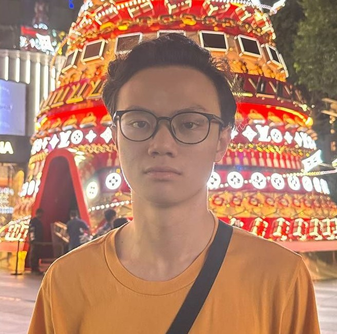

hi, i am Chin Herng.
====================

My full name is **Chong Chin Herng**. I am currently a final-year undergraduate from National University of Singapore, majoring in Computer Science with a specialization in theoretical computer science and a minor in Mathematics. I am also a pretty decent undergraduate tutor under NUS School of Computing.

I am mostly interested in the research of algorithms, theory of computation and discrete mathematics. I am also passionate about teaching.

My long-term goal is to get into academia and education where I can contribute to the total sum of human knowledge.

.. toctree::
   :hidden:

   about_me
   teaching
   cs1231s-discrete-structures/index
   blogs/index
   contact
