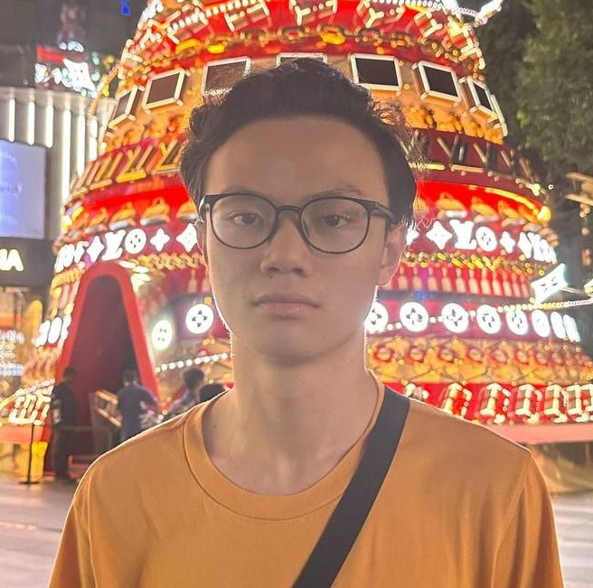

hi, i am Chin Herng.
====================

My full name is **Chong Chin Herng**. I am currently a fresh Computer Science graduate from National University of Singapore. I specialize in theoretical computer science and did a minor in Mathematics.

I am broadly interested in mathematics and its applications in theoretical computer science. I am currently exploring computational complexity theory, specifically fine-grained complexity, circuit complexity and the theory of hardness of approximation.

My long-term goal is to get into academia where I can contribute to the total sum of human knowledge.

.. toctree::
   :hidden:

   about_me
   teaching
   blogs/index
   cs1231s-discrete-structures/index
   contact
